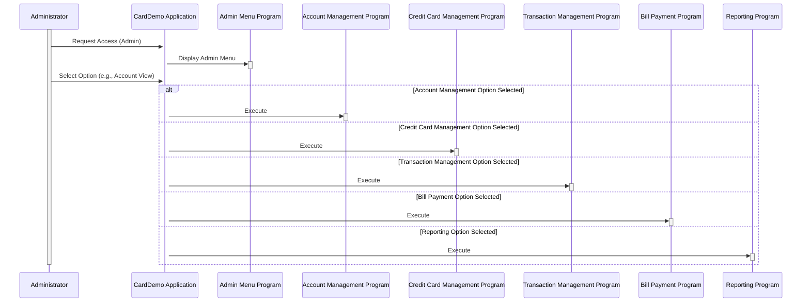

Gerado em: 1 de outubro de 2024

**Título do Documento:** Aplicativo CardDemo - Especificação das Opções do Menu Administrativo

**Descrição Resumida:**
O Menu Administrativo do Aplicativo CardDemo fornece uma lista de funcionalidades para gerenciar vários aspectos do sistema de cartão de crédito. Após o login, os administradores podem escolher entre opções como visualizar e atualizar contas, gerenciar detalhes do cartão de crédito, lidar com transações, processar pagamentos de contas e acessar relatórios. Cada opção corresponde a um programa específico dentro do sistema.

**Histórias do Usuário:**
Como administrador, preciso de acesso a um menu centralizado para gerenciar com eficiência diferentes aspectos do sistema de cartão de crédito, como contas, cartões, transações e relatórios.

**Épico Relacionado:**
6 - Gerenciamento de Usuários e Segurança

**Requisitos Funcionais:**
- O Menu Administrativo deve ser acessível apenas após autenticação bem-sucedida do administrador.
- O menu deve exibir uma lista numerada de opções para o administrador.
- Cada opção do menu deve ter uma descrição clara e concisa.
- Selecionar uma opção de menu deve executar o programa ou módulo associado.
- O sistema deve lidar com seleções de menu inválidas normalmente e fornecer feedback apropriado ao usuário.

**Requisitos Não Funcionais:**
- O Menu Administrativo deve carregar rapidamente e responder prontamente às seleções do usuário.
- A estrutura do menu deve ser fácil de entender e navegar.
- O sistema deve ser projetado para permitir atualizações e modificações fáceis nas opções do Menu Administrativo no futuro.

**Critérios de Aceitação:**
- Somente administradores autenticados podem acessar o Menu Administrativo.
- O menu exibe todas as opções necessárias com descrições precisas.
- Selecionar uma opção inicia corretamente o programa associado.
- O sistema lida com seleções inválidas e fornece mensagens informativas.

**Melhorias de Código:**
- **Estrutura de Menu Dinâmica:** Em vez de codificar opções de menu, implemente uma abordagem orientada a banco de dados. Isso permite atualizações mais fáceis, personalização baseada em funções e potencial para uma estrutura de menu mais dinâmica no futuro.
- **Tratamento de Erros Aprimorado:** Implemente o tratamento de erros centralizado com registro detalhado para facilitar a solução de problemas. Forneça mensagens de erro amigáveis ​​em vez de códigos de nível de sistema.
- **Considere GUI:** Se uma GUI for planejada, projete uma interface intuitiva para o Menu Administrativo com dicas visuais claras e navegação fácil.

**Melhorias de Segurança:**
- **Validação de Entrada:** Implemente validação de entrada robusta nas seleções de menu para evitar vulnerabilidades de injeção.
- **Verificações de Autorização:** Antes de executar qualquer programa vinculado a uma opção de menu, verifique as permissões do usuário para essa ação específica.
- **Registro:** Registre todas as tentativas de acesso e ações realizadas no Menu Administrativo para fins de auditoria.

**Diagrama Conceitual:**

--Made by "Smart Engineering" (by Compass.UOL)--