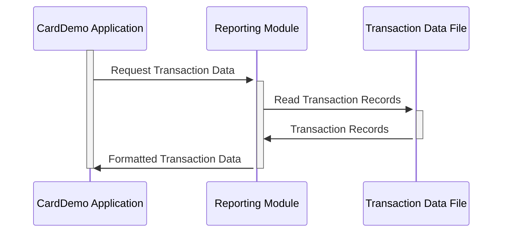

Gerado em: 1 de outubro de 2024

# **Título do Documento:** Estrutura de Dados para Relatórios de Transações do CardDemo

# **Descrição Resumida:**
Este documento define a estrutura de dados utilizada na aplicação CardDemo para gerar relatórios de transações de cartão de crédito. Ele garante dados consistentes e organizados para a geração de diversos relatórios.

# **Histórias do Usuário:**
Como analista de dados, preciso de uma estrutura de dados de transações padronizada para gerar relatórios precisos e consistentes sobre a atividade do cartão de crédito.

# **Épico Relacionado:**
5 - Relatórios e Análise

# **Requisitos Funcionais:**
- A estrutura de dados deve incluir campos para identificar cada transação de forma única, como número do cartão e ID da transação.
- Deve categorizar as transações por tipo (por exemplo, compra, reembolso) e categoria (por exemplo, supermercado, viagens).
- A estrutura deve armazenar informações relevantes do comerciante, incluindo ID, nome, cidade e CEP.
- Deve registrar os valores das transações com precisão, incluindo casas decimais para centavos.
- A estrutura deve capturar timestamps para início e processamento da transação.

# **Requisitos Não Funcionais:**
- **Integridade de Dados:** A estrutura de dados deve garantir a precisão e consistência dos dados por meio de tipos de dados apropriados e regras de validação.
- **Desempenho:** A estrutura deve ser projetada para facilitar a recuperação e o processamento eficientes dos dados para geração de relatórios.

# **Critérios de Aceitação:**
- A estrutura de dados representa com precisão todas as informações necessárias para relatórios de transações de cartão de crédito.
- Os relatórios gerados usando esta estrutura são consistentes, precisos e facilmente interpretáveis.

# **Melhorias de Código:**
- Implementar regras de validação de dados dentro da aplicação para reforçar a integridade dos dados no ponto de entrada.
- Adicionar mecanismos de tratamento de erros para gerenciar graciosamente dados inválidos e evitar interrupções no sistema.

# **Melhorias de Segurança:**
- Criptografar dados confidenciais dentro dos registros de transações, como números de cartão, para proteger contra acesso não autorizado.
- Implementar controles de acesso para restringir os privilégios de visualização e modificação de dados apenas ao pessoal autorizado.

# **Diagrama Conceitual:**

--Made by "Smart Engineering" (by Compass.UOL)--