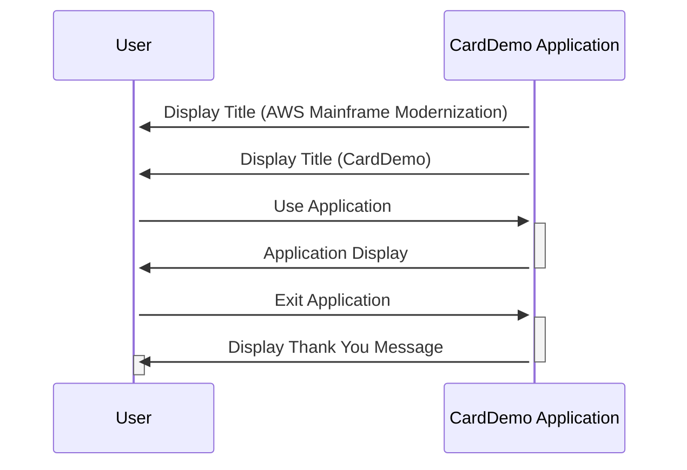

Gerado em: 1º de outubro de 2024

# **Título do Documento:** Aplicativo CardDemo - Títulos e Mensagens da Tela

# **Descrição Resumida:** 
Este documento descreve os títulos e mensagens da tela usados no aplicativo CardDemo, um sistema de gerenciamento de cartão de crédito baseado em COBOL. Ele se concentra em aprimorar a experiência do usuário, fornecendo uma identidade visual clara e mensagens amigáveis.

# **Histórias do Usuário:** 
Como usuário, quero ver títulos e mensagens claras e informativas para que eu possa entender o propósito do aplicativo e navegar nele facilmente.

# **Épico Relacionado:** 
9 - Utilitários do Sistema

# **Requisitos Funcionais:**
- O aplicativo deve exibir "AWS Mainframe Modernization" na primeira linha da barra de título.
- O aplicativo deve exibir "CardDemo" na segunda linha da barra de título.
- Ao sair, o aplicativo deve exibir uma mensagem de "Obrigado" ao usuário.

# **Requisitos Não Funcionais:**
- Os títulos e mensagens devem ser exibidos em uma fonte clara e legível.
- A mensagem "Obrigado" deve ser exibida por um período de tempo razoável antes que o aplicativo seja fechado.

# **Critérios de Aceitação:**
- Os títulos e mensagens especificados são exibidos corretamente nas respectivas telas.
- A fonte e a duração da exibição das mensagens atendem aos padrões definidos.

# **Melhorias de Código:**
-  **Externalizar Strings:**  Em vez de codificar os títulos e mensagens diretamente no programa, armazene-os em um arquivo externo ou banco de dados. Isso permite uma modificação mais fácil do texto sem recompilar o programa.
- **Suporte Multilíngue:**  Considere adicionar suporte para vários idiomas, permitindo que o aplicativo exiba títulos e mensagens no idioma preferido do usuário. 

# **Melhorias de Segurança:**
- N/A - Este componente se concentra em elementos de interface do usuário e não envolve diretamente dados confidenciais ou funções de segurança.

# **Diagrama Conceitual:**

--Made by "Smart Engineering" (by Compass.UOL)--