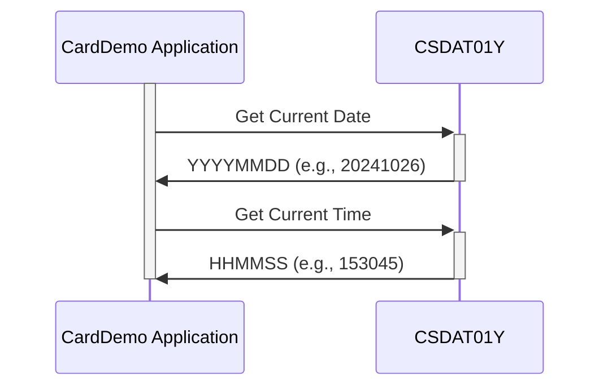

Gerado em: 1º de outubro de 2024

**Título do Documento:** Aplicativo CardDemo - Especificação Padrão de Data e Hora

**Descrição Resumida:**
Este documento descreve o formato padronizado para tratamento de informações de data e hora no aplicativo CardDemo. Ele garante consistência e precisão na gravação, exibição e processamento de datas e horas em todas as funcionalidades do sistema.

**Histórias de Usuário:**
Como Analista de Dados, preciso garantir que todas as datas e horas sejam registradas e processadas de forma consistente no aplicativo CardDemo para manter a precisão dos dados e gerar relatórios confiáveis.

**Épico Relacionado:** 9 - Utilitários do Sistema

**Requisitos Funcionais:**
O código define uma estrutura padrão para representar informações de data e hora dentro do aplicativo CardDemo.
- Ele estabelece contêineres específicos para armazenar os valores de ano, mês, dia, hora, minuto, segundo e milissegundo.
- O código suporta diferentes formatos de exibição para datas (AAAA-MM-DD, MM/DD/AA) e horas (HH:MM:SS), garantindo compatibilidade com várias fontes de entrada/saída.
- Ele lida com a conversão desses formatos legíveis por humanos em uma representação interna consistente que o sistema pode usar eficientemente para cálculos e comparações.

**Regras de Negócio:**
* **Precisão:** Todos os módulos devem aderir aos formatos definidos para garantir o registro e processamento precisos de data e hora.
* **Consistência:** O mesmo formato deve ser usado de forma consistente em todo o aplicativo para evitar discrepâncias e garantir a integridade dos dados.

**Requisitos Não Funcionais:**
- **Desempenho:** As operações de data e hora devem ser realizadas de forma eficiente para evitar impacto no desempenho geral do sistema.
- **Manutenibilidade:** O código deve ser bem documentado e fácil de entender para futuras manutenções e aprimoramentos.
- **Confiabilidade:** O mecanismo de tratamento de data e hora deve ser confiável e produzir resultados consistentes em diferentes partes do aplicativo.

**Critérios de Aceitação:**
- Todos os módulos do aplicativo CardDemo devem usar os formatos de data e hora definidos de forma consistente.
- As operações de data e hora devem ser realizadas com precisão e eficiência.
- O sistema deve ser capaz de lidar com diferentes formatos de exibição para datas e horas.

**Melhorias no Código:**
- Adicionar comentários para esclarecer o propósito e o uso de cada variável e estrutura de dados.
- Implementar tratamento de erros para casos em que valores de data ou hora inválidos são encontrados.
- Considerar o uso de uma biblioteca dedicada de data e hora para funcionalidade e capacidade de manutenção aprimoradas.

**Melhorias na Segurança:**
- Garantir que informações confidenciais de data e hora, se houver, sejam tratadas com segurança e protegidas contra acesso não autorizado.
- Implementar mecanismos de registro e auditoria para rastrear alterações feitas nos dados de data e hora.

**Diagrama Conceitual:**

--Made by "Smart Engineering" (by Compass.UOL)--