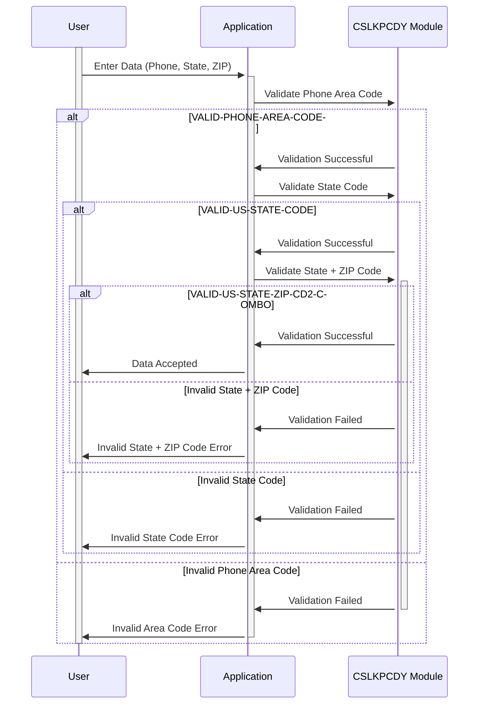

Gerado em: 1º de outubro de 2024

# Data Integrity Guardian - Especificação do Repositório de Códigos de Pesquisa

## Descrição Resumida:

Este módulo garante a integridade dos dados no aplicativo CardDemo validando os números de telefone, códigos de estado dos EUA e códigos postais inseridos pelo usuário em relação a listas predefinidas de valores aceitáveis. Esse processo de validação é crucial para manter registros precisos de clientes e transações, garantindo a conformidade com os padrões de telecomunicações e suportando operações confiáveis relacionadas a endereços.

## Histórias do Usuário:

Como analista de dados, preciso ter certeza de que os números de telefone, códigos de estado e códigos postais armazenados no sistema são precisos e consistentes, para que eu possa realizar análises e relatórios confiáveis sem encontrar problemas de qualidade de dados.

## Épico Relacionado:

9 - Utilitários do Sistema

## Requisitos Funcionais:

1. **Validação do Código de Área do Telefone:**
    - O sistema deve validar o código de área do telefone inserido em relação a uma lista de códigos de área válidos da América do Norte.
    - Se o código de área inserido estiver presente na lista, a validação será aprovada.
    - Se o código de área inserido não for encontrado na lista, a validação falhará e o sistema deverá exibir uma mensagem de erro ao usuário.
2. **Validação do Código de Estado dos EUA:**
    - O sistema deve validar o código de estado de duas letras inserido em relação a uma lista de códigos de estado válidos.
    - Se o código de estado inserido estiver presente na lista, a validação será aprovada.
    - Se o código de estado inserido não for encontrado na lista, a validação falhará e o sistema deverá exibir uma mensagem de erro ao usuário.
3. **Validação de Estado + Código Postal:**
    - O sistema deve validar a combinação do código de estado dos EUA inserido e os primeiros dois dígitos do código postal em relação a uma lista de combinações válidas de estado + código postal.
    - Se a combinação inserida estiver presente na lista, a validação será aprovada.
    - Se a combinação inserida não for encontrada na lista, a validação falhará e o sistema deverá exibir uma mensagem de erro ao usuário.

## Requisitos Não Funcionais:

1. **Desempenho:**
    - O processo de validação deve ser realizado em tempo real (durante a entrada de dados) sem introduzir atrasos perceptíveis para o usuário.
    - O tempo de pesquisa para validar códigos deve ser mínimo para garantir uma experiência responsiva ao usuário.
2. **Confiabilidade:**
    - O processo de validação deve ser confiável e consistente, garantindo que apenas códigos válidos sejam aceitos.
    - As listas de pesquisa devem ser atualizadas regularmente para refletir quaisquer alterações nos códigos válidos.
3. **Manutenibilidade:**
    - O código do módulo de validação deve ser bem estruturado, documentado e facilmente manutenível.
    - As listas de pesquisa devem ser armazenadas em um local centralizado para fácil acesso e modificação.
4. **Segurança:**
    - O acesso para modificar as listas de pesquisa deve ser restrito apenas ao pessoal autorizado.
    - A integridade das listas de pesquisa deve ser mantida para evitar modificações não autorizadas.

## Critérios de Aceitação:

1. O sistema valida com sucesso os códigos de área de telefone em relação à lista predefinida e exibe mensagens de erro adequadas para entradas inválidas.
2. O sistema valida com sucesso os códigos de estado dos EUA em relação à lista predefinida e exibe mensagens de erro adequadas para entradas inválidas.
3. O sistema valida com sucesso a combinação de códigos de estado dos EUA e os primeiros dois dígitos dos códigos postais em relação à lista predefinida e exibe mensagens de erro adequadas para entradas inválidas.
4. O processo de validação é realizado em tempo real sem degradação de desempenho perceptível.
5. As listas de pesquisa são atualizadas regularmente para refletir quaisquer alterações nos códigos válidos.

## Melhorias de Código:

1. **Tratamento de Erros:** Implemente um mecanismo de tratamento de erros padronizado que forneça informações detalhadas sobre a falha de validação, como o código inválido específico e o campo correspondente.
2. **Documentação:** Adicione documentação abrangente ao código, explicando a lógica de validação, a finalidade de cada lista de pesquisa e quaisquer regras de negócios relevantes.
3. **Otimização de Desempenho:** Explore técnicas para otimizar o processo de pesquisa, como usar estruturas de dados eficientes ou mecanismos de cache, para melhorar ainda mais o desempenho.

## Melhorias de Segurança:

1. **Controle de Acesso:** Implemente medidas rígidas de controle de acesso para garantir que apenas pessoal autorizado possa modificar as listas de pesquisa.
2. **Trilha de Auditoria:** Mantenha uma trilha de auditoria que registre todas as modificações feitas nas listas de pesquisa, incluindo o usuário que fez a alteração, a data e hora e as alterações específicas feitas.
3. **Avaliações Regulares de Segurança:** Realize avaliações regulares de segurança para identificar e mitigar quaisquer vulnerabilidades potenciais relacionadas ao módulo de validação.

## Diagrama Conceitual:

--Made by "Smart Engineering" (by Compass.UOL)--