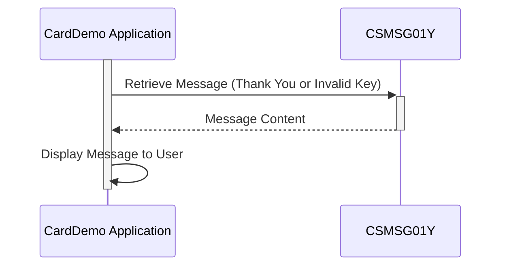

Gerado em: 1º de outubro de 2024

# **Título do Documento:** Aplicativo CardDemo - Especificação do Repositório de Mensagens Comuns

# **Descrição Resumida:**

Este documento descreve a funcionalidade do arquivo `CSMSG01Y.cpy` dentro do aplicativo CardDemo. Este arquivo atua como um repositório central para mensagens comuns do usuário, garantindo a consistência na comunicação em todo o aplicativo.

# **Histórias do Usuário:**

Como desenvolvedor do aplicativo, preciso de mensagens predefinidas para fornecer feedback claro e consistente aos usuários sobre suas ações no aplicativo CardDemo.

# **Epic Relacionado:**

9 - Utilitários do Sistema

# **Requisitos Funcionais:**

- O sistema deve fornecer mensagens predefinidas para interações comuns do usuário, como operações bem-sucedidas e entrada inválida.
- As mensagens devem ser armazenadas em um local central acessível a diferentes partes do aplicativo.

# **Requisitos Não Funcionais:**

- As mensagens devem ser claras, concisas e facilmente compreensíveis pelos usuários finais.
- O repositório de mensagens deve ser sustentável e escalável para acomodar futuras adições ou modificações de mensagens.

# **Critérios de Aceitação:**

- O arquivo `CSMSG01Y.cpy` deve conter as mensagens definidas para uma mensagem de "Obrigado" e uma mensagem de "Chave Inválida".
- As mensagens devem ser usadas de forma consistente no aplicativo CardDemo, onde aplicável.

# **Melhorias de Código:**

-   **Suporte Multilíngue:**  Considere adicionar suporte para vários idiomas para tornar o aplicativo CardDemo acessível a um público maior.  Isso pode envolver o uso de variáveis ​​para armazenar mensagens em diferentes idiomas e um mecanismo para selecionar o idioma apropriado com base nas preferências do usuário ou nas configurações do sistema. 
-   **Personalização de Mensagem:** Explore a permissão de personalização limitada de mensagens para alinhar com os requisitos específicos de negócios.  Por exemplo, você pode permitir a alteração do nome do aplicativo na mensagem de agradecimento, preservando a estrutura e o tom gerais. 

# **Melhorias de Segurança:**

- Nenhuma melhoria de segurança direta é necessária para este arquivo específico, pois ele não lida com dados confidenciais. No entanto, certifique-se de que quaisquer dados exibidos ao usuário usando essas mensagens sejam sanitizados e protegidos adequadamente para evitar vulnerabilidades como cross-site scripting (XSS).

# **Diagrama Conceitual:**

--Made by "Smart Engineering" (by Compass.UOL)--