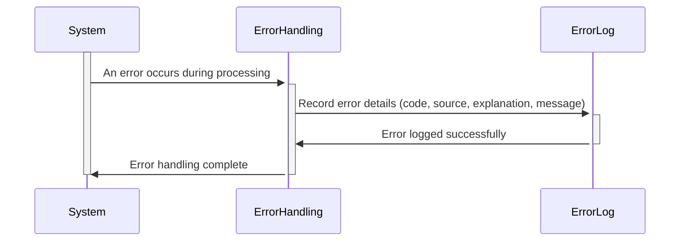

Gerado em: 1º de outubro de 2024

# **Título do Documento:** Especificação de Registro de Erros do Sistema de Cartões

# **Descrição Resumida:**
Esta especificação define um formato padronizado para registrar erros dentro do Sistema de Cartões. Ele garante relatórios de erros consistentes, simplifica o diagnóstico de problemas e contribui para a estabilidade geral do sistema. Quando ocorre um erro, o sistema captura detalhes importantes, incluindo um código de erro, o programa de origem, uma explicação detalhada e uma mensagem geral.

# **Histórias do Usuário:**
Como um administrador do sistema, preciso de uma maneira padronizada de entender os erros do sistema para que eu possa identificar e resolver rapidamente os problemas que afetam o Sistema de Cartões.

# **Épico Relacionado:**
9 - Utilitários do Sistema

# **Requisitos Funcionais:**
1.  **Captura de Erro:** O sistema deve capturar as seguintes informações quando ocorrer um erro:
    - **Código de Erro (ABEND-CODE):** Um código de 4 caracteres categorizando o tipo de erro (por exemplo, "DBER" para Erro de Banco de Dados, "CNVL" para Erro de Conversão).
    - **Programa de Origem (ABEND-CULPRIT):** O nome do programa ou módulo onde o erro se originou (por exemplo, "COACTUPC", "CBTRN01C").
    - **Explicação do Erro (ABEND-REASON):** Uma explicação concisa da causa do erro (por exemplo, "Número de conta inválido", "Arquivo não encontrado").
    - **Mensagem Geral (ABEND-MSG):** Uma mensagem amigável associada ao erro (por exemplo, "Ocorreu um erro durante o processamento da transação. Por favor, tente novamente mais tarde.").

# **Requisitos Não Funcionais:**
1.  **Desempenho:** O registro de erros deve ter impacto mínimo no desempenho geral do sistema.
2.  **Confiabilidade:** O mecanismo de registro de erros deve ser confiável, garantindo que todos os erros sejam capturados e registrados sem falhas.
3.  **Manutenibilidade:** O código de registro de erros e as estruturas de dados devem ser facilmente mantidos e extensíveis para acomodar mudanças futuras.

# **Critérios de Aceitação:**
1.  **Informações Completas do Erro:** Todas as entradas do log de erros devem conter as informações necessárias: Código do Erro, Programa de Origem, Explicação do Erro e Mensagem Geral.
2.  **Relato de Erro Preciso:** As informações registradas devem refletir com precisão a natureza e a origem do erro.
3.  **Registro Oportuno:** Os erros devem ser registrados imediatamente após a detecção para fornecer uma visão em tempo real da saúde do sistema.

# **Melhorias de Código:**
1.  **Tratamento de Erros Centralizado:** Implemente uma rotina centralizada de tratamento de erros para garantir consistência e reduzir a duplicação de código.
2.  **Padronização do Código de Erro:** Defina um conjunto abrangente e padronizado de códigos de erro para facilitar a análise e o relatório.
3.  **Níveis de Registro:** Introduza diferentes níveis de registro (por exemplo, DEBUG, INFO, ERROR, FATAL) para controlar a verbosidade dos logs.

# **Melhorias de Segurança:**
1.  **Armazenamento Seguro de Logs:** Armazene logs de erros com segurança para impedir acesso não autorizado e modificação.
2.  **Monitoramento e Auditoria de Logs:** Implemente mecanismos para monitorar logs de erros para atividades suspeitas e gerar trilhas de auditoria.
3.  **Minimização de Dados:** Evite registrar informações confidenciais, como dados do cliente ou senhas, em logs de erros.

# **Diagrama Conceitual:**

--Made by "Smart Engineering" (by Compass.UOL)--