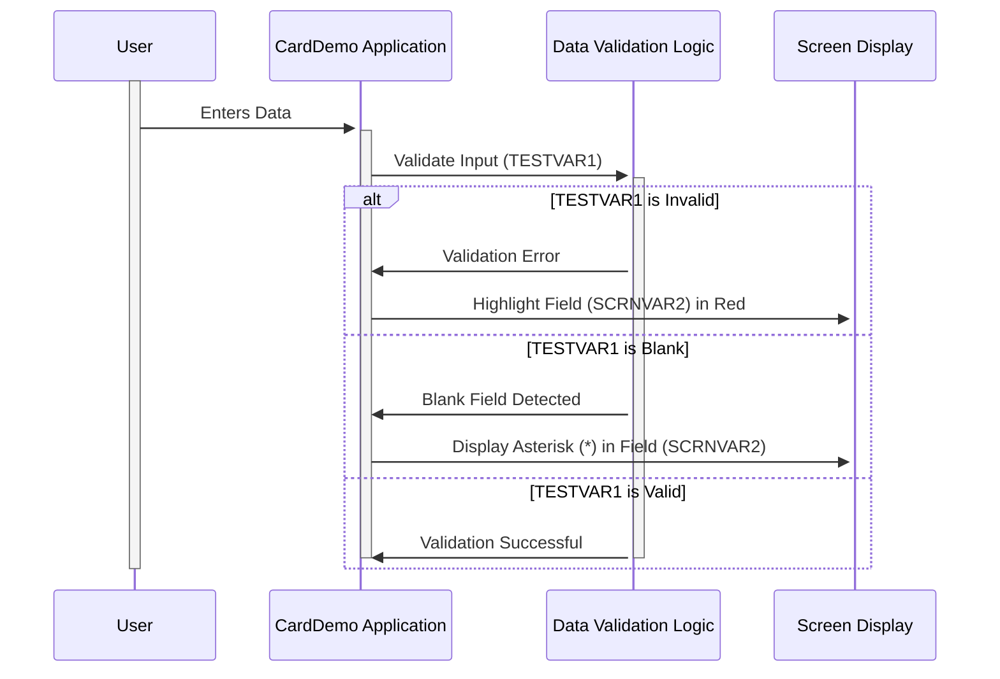

Gerado em: 1º de outubro de 2024

# **Título do Documento:** Especificação de Validação de Campo CardDemo

# **Descrição Resumida:**
Este documento detalha a funcionalidade de um trecho de código dentro do aplicativo CardDemo. Sua função principal é fornecer feedback visual aos usuários durante a entrada de dados, garantindo a precisão dos dados, destacando possíveis erros e orientando os usuários a preencher os campos obrigatórios.

# **Histórias do Usuário:**
Como Representante de Atendimento ao Cliente, preciso de dicas visuais claras na tela para entender se os dados que inseri estão corretos e completos, para evitar erros e garantir a precisão dos dados no sistema.

# **Épico Relacionado:**
9 - Utilitários do Sistema

# **Requisitos Funcionais:**

- **RF 01:** O sistema deve validar a entrada do usuário em tempo real conforme os dados são inseridos.
- **RF 02:** Se os dados inseridos forem inválidos, o campo correspondente na tela deverá ser destacado em vermelho.
- **RF 03:** Se um campo obrigatório for deixado em branco, um asterisco (*) deverá ser exibido dentro do campo.

## **Regras de Negócio:**

- **RN 01:** As regras de validação de dados para cada campo devem ser predefinidas e aplicadas de forma consistente.
- **RN 02:** Os campos obrigatórios são definidos pelo projeto do sistema e não podem ser ignorados pelo usuário.
- **RN 03:** O feedback visual (destaque em vermelho e asterisco) deve ser claro, imediato e perceptível ao usuário.

# **Requisitos Não Funcionais:**

- **RNF 01:** O processo de validação de campo não deve impactar significativamente o desempenho do sistema.
- **RNF 02:** O feedback visual deve ser consistente em diferentes resoluções de tela e dispositivos.
- **RNF 03:** A lógica de validação deve ser sustentável e facilmente adaptável a mudanças futuras nas regras de negócios.

# **Critérios de Aceitação:**

- **CA 01:** O sistema destaca com sucesso os campos de dados inválidos em vermelho após a entrada.
- **CA 02:** Um asterisco (*) é exibido corretamente em campos obrigatórios que são deixados em branco.
- **CA 03:** O processo de validação não causa atrasos ou interrupções perceptíveis no desempenho do sistema.
- **CA 04:** O feedback visual é acessível a usuários com deficiência visual (por exemplo, esquemas de cores alternativos ou compatibilidade com leitores de tela).

# **Melhorias de Código:**

- **MC 01:** Implementar tratamento de erros centralizado para gerenciar e registrar erros de validação de forma consistente.
- **MC 02:** Adicionar documentação abrangente ao trecho de código explicando a lógica de validação, as regras de negócios e quaisquer dependências.
- **MC 03:** Explorar técnicas de otimização de desempenho se o processo de validação causar atrasos perceptíveis, especialmente para conjuntos de dados grandes ou regras de validação complexas.

# **Melhorias de Segurança:**

- **MS 01:** Garantir que os dados confidenciais dentro dos campos validados (por exemplo, senhas, números de cartão de crédito) sejam tratados com segurança, seguindo as melhores práticas para criptografia e mascaramento de dados.
- **MS 02:** Implementar técnicas de higienização de entrada para evitar vulnerabilidades como ataques de script entre sites (XSS), onde código malicioso pode ser injetado por meio de campos de entrada do usuário.
- **MS 03:** Registrar falhas de validação para rastrear possíveis tentativas maliciosas ou erros do sistema para fins de auditoria de segurança.

# **Diagrama Conceitual:**

--Made by "Smart Engineering" (by Compass.UOL)--