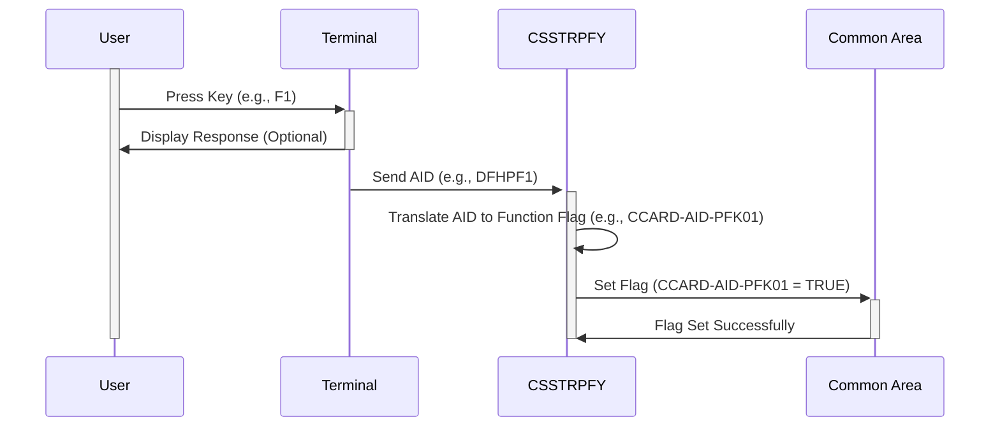

Gerado em: 1º de Outubro de 2024

# **Título do Documento:** Tradutor de Ações do Usuário CICS

# **Descrição Resumida:**
Este programa traduz ações do usuário, como teclas pressionadas em um terminal, em comandos específicos dentro de um aplicativo CICS. Ele age como um decodificador, convertendo a entrada do usuário em instruções que o aplicativo pode entender.

# **Histórias do Usuário:**
Como desenvolvedor de aplicativos, preciso de uma maneira de interpretar consistentemente as ações do usuário em diferentes tipos de terminais para que o aplicativo se comporte de forma previsível para todos os usuários.

# **Épico Relacionado:**
9 - Utilitários do Sistema

# **Requisitos Funcionais:**
1. **Capturar Entrada do Usuário:**
   - O programa deve capturar o Identificador de Atenção (AID) gerado pela ação do usuário no terminal. Este AID representa uma tecla específica pressionada ou outro evento de entrada.
2. **Traduzir AID para Função do Programa:**
   - O programa deve ter um mapeamento predefinido entre AIDs e funções de programa correspondentes. 
   - Por exemplo:
      - `DFHENTER` (tecla Enter) mapeia para `CCARD-AID-ENTER`
      - `DFHCLEAR` (tecla Clear) mapeia para `CCARD-AID-CLEAR`
      - `DFHPA1` (tecla PA1) mapeia para `CCARD-AID-PA1`
      - `DFHPF1` (tecla F1) mapeia para `CCARD-AID-PFK01`
      - e assim por diante para outras teclas de função.
3. **Definir Flags na Área Comum:**
   - Em vez de executar diretamente a função do programa, o programa deve definir um sinalizador correspondente em uma área comum designada (memória compartilhada).
   - Este sinalizador indica a ação pretendida do usuário para outras partes do aplicativo CICS.

# **Requisitos Não Funcionais:**
1. **Desempenho:** O processo de tradução deve ser muito rápido, pois faz parte da interação do usuário. Quaisquer atrasos serão perceptíveis.
2. **Confiabilidade:** O mapeamento entre AIDs e funções do programa deve ser preciso e consistente.
3. **Manutenibilidade:** O código deve ser estruturado para adicionar facilmente novos AIDs ou modificar mapeamentos existentes conforme o aplicativo evolui. 

# **Critérios de Aceitação:**
1. O programa captura com sucesso AIDs gerados por ações do usuário no terminal.
2. O programa traduz corretamente os AIDs capturados em seus sinalizadores de função de programa correspondentes.
3. O programa define os sinalizadores corretos na área comum sem erros.

# **Melhorias de Código:**
1. **Tratamento de Erros:**
   - Implemente verificações para AIDs inesperados. Se um AID não reconhecido for encontrado, registre o erro e, potencialmente, exiba uma mensagem genérica para o usuário.
2. **Mapeamento Centralizado:**
   - Considere usar uma tabela ou arquivo de configuração para armazenar o mapeamento AID-para-função em vez de codificá-lo na instrução `EVALUATE`. Isso tornará mais fácil atualizar os mapeamentos sem modificar o código do programa.
3. **Documentação:**
   - Documente claramente o propósito do programa, o mapeamento AID-para-função e a localização e propósito dos sinalizadores na área comum.

# **Melhorias de Segurança:**
1. **Controle de Acesso:**
   - Garanta que apenas usuários ou programas autorizados tenham acesso para modificar a área comum onde os sinalizadores são armazenados.
2. **Validação de Entrada:**
   - Limpe e valide toda a entrada recebida do terminal para evitar ataques de injeção, embora os AIDs sejam normalmente gerados pelo sistema.

# **Diagrama Conceitual:**

--Made by "Smart Engineering" (by Compass.UOL)--