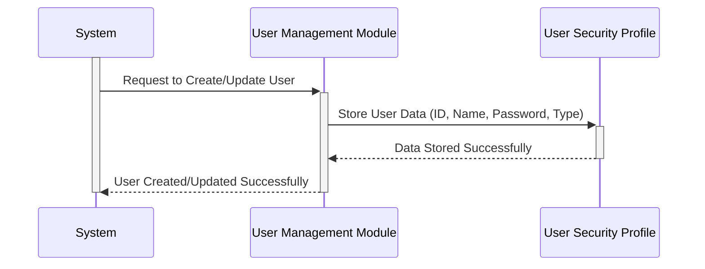

Gerado em: 1º de outubro de 2024

**Título do Documento:** Perfil de Segurança do Usuário - Especificação da Estrutura de Dados

**Descrição Resumida:** 
Este documento descreve a estrutura para armazenar as informações do usuário de forma segura no aplicativo CardDemo. Esta estrutura define como os dados do usuário, como ID, nome, senha e nível de acesso, são organizados e armazenados.

**Histórias do Usuário:** 
Como administrador do sistema, preciso de uma maneira segura de armazenar as informações do usuário, incluindo suas credenciais de login e direitos de acesso, para garantir que apenas indivíduos autorizados possam acessar dados e funcionalidades confidenciais.

**Épico Relacionado:**  
6 - Gestão de Usuários e Segurança

**Requisitos Funcionais:**
- O sistema deve armazenar um ID exclusivo para cada usuário.
- O sistema deve armazenar o nome e o sobrenome do usuário.
- O sistema deve armazenar uma senha para cada usuário.
- O sistema deve armazenar um código indicando o tipo ou nível de acesso do usuário.
- O sistema deve incluir espaço para potencial expansão futura dos dados do usuário.

**Requisitos Não Funcionais:**
- **Segurança:** As senhas dos usuários devem ser armazenadas com segurança para evitar acesso não autorizado. Isso pode envolver técnicas de criptografia ou hashing, que não são detalhadas nesta estrutura de dados específica.
- **Desempenho:** A recuperação de informações do usuário deve ser eficiente para garantir o desempenho ideal do sistema.
- **Integridade de Dados:** O sistema deve aplicar regras de validação de dados para manter a precisão e consistência dos dados do usuário.

**Critérios de Aceitação:**
- O sistema pode armazenar e recuperar com sucesso todos os campos de dados do usuário definidos.
- As senhas dos usuários são tratadas como confidenciais e não são exibidas em texto simples.
- O sistema pode diferenciar usuários com base em seu tipo e controlar o acesso às funcionalidades de acordo.

**Melhorias de Código:**
- **Segurança de Senha:** Implemente um algoritmo robusto de hash de senha para proteger as credenciais do usuário contra acesso não autorizado.
- **Validação de Dados:** Adicione verificações de validação de entrada para garantir que os dados inseridos para cada campo atendam ao formato e comprimento necessários.
- **Documentação:** Forneça comentários claros no código para explicar a finalidade de cada campo e quaisquer considerações de segurança.

**Melhorias de Segurança:**
- **Criptografia:** Considere criptografar dados confidenciais do usuário, especialmente senhas, tanto em trânsito quanto em repouso.
- **Controle de Acesso:** Implemente medidas rigorosas de controle de acesso para restringir quem pode visualizar, modificar ou excluir dados do usuário.
- **Auditoria:** Registre todas as ações relacionadas aos dados do usuário, como criação, modificação e tentativas de acesso, para fins de auditoria de segurança.

**Diagrama Conceitual:**

--Made by "Smart Engineering" (by Compass.UOL)--