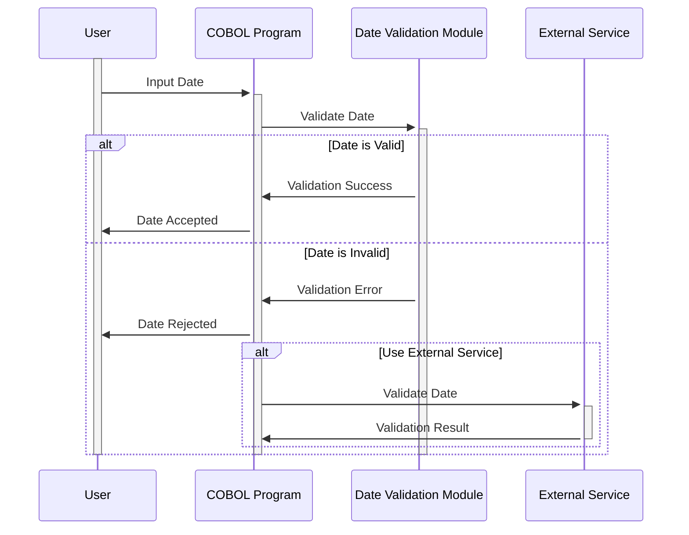

Gerado em: 1º de outubro de 2024

# Aplicativo CardDemo - Módulo de Validação de Data

## Descrição Resumida

Este módulo garante que as datas inseridas no sistema CardDemo sejam válidas e lógicas. Ele evita que datas incorretas causem problemas em outras partes do aplicativo, como cálculo de juros ou determinação da elegibilidade do cartão de crédito.

## Histórias do Usuário

Como analista de dados, quero ter certeza de que todas as datas no sistema sejam precisas para que minhas análises e relatórios sejam baseados em dados confiáveis.

## Épico Relacionado

9 - Utilitários do Sistema

## Requisitos Funcionais

- O módulo deve validar as datas inseridas no formato AAAAMMDD.
- Deve verificar se o ano está dentro de um século razoável (19xx ou 20xx).
- Deve verificar se o mês está entre 1 e 12.
- Deve garantir que o dia seja válido para o mês informado (por exemplo, não 31 de fevereiro).
- Deve lidar com anos bissextos corretamente, aceitando 29 de fevereiro apenas em anos bissextos.
- Deve impedir que datas de nascimento futuras sejam inseridas.
- Deve ter a opção de usar um serviço externo (`CSUTLDTC`) para validação adicional de data, se necessário.

## Requisitos Não Funcionais

- O módulo deve ser confiável e preciso na validação de datas.
- Deve ser eficiente e não impactar negativamente o desempenho do aplicativo CardDemo.
- O código deve ser bem documentado e sustentável.

## Critérios de Aceitação

- O módulo deve validar com sucesso datas válidas e rejeitar datas inválidas com base nas regras definidas.
- O módulo deve fornecer mensagens de erro claras quando a validação falhar, indicando o problema específico com a data.
- O módulo deve integrar-se perfeitamente com outras partes do aplicativo CardDemo que exigem validação de data.

## Melhorias de Código

- Implementar um mecanismo centralizado de tratamento de erros para fornecer mensagens de erro consistentes e amigáveis.
- Adicionar comentários mais detalhados ao código para melhorar a legibilidade e a manutenção.
- Explorar técnicas de otimização de desempenho, como o uso de pesquisa binária para verificações de intervalo de datas, se necessário.

## Melhorias de Segurança

- Garantir que o acesso ao módulo de validação de data e seus dados subjacentes seja restrito apenas ao pessoal autorizado.
- Desinfetar todas as entradas para o módulo para evitar vulnerabilidades como injeção de SQL.

## Diagrama Conceitual

--Made by "Smart Engineering" (by Compass.UOL)--