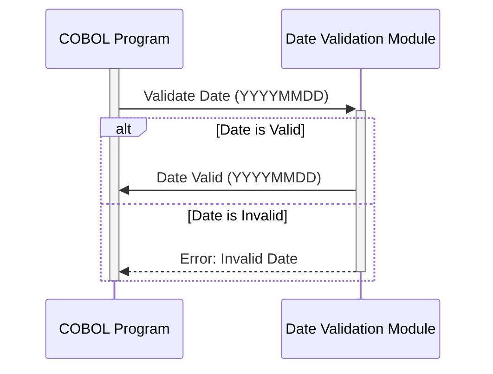

Gerado em: 1 de outubro de 2024

# **Título do Documento:** Módulo de Validação e Padronização de Datas

# **Descrição Resumida:**
Este código COBOL define um módulo reutilizável para validar e padronizar informações de data. Ele garante que as datas sejam logicamente válidas (por exemplo, mês válido, dia dentro do mês, tratamento de ano bissexto) e possam ser formatadas em um formato de saída consistente.

# **Histórias do Usuário:**
Como analista de dados, preciso garantir que todas as datas usadas em relatórios e análises sejam precisas e consistentes, portanto, preciso de uma maneira confiável de validar e padronizar informações de data de várias fontes.

# **Épico Relacionado:**
9 - Utilitários do Sistema

# **Requisitos Funcionais:**
- **Validação de Data:**
    - Validar os componentes de ano, mês e dia de uma data.
    - Garantir que o mês esteja dentro do intervalo válido (1-12).
    - Verificar se o dia está dentro do intervalo correto para o mês fornecido, considerando anos bissextos.
    - Lidar com informações de século com precisão (por exemplo, '20' para o século 21, '19' para o século 20).
- **Formatação de Data:**
   - Formatar datas validadas em um formato de saída padronizado (por exemplo, YYYYMMDD).

# **Requisitos Não Funcionais:**
 - **Reutilização:** O módulo deve ser projetado como um copybook COBOL para fácil inclusão em outros programas.
 - **Manutenibilidade:** O código deve ser bem estruturado e documentado para facilitar a manutenção e as atualizações.
 - **Desempenho:** A validação e formatação de datas devem ser eficientes, especialmente ao lidar com grandes volumes de dados.

# **Critérios de Aceitação:**
- O módulo valida corretamente uma variedade de entradas de data, incluindo datas válidas e inválidas, anos bissextos e diferentes representações de século.
- As datas são formatadas com precisão no formato de saída especificado (YYYYMMDD).
- O tratamento de erros está em vigor para identificar e registrar valores de data inválidos.
- O módulo pode ser facilmente integrado a outros programas COBOL.

# **Melhorias de Código:**
- **Mensagens de Erro Detalhadas:** Forneça mensagens de erro mais específicas para ajudar na depuração (por exemplo, "Mês inválido: XX").
- **Funções de Cálculo de Data:** Considere adicionar funções para cálculos de data comuns (por exemplo, adicionar/subtrair dias, calcular a diferença entre datas).
- **Opções de Configuração:** Permitir a configuração do formato de data de saída.

# **Melhorias de Segurança:**
- **Limpeza de Entrada:** Implemente a validação de entrada para evitar vulnerabilidades como estouro de buffer ou ataques de injeção.

# **Diagrama Conceitual:**

--Made by "Smart Engineering" (by Compass.UOL)--