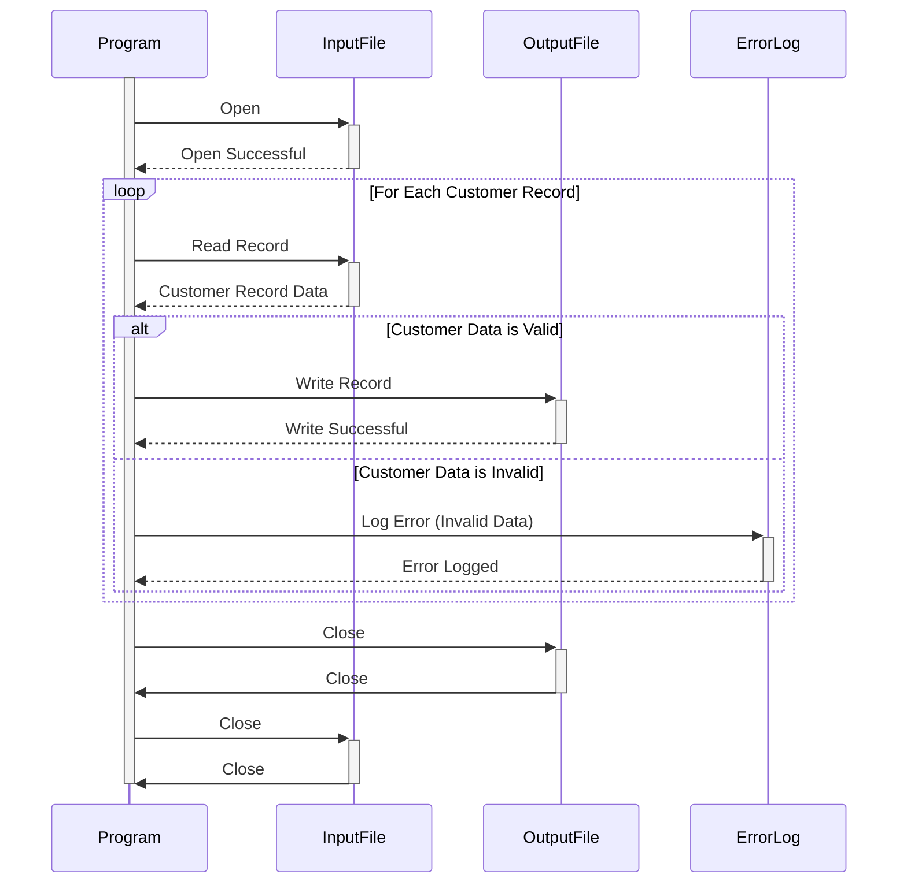

Gerado em: 1º de outubro de 2024

# **Documento de Título:** CardDemo - Programa de Validação e Processamento de Dados do Cliente

## **Descrição Resumida:**

Este programa tem como foco garantir a qualidade dos dados do cliente dentro do sistema CardDemo. Ele lê os registros do cliente de um arquivo de entrada, valida informações importantes como nomes e endereços e grava os registros válidos em um arquivo de saída. Os registros que falham na validação são registrados para posterior revisão e correção. Este processo é crucial para manter dados precisos do cliente, o que é essencial para várias operações comerciais, como marketing, atendimento ao cliente e relatórios.

## **Histórias do Usuário:**

Como analista de dados, preciso ter certeza de que os dados do cliente usados ​​para análise são precisos e confiáveis. Este programa me ajuda identificando e separando quaisquer registros de clientes inválidos, garantindo que minha análise seja baseada em dados confiáveis.

## **Épico Relacionado:**
8 - Gestão de Dados do Cliente

## **Requisitos Funcionais:**

1. **Ler Registros do Cliente:** O programa deve ser capaz de ler registros de clientes de um arquivo de entrada designado. O formato do arquivo de entrada deve ser consistente com a estrutura `CUSTOMER-RECORD` definida no arquivo `CUSTREC.cpy`.
2. **Validar Dados do Cliente:**
    - **Validação de Nome:** O programa deve verificar se os campos de nome, nome do meio (se fornecido) e sobrenome não estão em branco e contêm apenas caracteres alfabéticos (espaços permitidos).
    - **Validação de Endereço:** O programa deve verificar se os campos de endereço estão preenchidos com dados válidos. Isso pode envolver verificações em relação a uma lista conhecida de endereços válidos ou o uso de um serviço de verificação de endereço de terceiros.
    - **Outras Validações:** O programa pode precisar realizar validações de dados adicionais com base em regras de negócios específicas. Por exemplo, ele pode verificar se o campo Número do Seguro Social (SSN) contém nove dígitos ou se a pontuação de crédito FICO está dentro de um intervalo aceitável.
3. **Lidar com Registros Inválidos:**
    - **Registrar Erros:** Se um registro falhar na validação, o programa deve registrar os detalhes do erro, incluindo o ID do cliente, o campo que falhou na validação e uma breve mensagem de erro. Este log pode ser usado para identificar e corrigir os dados inválidos no sistema de origem.
    - **Excluir da Saída:** Registros inválidos não devem ser gravados no arquivo de saída.
4. **Gravar Registros Válidos:**
    - **Criar Arquivo de Saída:** O programa deve criar um arquivo de saída para armazenar os registros de clientes validados.
    - **Manter Estrutura:** O arquivo de saída deve manter a mesma estrutura `CUSTOMER-RECORD` do arquivo de entrada, garantindo consistência na organização dos dados.

## **Requisitos Não Funcionais:**

- **Desempenho:** O programa deve ser capaz de processar grandes volumes de dados do cliente com eficiência. O tempo de processamento deve ser razoável mesmo para arquivos contendo milhões de registros.
- **Confiabilidade:** O programa deve ser confiável e produzir resultados consistentes. Ele deve ser completamente testado para minimizar o risco de erros ou comportamentos inesperados.
- **Manutenibilidade:** O programa deve ser escrito de forma clara e bem estruturada para facilitar a manutenção e os aprimoramentos futuros.
- **Segurança:** O acesso ao programa, ao arquivo de entrada e ao arquivo de saída deve ser restrito apenas ao pessoal autorizado. O programa deve lidar com dados confidenciais, como SSNs e pontuações de crédito, com segurança, seguindo os regulamentos de privacidade de dados e as melhores práticas.

## **Critérios de Aceitação:**

- **Processamento de Arquivo Bem-Sucedido:** O programa deve ler com sucesso todos os registros do arquivo de entrada.
- **Validação Precisa:** O programa deve validar corretamente todos os dados do cliente de acordo com as regras definidas.
- **Tratamento de Erros Abrangente:** Todos os registros inválidos devem ser identificados e os erros devem ser registrados adequadamente.
- **Saída Correta:** O arquivo de saída deve conter apenas registros de clientes válidos e os dados devem ser formatados corretamente de acordo com a estrutura `CUSTOMER-RECORD`.

## **Melhorias de Código:**

- **Design Modular:** Divida a lógica de validação em funções ou módulos separados e reutilizáveis. Isso melhorará a organização do código e tornará mais fácil adicionar ou modificar regras de validação no futuro.
- **Validação Orientada por Configuração:** Permitir que as regras de validação sejam definidas externamente por meio de um arquivo de configuração. Isso tornaria mais fácil atualizar os critérios de validação sem modificar o código do programa.
- **Relato de Erros Aprimorado:** Forneça mensagens de erro mais detalhadas no log, incluindo a regra de validação específica que falhou.
- **Otimização de Desempenho:** Explore técnicas para otimizar o desempenho do programa, especialmente ao lidar com arquivos de entrada grandes. Isso pode envolver o uso de estruturas de dados eficientes, otimizando as operações de E/S de arquivo ou aproveitando os recursos de processamento paralelo.

## **Melhorias de Segurança:**

- **Criptografia de Dados:** Criptografe dados confidenciais nos arquivos de entrada, saída e log para protegê-los de acesso não autorizado.
- **Log Seguro:** Implemente práticas de log seguras para proteger informações confidenciais que podem estar incluídas nos logs de erro.
- **Controle de Acesso:** Garanta que apenas usuários autorizados tenham acesso ao programa, seu código-fonte e os arquivos de dados que ele processa.

## **Diagrama Conceitual:**

--Made by "Smart Engineering" (by Compass.UOL)--