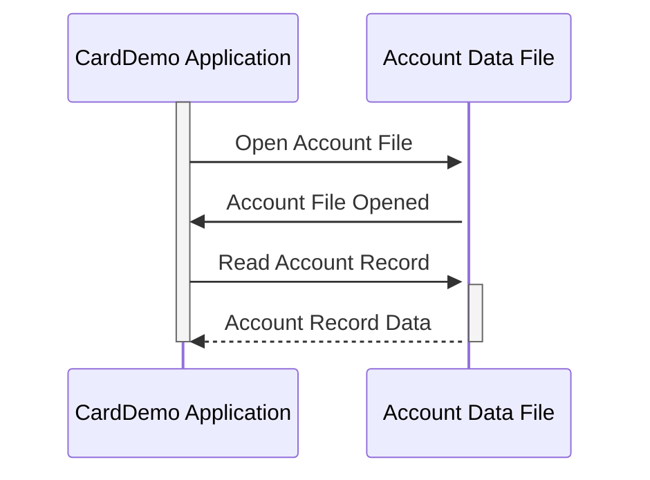

Gerado em: 1º de outubro de 2024

# **Título do Documento:** Especificação da Estrutura de Dados da Conta CardDemo

# **Descrição Resumida:**

Este documento descreve a estrutura de dados dos registros de contas de clientes no aplicativo CardDemo. Ele descreve as informações armazenadas para cada conta, incluindo identificação, status, saldo, limites de crédito e outros detalhes relevantes.

# **Histórias do Usuário:**

Como administrador do sistema de cartão de crédito, preciso de uma maneira padronizada de armazenar e acessar as informações da conta do cliente para garantir o processamento preciso de transações, gerenciamento de contas e relatórios.

# **Épico Relacionado:**
2 - Gestão de Contas

# **Requisitos Funcionais:**

A estrutura de dados do Registro da Conta deve incluir os seguintes campos:

* **`ACCT-ID`:** Um identificador exclusivo para cada conta.
* **`ACCT-ACTIVE-STATUS`:** Um indicador do status atual da conta (por exemplo, Ativo, Inativo, Fechado).
* **`ACCT-CURR-BAL`:** O saldo atual da conta.
* **`ACCT-CREDIT-LIMIT`:** A linha de crédito máxima estendida ao titular da conta.
* **`ACCT-CASH-CREDIT-LIMIT`:** O valor máximo de saque em dinheiro permitido na conta.
* **`ACCT-OPEN-DATE`:** A data em que a conta foi aberta.
* **`ACCT-EXPIRAION-DATE`:** A data em que a conta expirará.
* **`ACCT-REISSUE-DATE`:** A data da última renovação ou reemissão da conta.
* **`ACCT-CURR-CYC-CREDIT`:** O total de transações de crédito processadas no ciclo de cobrança atual.
* **`ACCT-CURR-CYC-DEBIT`:** O total de transações de débito processadas no ciclo de cobrança atual.
* **`ACCT-ADDR-ZIP`:** O CEP associado ao endereço do titular da conta.
* **`ACCT-GROUP-ID`:** Um código que identifica a afiliação de grupo da conta (se aplicável).

# **Requisitos Não Funcionais:**

* **Integridade de dados:** O sistema deve garantir a precisão e consistência dos dados da conta por meio de regras de validação e verificações de integridade de dados.
* **Segurança:** O acesso às informações da conta deve ser restrito a pessoal autorizado, seguindo os protocolos de segurança estabelecidos pela organização.
* **Desempenho:** As operações de recuperação e atualização em registros de contas devem ser realizadas de forma eficiente para garantir o desempenho ideal do sistema.

# **Critérios de Aceitação:**

* A estrutura de dados do Registro da Conta deve ser implementada conforme definido nesta especificação.
* Todos os campos obrigatórios devem ser preenchidos com dados válidos.
* O sistema deve aplicar regras de validação de dados para cada campo para manter a integridade dos dados.
* O acesso às informações da conta deve ser restrito a usuários autorizados.
* O teste de desempenho deve ser conduzido para garantir a recuperação e atualização de dados eficientes.

# **Melhorias de Código:**

* Implemente rotinas de validação de dados para garantir a precisão dos dados inseridos no registro da conta.
* Adicione mecanismos de tratamento de erros para lidar normalmente com quaisquer exceções ou erros durante o processamento de dados.
* Documente a estrutura de dados e seus campos claramente para melhorar a legibilidade e manutenção do código.

# **Melhorias de Segurança:**

* Criptografe informações confidenciais da conta, como números de conta e detalhes do cartão de crédito, para proteger contra acesso não autorizado.
* Implemente mecanismos de controle de acesso para restringir o acesso a dados com base em funções e permissões do usuário.
* Audite o sistema regularmente para rastrear o acesso a dados e identificar quaisquer violações de segurança em potencial.

# **Diagrama Conceitual:**

--Made by "Smart Engineering" (by Compass.UOL)--