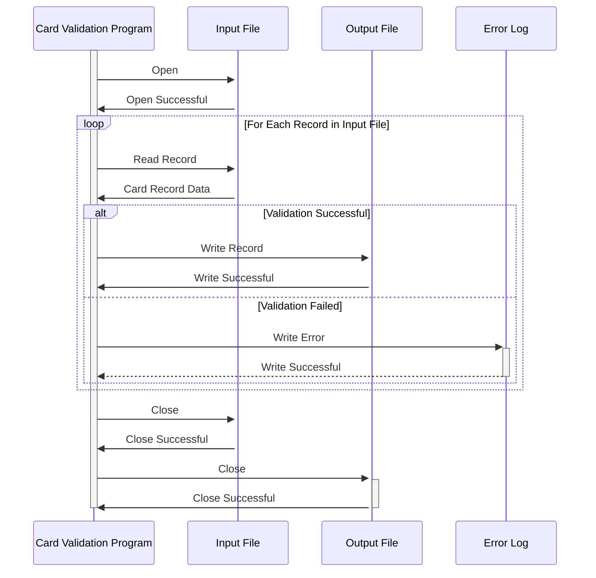

Gerado em: 1 de outubro de 2024

# **Título do Documento:** Programa de Validação e Processamento de Dados de Cartão

## **Descrição Resumida:** 
Este programa valida dados de cartão de crédito de um arquivo de entrada e grava registros válidos em um arquivo de saída. Ele desempenha um papel crucial na garantia da integridade dos dados para processos downstream, como processamento de transações, geração de relatórios e gerenciamento de contas.

## **Histórias do Usuário:**
Como analista de dados, preciso garantir que apenas registros válidos de cartão de crédito sejam usados para análise e geração de relatórios, a fim de manter a precisão e a confiabilidade dos dados.

## **Épico Relacionado:**
3 - Gerenciamento de Cartão de Crédito

## **Requisitos Funcionais:**
1. **Ler Dados do Cartão:** O programa deve ler os registros do cartão de crédito de um arquivo de entrada.
2. **Validar Número do Cartão:** Validar o número do cartão com base em regras predefinidas (por exemplo, comprimento, algoritmo de Luhn).
3. **Validar Data de Validade:** Verificar se o cartão não está expirado com base na data atual.
4. **Validar Status Ativo:** Verificar se o cartão está marcado como ativo.
5. **Lidar com Registros Inválidos:** Se um registro falhar na validação, registrar os detalhes do erro (por exemplo, motivo da falha, detalhes do registro) em um log de erros.
6. **Gravar Registros Válidos:** Gravar registros de cartão validados em um arquivo de saída para processamento posterior.

## **Requisitos Não Funcionais:**
1. **Desempenho:** O programa deve processar um grande volume de registros de cartão de forma eficiente dentro de um prazo aceitável.
2. **Confiabilidade:** O programa deve operar de forma confiável, sem erros ou corrupção de dados.
3. **Manutenibilidade:** O código do programa deve ser bem estruturado, documentado e fácil de entender para futuras modificações ou aprimoramentos.
4. **Segurança:** O programa deve lidar com dados confidenciais do cartão de forma segura e cumprir as regulamentações relevantes de proteção de dados (por exemplo, PCI DSS).

## **Critérios de Aceitação:**
1. O programa lê e valida com sucesso os dados do cartão de crédito do arquivo de entrada.
2. Os registros inválidos são identificados, registrados com detalhes específicos do erro e excluídos do arquivo de saída.
3. Os registros de cartão válidos são gravados corretamente no arquivo de saída no formato esperado.
4. O programa lida com erros normalmente, registra informações relevantes para solução de problemas e fornece mensagens de erro claras ao usuário.
5. O programa atende aos requisitos de desempenho definidos, processando registros dentro do prazo aceitável.

## **Melhorias de Código:**
1. Implementar um mecanismo de tratamento de erros mais robusto para capturar e lidar com várias exceções (por exemplo, arquivo não encontrado, formato de dados inválido).
2. Adicionar registro para operações bem-sucedidas e marcos importantes no fluxo de processamento para facilitar o monitoramento e a solução de problemas.
3. Otimizar a lógica de validação para melhorar o desempenho, especialmente ao lidar com um grande volume de registros.
4. Considerar o uso de uma biblioteca ou estrutura de validação de dados para simplificar e padronizar as regras de validação.

## **Melhorias de Segurança:**
1. Implementar controles de acesso apropriados para restringir o acesso não autorizado ao programa, arquivo de entrada, arquivo de saída e logs de erros.
2. Criptografar dados confidenciais do cartão durante o processamento e armazenamento para protegê-los contra acesso não autorizado.
3. Registrar todas as tentativas de acesso a dados, incluindo IDs de usuário e carimbos de data/hora, para fins de auditoria e monitoramento de segurança.
4. Revisar e atualizar regularmente as medidas de segurança para lidar com novas vulnerabilidades e ameaças.

## **Diagrama Conceitual:**

--Made by "Smart Engineering" (by Compass.UOL)--