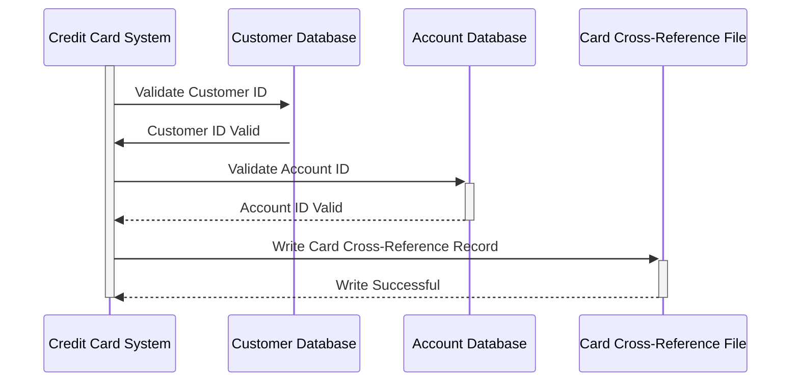

Gerado em: 1 de outubro de 2024

# **Título do Documento:** Especificação de Dados de Referência Cruzada de Cartão de Crédito

# **Descrição Resumida:**
Este documento descreve a estrutura e função do Registro de Referência Cruzada de Cartão dentro do Sistema de Gerenciamento de Cartão de Crédito. Este registro atua como um elo entre um cartão de crédito, seu titular (o cliente) e sua conta associada.

# **Histórias do Usuário:**
Como administrador do sistema de cartão de crédito, preciso ser capaz de vincular números de cartão de crédito às informações do cliente e da conta para que eu possa rastrear transações e gerenciar contas de forma eficaz. 

# **Epic Relacionado:**
3 - Gestão de Cartão de Crédito

# **Requisitos Funcionais:**
O Registro de Referência Cruzada de Cartão deve armazenar as seguintes informações:

* **Número do Cartão de Crédito:** Um número de 16 dígitos que identifica exclusivamente o cartão de crédito.
* **ID do Cliente:** Um identificador exclusivo para o cliente que possui o cartão de crédito.
* **ID da Conta:** Um identificador exclusivo para a conta associada ao cartão de crédito.

# **Requisitos Não Funcionais:**
* **Integridade de Dados:** O sistema deve garantir que o Registro de Referência Cruzada do Cartão seja preciso e atualizado. Isso inclui validar o número do cartão de crédito, ID do cliente e ID da conta em relação aos respectivos bancos de dados.
* **Desempenho:** O sistema deve ser capaz de recuperar Registros de Referência Cruzada de Cartão de forma rápida e eficiente, pois este é um componente crítico de muitas operações de cartão de crédito.
* **Segurança:** O Registro de Referência Cruzada do Cartão contém informações confidenciais, por isso é importante protegê-lo de acesso não autorizado.

# **Critérios de Aceitação:**
* O Registro de Referência Cruzada do Cartão deve ser criado e preenchido com sucesso com as informações corretas quando um novo cartão de crédito for emitido.
* O sistema deve ser capaz de recuperar Registros de Referência Cruzada de Cartão por número de cartão de crédito, ID do cliente ou ID da conta.
* O sistema deve impedir que Registros de Referência Cruzada de Cartão duplicados sejam criados.

# **Melhorias de Código:**
* Adicionar verificações de validação de dados para garantir que o número do cartão de crédito, ID do cliente e ID da conta sejam válidos.
* Implementar um mecanismo de registro para rastrear todas as alterações no Registro de Referência Cruzada do Cartão.
* Criar uma interface de usuário ou API para permitir que usuários autorizados visualizem e gerenciem os Registros de Referência Cruzada de Cartão.

# **Melhorias de Segurança:**
* Criptografar o Registro de Referência Cruzada do Cartão para protegê-lo de acesso não autorizado.
* Implementar medidas de controle de acesso para restringir o acesso ao Registro de Referência Cruzada do Cartão apenas a usuários autorizados.
* Auditar regularmente o Registro de Referência Cruzada do Cartão para garantir que ele esteja sendo acessado e usado de forma adequada.

# **Diagrama Conceitual:**

--Made by "Smart Engineering" (by Compass.UOL)--