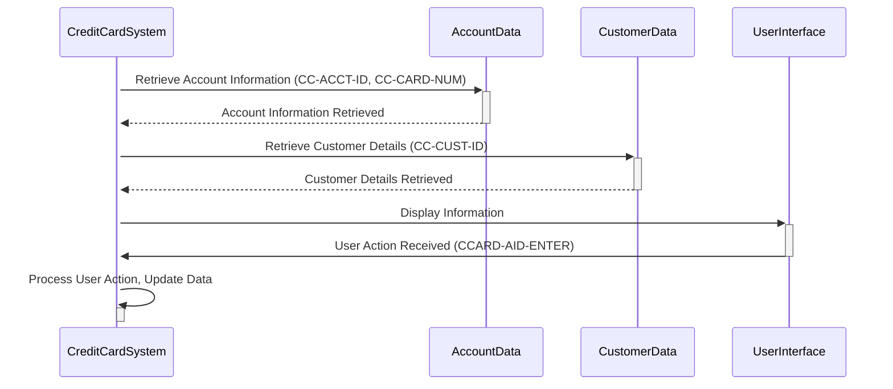

Gerado em: 1º de outubro de 2024

# **Título do Documento:** Sistema de Cartão de Crédito - Estrutura de Dados para Operações de Cartão de Crédito

# **Descrição Resumida:**
Este documento detalha a estrutura de dados utilizada em um sistema de cartão de crédito, com foco em como as informações da conta do cartão de crédito, os detalhes do cliente e as interações do usuário são armazenadas e acessadas. Esta estrutura é definida no copybook CVCRD01Y, que atua como um modelo para organizar essas informações dentro do sistema.

# **Histórias do Usuário:**
Como usuário do Sistema de Cartão de Crédito, preciso de uma maneira padronizada de armazenar e acessar as informações da conta do cartão de crédito, os detalhes do cliente e rastrear as interações do usuário para garantir o processamento eficiente e preciso das operações do cartão de crédito.

# **Epic Relacionado:**
3 - Gestão de Cartão de Crédito

# **Requisitos Funcionais:**
* **Identificação da Conta:** O sistema deve ser capaz de identificar exclusivamente cada conta de cartão de crédito. Isso é feito usando um identificador exclusivo armazenado no item de dados `CC-ACCT-ID`.
* **Gerenciamento do Número do Cartão:** O sistema deve ser capaz de armazenar e processar números de cartão de crédito. O item de dados `CC-CARD-NUM` é usado para essa finalidade e pode ser tratado como dados de texto e numéricos.
* **Associação do Cliente:** O sistema deve vincular as informações do cartão de crédito a um cliente específico. Isso é obtido armazenando um identificador de cliente exclusivo no item de dados `CC-CUST-ID`.
* **Interação da Interface do Usuário:** O sistema precisa lidar com as interações do usuário, como teclas pressionadas. Itens de dados como `CCARD-AID-ENTER` e `CCARD-AID-CLEAR` provavelmente representam ações como pressionar as teclas "Enter" ou "Clear".
* **Controle de Fluxo do Programa:** O sistema deve gerenciar o fluxo de operações, como navegar entre diferentes programas ou telas. Itens de dados como `CCARD-LAST-PROG` e `CCARD-NEXT-PROG` provavelmente armazenam os nomes dos programas envolvidos neste fluxo.

# **Requisitos Não Funcionais:**
* **Desempenho:** O acesso e a recuperação de dados da estrutura de dados devem ser rápidos e eficientes para evitar impactar o desempenho do sistema.
* **Manutenibilidade:** A estrutura de dados deve ser bem organizada e documentada para facilitar a manutenção e as atualizações.
* **Escalabilidade:** O design da estrutura de dados deve permitir a expansão futura e a adição de novos elementos de dados sem exigir alterações significativas no código.

# **Critérios de Aceitação:**
* A estrutura de dados representa com precisão as informações da conta do cartão de crédito, os detalhes do cliente e as interações do usuário, conforme definido nos requisitos.
* O sistema pode armazenar e recuperar dados com sucesso usando esta estrutura.
* A estrutura de dados se integra perfeitamente com outras partes do sistema de cartão de crédito.

# **Melhorias de Código:**
* **Validação de Dados:** Implemente verificações para garantir a validade dos dados que estão sendo armazenados na estrutura. Por exemplo, os números de cartão de crédito devem ser validados usando um algoritmo de checksum.
* **Documentação:** Adicione comentários claros para explicar a finalidade de cada item de dados e como ele é usado no sistema.
* **Padronização:** Se possível, alinhe a estrutura de dados com quaisquer padrões do setor para troca ou armazenamento de dados para melhorar a interoperabilidade com outros sistemas.

# **Melhorias de Segurança:**
* **Criptografia de Dados:** Criptografe dados confidenciais, como números de cartão de crédito, para protegê-los de acesso não autorizado.
* **Controle de Acesso:** Implemente mecanismos para restringir o acesso à estrutura de dados e seus elementos com base nas funções e permissões do usuário.
* **Registro de Auditoria:** Rastreie todos os acessos e modificações na estrutura de dados para fins de auditoria e segurança.

# **Diagrama Conceitual:**

--Made by "Smart Engineering" (by Compass.UOL)--