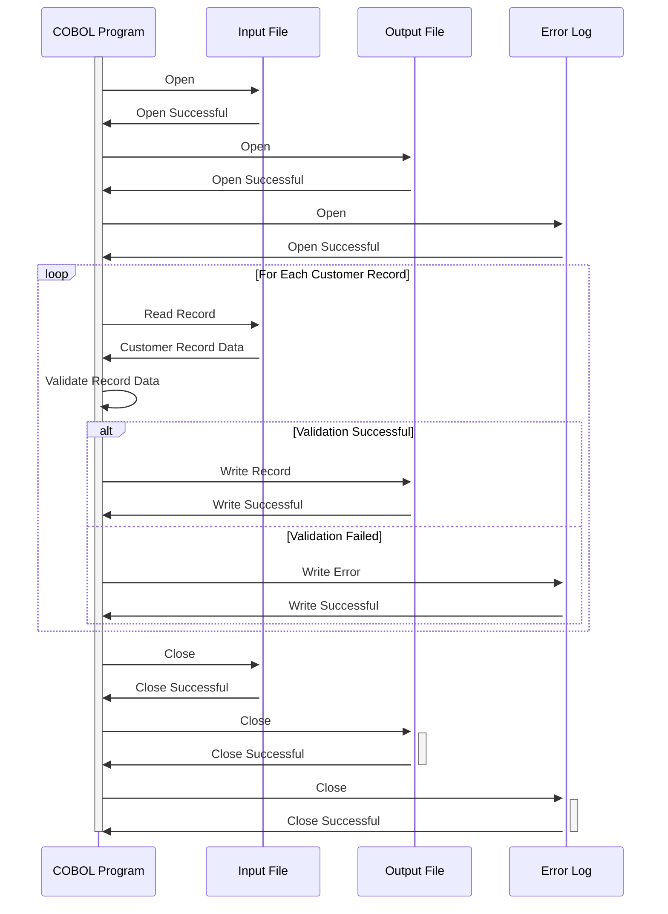

Gerado em: 1º de outubro de 2024

# **Título do Documento:** Programa de Validação e Processamento de Dados do Cliente

## **Descrição Resumida:**

Este programa valida os dados do cliente a partir de um arquivo de entrada. Ele verifica o formato e o conteúdo de cada campo no registro do cliente, garantindo a integridade dos dados. Somente os registros válidos são gravados em um arquivo de saída, enquanto os registros inválidos são registrados para revisão e correção.

## **Histórias do Usuário:**

Como analista de dados, preciso garantir que apenas dados de clientes válidos e consistentes sejam usados para análise e relatórios. Este programa me ajuda a conseguir isso validando automaticamente os dados e isolando quaisquer registros incorretos.

## **Épico Relacionado:**
8 - Gestão de Dados do Cliente

## **Requisitos Funcionais:**

1. **Ler Registros do Cliente:** O programa lê os registros do cliente de um arquivo de entrada. O formato do arquivo e o layout do registro são definidos no copybook CVCUS01Y.

2. **Validar Campos de Dados:** O programa valida cada campo no registro do cliente de acordo com as seguintes regras:
    - **CUST-ID:**
        - Deve ser um valor numérico.
        - Deve ser exclusivo (IDs de cliente duplicados não são permitidos).
    - **CUST-FIRST-NAME, CUST-MIDDLE-NAME, CUST-LAST-NAME:**
        - Deve conter apenas caracteres alfabéticos (A-Z, a-z) e espaços.
        - Não deve exceder o comprimento máximo do campo.
    - **CUST-ADDR-LINE-1, CUST-ADDR-LINE-2, CUST-ADDR-LINE-3:**
        - Não deve exceder o comprimento máximo do campo.
    - **CUST-ADDR-STATE-CD:**
        - Deve ser um código de estado válido dos EUA com duas letras (por exemplo, CA, NY).
    - **CUST-ADDR-COUNTRY-CD:**
        - Deve ser um código de país válido com três letras (por exemplo, USA, CAN).
    - **CUST-ADDR-ZIP:**
        - Deve ser um código postal válido de cinco ou nove dígitos.
    - **CUST-PHONE-NUM-1, CUST-PHONE-NUM-2:**
        - Deve ser um formato de número de telefone válido (por exemplo, (XXX) XXX-XXXX).
    - **CUST-SSN:**
        - Deve ser um valor numérico de nove dígitos.
        - Deve ser exclusivo (números de SSN duplicados não são permitidos).
    - **CUST-GOVT-ISSUED-ID:**
        - Não deve exceder o comprimento máximo do campo.
    - **CUST-DOB-YYYY-MM-DD:**
        - Deve ser uma data válida no formato AAAA-MM-DD.
        - Deve representar uma data no passado.
    - **CUST-EFT-ACCOUNT-ID:**
        - Não deve exceder o comprimento máximo do campo.
    - **CUST-PRI-CARD-HOLDER-IND:**
        - Deve ser um único caractere, 'Y' (Sim) ou 'N' (Não).
    - **CUST-FICO-CREDIT-SCORE:**
        - Deve ser um valor numérico entre 300 e 850.

3. **Gerenciar Registros Inválidos:** Se alguma regra de validação falhar para um registro:
    - O registro inteiro é sinalizado como inválido.
    - Uma mensagem de erro é registrada, especificando os detalhes do registro e a regra de validação que falhou.
    - O registro inválido não é gravado no arquivo de saída.

4. **Gravar Registros Válidos:** Se todas as regras de validação forem aprovadas para um registro:
    - O registro é gravado no arquivo de saída.
    - O arquivo de saída usa o mesmo formato e layout de registro do arquivo de entrada, garantindo consistência.

5. **Registro em Log:** O programa mantém um arquivo de log que registra:
    - A hora de início e término do processo de validação.
    - O número de registros processados.
    - O número de registros válidos gravados no arquivo de saída.
    - O número de registros inválidos encontrados.
    - Mensagens de erro detalhadas para cada registro inválido, incluindo a regra de validação específica que falhou.

## **Requisitos Não Funcionais:**

- **Desempenho:** O programa deve processar arquivos de entrada grandes (por exemplo, milhões de registros) com eficiência em um prazo razoável.
- **Confiabilidade:** O programa deve ser robusto e lidar com erros inesperados normalmente sem travar ou corromper dados.
- **Manutenibilidade:** O código deve ser bem estruturado, documentado e fácil de entender e modificar para aprimoramentos futuros.
- **Segurança:**
    - O programa deve ter controles de acesso apropriados para evitar acesso não autorizado a dados confidenciais do cliente (por exemplo, SSN).
    - Considere implementar criptografia de dados para campos confidenciais em repouso e em trânsito.
    - Registre todas as tentativas de acesso a dados para fins de auditoria.

## **Critérios de Aceitação:**

- O programa lê e processa com sucesso todos os registros de clientes do arquivo de entrada.
- Todas as regras de validação de dados são implementadas corretamente e o programa identifica com precisão os registros inválidos.
- Somente os registros válidos são gravados no arquivo de saída, mantendo a integridade dos dados.
- Os registros inválidos são registrados com mensagens de erro detalhadas, facilitando a correção de dados.
- O programa lida com arquivos de entrada grandes com eficiência e conclui o processamento em um prazo aceitável.
- O programa é robusto e lida com erros inesperados normalmente, registrando-os para solução de problemas.

## **Melhorias de Código:**

- Implemente um design modular com funções separadas ou sub-rotinas para cada regra de validação. Isso melhora a legibilidade do código, a capacidade de manutenção e a capacidade de teste.
- Use nomes de variáveis descritivos e adicione comentários para explicar a lógica por trás das regras de validação.
- Implemente o tratamento de erros para operações de arquivo (por exemplo, abrir, ler, gravar, fechar) para evitar perda de dados e melhorar a confiabilidade do programa.

## **Melhorias de Segurança:**

- Implemente controles de acesso para restringir a execução do programa e o acesso a dados apenas ao pessoal autorizado.
- Considere criptografar campos de dados confidenciais (por exemplo, SSN, ID de conta EFT) em repouso e em trânsito para proteger a privacidade do cliente.
- Implemente o registro em log para todas as tentativas de acesso a dados, incluindo ID do usuário, carimbo de data/hora e ações executadas. Isso ajuda a rastrear possíveis violações de dados e garante a responsabilidade.

## **Diagrama Conceitual:**

--Made by "Smart Engineering" (by Compass.UOL)--