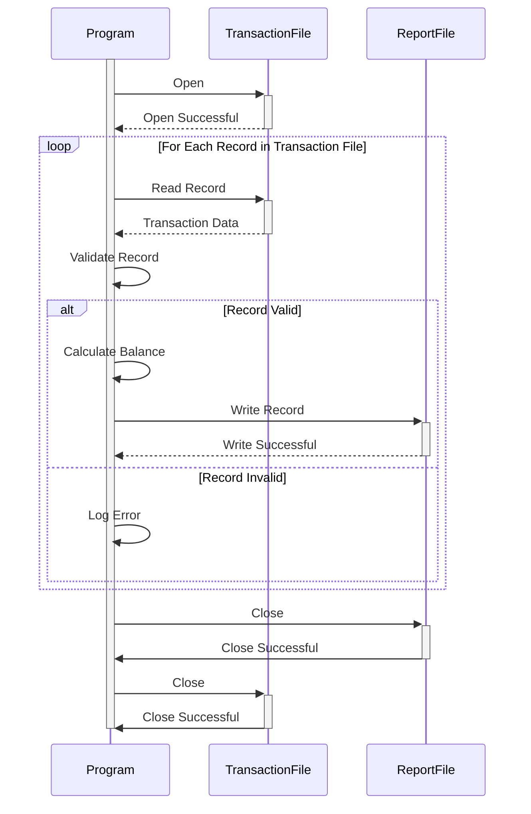

Gerado em: 1º de outubro de 2024

**Título do Documento:** Especificação do Programa Relatório de Saldo da Categoria de Transação

**Descrição Resumida:** Este programa extrai, processa e resume informações de saldo da categoria de transação para relatórios financeiros e análise.

**Histórias do Usuário:** Como analista financeiro, preciso acessar e analisar os saldos das categorias de transações para gerar relatórios financeiros precisos e obter insights sobre padrões de gastos.

**Épico Relacionado:** 4 - Processamento de Transações

**Requisitos Funcionais:**
1. **Extração de Dados:**
   - Ler registros de transações do arquivo de entrada (`TRAN-CAT-BAL-RECORD`).
2. **Validação de Dados:**
   - Validar `TRANCAT-ACCT-ID` em relação aos registros de contas existentes.
   - Validar `TRANCAT-TYPE-CD` em relação a uma lista predefinida de tipos de transações válidos.
   - Validar `TRANCAT-CD` para garantir que esteja alinhado com as categorias de transação definidas.
3. **Cálculo de Saldo:**
   - Calcular o saldo para cada combinação exclusiva de `TRANCAT-ACCT-ID`, `TRANCAT-TYPE-CD` e `TRANCAT-CD`.
4. **Relatórios:**
   - Gerar um relatório resumindo o saldo para cada categoria de transação.
   - O relatório deve incluir:
     - ID da conta
     - Código do Tipo de Transação
     - Código da Categoria de Transação
     - Saldo

**Requisitos Não Funcionais:**
- **Desempenho:** O programa deve processar grandes volumes de dados de transações com eficiência.
- **Confiabilidade:** O programa deve ser confiável e produzir resultados precisos de forma consistente.
- **Manutenibilidade:** O código deve ser bem estruturado, documentado e fácil de manter.
- **Segurança:** O acesso a dados financeiros confidenciais deve ser restrito a pessoal autorizado.

**Critérios de Aceitação:**
- O programa extrai e valida com sucesso os dados de saldo da categoria de transação.
- O programa calcula e relata com precisão os saldos para cada categoria de transação.
- O programa lida com erros normalmente e fornece mensagens de erro informativas.
- O programa atende aos requisitos de desempenho para processamento de grandes conjuntos de dados.

**Melhorias de Código:**
- Implementar o registro em log para melhor rastreamento e depuração.
- Introduzir tratamento de erros para potenciais inconsistências de dados ou problemas de acesso a arquivos.
- Otimizar o algoritmo de cálculo de saldo para melhorar o desempenho.
- Adicionar comentários ao código para melhorar a legibilidade e a capacidade de manutenção.

**Melhorias de Segurança:**
- Implementar controles de acesso para restringir o acesso a dados a usuários autorizados.
- Criptografar dados financeiros confidenciais em trânsito e em repouso.
- Registrar todas as tentativas de acesso a dados para fins de auditoria.

**Diagrama Conceitual:**

--Made by "Smart Engineering" (by Compass.UOL)--