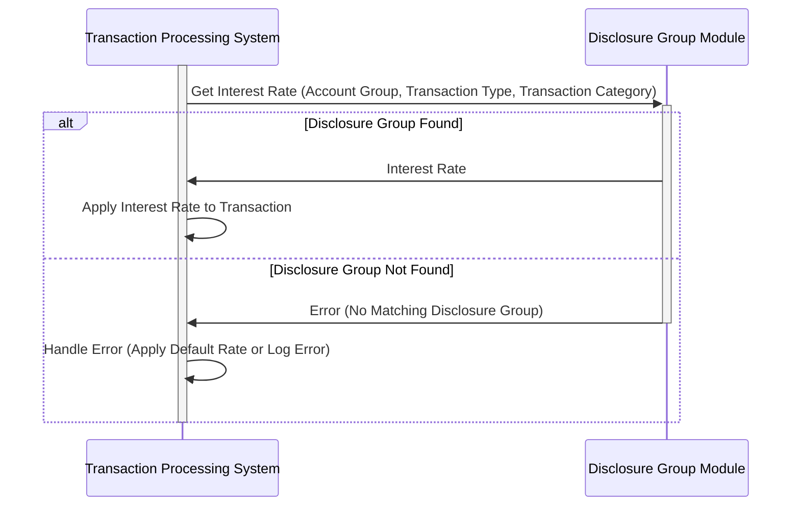

Gerado em: 1º de outubro de 2024

# **Título do Documento:** CardDemo - Especificação da Estrutura do Grupo de Divulgação

# **Descrição Resumida:**

Este documento descreve a estrutura do "Grupo de Divulgação" dentro do aplicativo CardDemo. Essa estrutura é usada para determinar a taxa de juros aplicada às transações com cartão de crédito com base no tipo de conta, tipo de transação e categoria da transação.

# **Histórias do Usuário:**

Como analista financeiro, preciso garantir que o sistema aplique as taxas de juros corretas aos diferentes tipos de transações com cartão de crédito para que possamos calcular com precisão a receita de juros e as declarações do cliente.

# **Épico Relacionado:**
3 - Gestão de Cartão de Crédito

# **Requisitos Funcionais:**

1. **Definir Grupo de Divulgação:** O sistema deve permitir a definição de um Grupo de Divulgação com uma combinação exclusiva de Grupo de Conta, Tipo de Transação e Categoria de Transação.
2. **Atribuir Taxa de Juros:** Cada Grupo de Divulgação deve ter uma taxa de juros associada.
3. **Recuperar Taxa de Juros:** O sistema deve ser capaz de recuperar a taxa de juros correta para uma transação com base em seu Grupo de Divulgação associado.

**Regras de Negócio:**

* **Grupo de Divulgação Exclusivo:** O sistema deve garantir que cada combinação de Grupo de Conta, Tipo de Transação e Categoria de Transação seja exclusiva dentro da estrutura do Grupo de Divulgação.
* **Taxa de Juros Válida:** O sistema deve validar se a taxa de juros atribuída a um Grupo de Divulgação é um valor numérico válido e está dentro de um intervalo aceitável predefinido.
* **Determinação da Taxa de Juros da Transação:**
    * Quando uma transação ocorre, o sistema deve determinar a taxa de juros aplicável combinando o Grupo de Conta, o Tipo de Transação e a Categoria de Transação da transação com o Grupo de Divulgação correspondente.
    * Se um Grupo de Divulgação correspondente for encontrado, o sistema aplica a taxa de juros associada à transação.
    * Se nenhum Grupo de Divulgação correspondente for encontrado, o sistema deve aplicar uma taxa de juros padrão ou acionar uma condição de erro, dependendo da regra de negócio.

# **Requisitos Não Funcionais:**

* **Desempenho:** A recuperação da taxa de juros com base no Grupo de Divulgação deve ser rápida e eficiente para evitar impacto nos tempos de processamento de transações.
* **Manutenibilidade:** A estrutura deve ser facilmente manutenível, permitindo a adição, modificação ou exclusão de Grupos de Divulgação e suas taxas de juros associadas.
* **Auditabilidade:** Todas as alterações na estrutura do Grupo de Divulgação, incluindo a criação, modificação e exclusão de grupos e taxas de juros, devem ser registradas para fins de auditoria.

# **Critérios de Aceitação:**

* O sistema define e armazena com sucesso Grupos de Divulgação com combinações exclusivas de Grupo de Conta, Tipo de Transação e Categoria de Transação.
* O sistema recupera corretamente a taxa de juros atribuída para um determinado Grupo de Divulgação.
* O sistema aplica a taxa de juros correta às transações com base em seu Grupo de Divulgação associado.
* Todas as alterações feitas nos Grupos de Divulgação são registradas e auditáveis.

# **Melhorias de Código:**

* **Tratamento de Erros:** Implemente um tratamento de erros robusto para cenários como entradas de taxa de juros inválidas e tentativas de criar Grupos de Divulgação duplicados.
* **Validação de Dados:** Adicione verificações de validação de dados para garantir a integridade dos dados armazenados na estrutura do Grupo de Divulgação, como validar o formato dos códigos de Grupo de Conta, Tipo de Transação e Categoria de Transação.
* **Comentários de Código:** Adicione comentários claros e concisos ao código para melhorar a legibilidade e a compreensão da estrutura do Grupo de Divulgação e seu uso.

# **Melhorias de Segurança:**

* **Controle de Acesso:** Implemente medidas adequadas de controle de acesso para restringir a modificação de Grupos de Divulgação e taxas de juros apenas ao pessoal autorizado.
* **Criptografia de Dados:** Considere criptografar dados confidenciais dentro da estrutura do Grupo de Divulgação, particularmente as taxas de juros, para proteger contra acesso não autorizado.

# **Diagrama Conceitual:**

--Made by "Smart Engineering" (by Compass.UOL)--