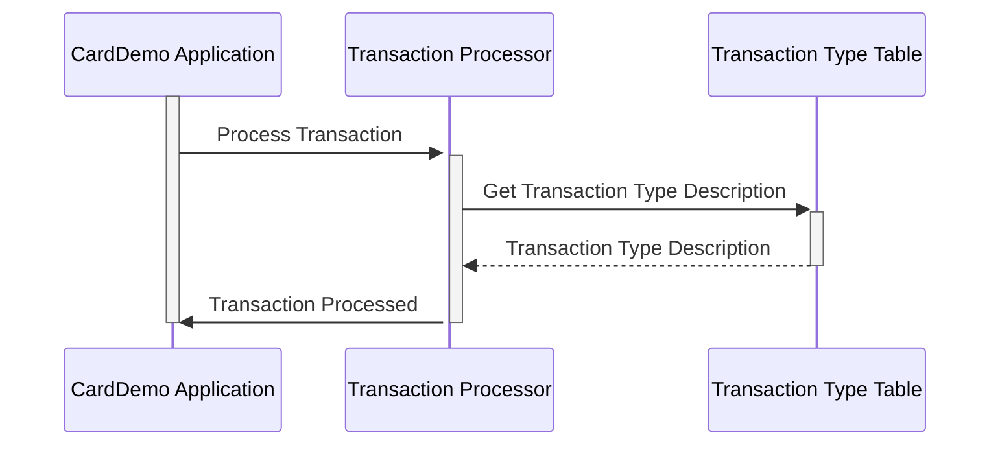

--CONTEÚDO TRADUZIDO--
Gerado em: 1º de outubro de 2024

**Título do Documento:** Especificação da Estrutura de Dados do Tipo de Transação CardDemo

**Descrição Resumida:** 
Este documento descreve a estrutura e o propósito da estrutura de dados `TRAN-TYPE-RECORD` dentro do aplicativo CardDemo. Essa estrutura é crucial para categorizar e descrever diferentes tipos de transações com cartão de crédito, garantindo processamento e relatórios precisos.

**Histórias do Usuário:** 
Como analista de dados, preciso identificar e entender facilmente os tipos de transações com cartão de crédito que estão sendo processadas para que eu possa realizar análises e relatórios precisos.

**Épico Relacionado:** 4 - Processamento de Transações

**Requisitos Funcionais:**
- O sistema deve definir uma estrutura de dados padrão (`TRAN-TYPE-RECORD`) para armazenar informações sobre o tipo de transação.
- A estrutura de dados deve incluir um código de dois caracteres (`TRAN-TYPE`) para representar o tipo de transação.
- A estrutura de dados deve incluir um rótulo descritivo (`TRAN-TYPE-DESC`) para o tipo de transação.

**Requisitos Não Funcionais:**
- N/A

**Critérios de Aceitação:**
- A estrutura de dados `TRAN-TYPE-RECORD` está definida no sistema.
- Cada tipo de transação definido tem um código exclusivo de dois caracteres e um rótulo descritivo.
- O sistema usa a estrutura `TRAN-TYPE-RECORD` para categorizar e armazenar informações sobre o tipo de transação.

**Melhorias de Código:**
- Adicione comentários inline para esclarecer o propósito e o uso de cada campo na estrutura de dados.
- Crie um programa ou módulo separado para gerenciar a lista de tipos de transações e seus respectivos códigos e descrições. Isso melhoraria a manutenção e reduziria o risco de erros.

**Melhorias de Segurança:**
- N/A

**Diagrama Conceitual:**

--Made by "Smart Engineering" (by Compass.UOL)--