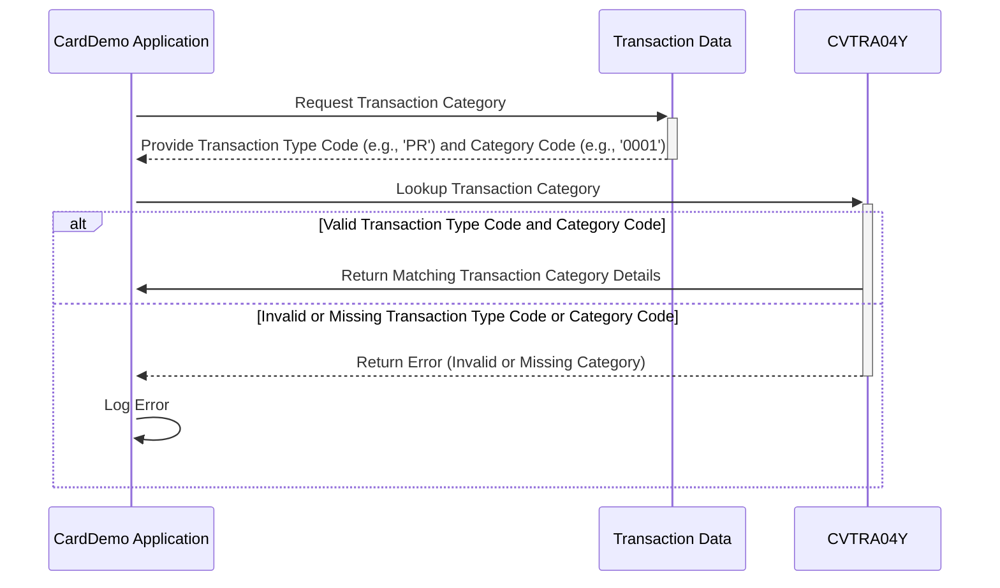

Gerado em: 1º de outubro de 2024

# **Título do Documento:** Especificação da Estrutura de Dados da Categoria de Transação CardDemo

# **Descrição Resumida:**
Este documento descreve a estrutura de dados usada pelo aplicativo CardDemo para categorizar transações de cartão de crédito. Essa categorização é essencial para relatórios precisos e análise de dados de transações.

# **Histórias do Usuário:**
Como analista de dados, preciso garantir que todas as transações sejam categorizadas de forma consistente para que eu possa gerar relatórios precisos e realizar análises significativas das tendências de transações.

# **Épico Relacionado:**
4 - Processamento de Transações

# **Requisitos Funcionais:**
- O sistema deve fornecer uma estrutura padronizada para definir e armazenar informações sobre diferentes categorias de transações.
- Cada categoria de transação deve ser identificada exclusivamente por uma combinação de um Código de Tipo de dois caracteres e um Código de Categoria de quatro dígitos.
- Cada categoria de transação deve ter uma descrição clara e concisa para facilitar a compreensão e o relatório.
- O sistema deve garantir que cada transação esteja associada a uma categoria de transação válida.

# **Requisitos Não Funcionais:**
- **Desempenho:** O processo de categorização de transações deve ser eficiente e não impactar o desempenho geral do sistema.
- **Manutenibilidade:** A estrutura de dados deve ser facilmente manutenível e extensível para acomodar novas categorias de transações conforme necessário.
- **Usabilidade:** Os códigos de categoria e descrições devem ser fáceis de entender para usuários que não estão familiarizados com os detalhes técnicos do sistema.

# **Critérios de Aceitação:**
- O sistema categoriza as transações com sucesso com base nos Códigos de Tipo e Categoria definidos.
- Cada categoria de transação tem uma combinação exclusiva de Código de Tipo e Código de Categoria.
- Todas as categorias de transações têm descrições claras e concisas.
- O sistema lida com categorias de transações inválidas ou indefinidas normalmente e registra mensagens de erro apropriadas.

# **Melhorias de Código:**
- Implementar verificações de validação de dados para garantir que os valores do Código de Tipo e do Código de Categoria estejam dentro dos intervalos e formatos definidos.
- Adicionar lógica de tratamento de erros para lidar normalmente com situações em que uma transação não pode ser categorizada devido a informações de categoria ausentes ou inválidas.
- Criar um módulo ou classe separado para encapsular a estrutura de dados da categoria de transação e funcionalidades relacionadas.
- Fornecer documentação abrangente para a estrutura de dados e seu uso.

# **Melhorias de Segurança:**
- Implementar mecanismos de controle de acesso para restringir modificações não autorizadas nos dados da categoria de transação.
- Registrar todas as alterações feitas nos dados da categoria de transação para fins de auditoria.
- Revisar e atualizar regularmente as definições de categoria de transação para garantir que estejam alinhadas com os requisitos de negócios e padrões de segurança mais recentes.

# **Diagrama Conceitual:**

--Made by "Smart Engineering" (by Compass.UOL)--