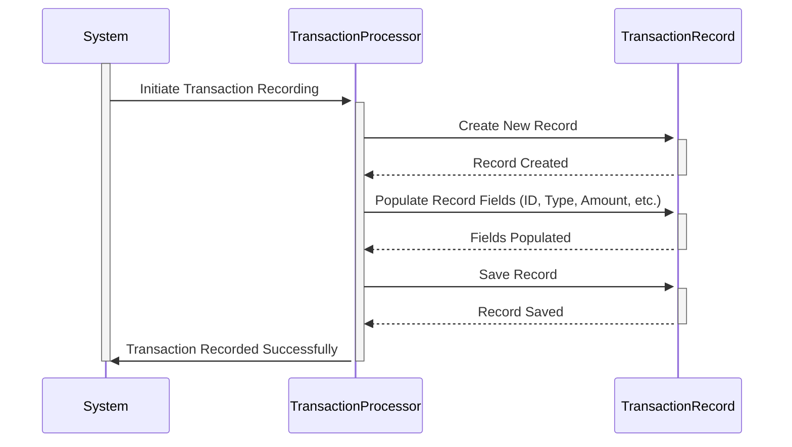

Gerado em: 1º de outubro de 2024

# **Título do Documento:** Especificação de Registro de Transação de Cartão de Crédito

# **Descrição Resumida:**
Este documento descreve a estrutura de dados para registrar transações individuais de cartão de crédito dentro de um sistema financeiro baseado em COBOL. Seu objetivo é garantir a uniformidade e a consistência na forma como essas informações são capturadas e armazenadas.

# **Histórias do Usuário:**
Como analista financeiro, preciso de um formato padronizado para registrar os detalhes da transação para que eu possa analisar padrões de gastos, identificar tendências e gerar relatórios abrangentes com precisão.

# **Épico Relacionado:**
4 - Processamento de Transações

# **Requisitos Funcionais:**
- O sistema deve suportar uma variedade de tipos de transação, cada um identificado por um código exclusivo de dois caracteres (por exemplo, "SA" para Venda, "CR" para Crédito).
- Cada registro de transação deve incluir uma descrição detalhada do comerciante envolvido, incluindo sua identificação única, nome, cidade e CEP.
- O sistema deve registrar com precisão o valor monetário de cada transação, capturando o valor com duas casas decimais para precisão.
- Cada registro de transação deve ter um carimbo de data e hora para indicar o horário original da transação e quando ela foi processada pelo sistema.

# **Requisitos Não Funcionais:**
- **Desempenho:** O sistema deve ser capaz de processar e armazenar um grande volume de registros de transações com eficiência, sem impactar o desempenho geral do sistema. 
- **Integridade de Dados:** O sistema deve aplicar regras de validação de dados para garantir a precisão e consistência dos dados de transação (por exemplo, formatos de data válidos, campos obrigatórios).
- **Auditabilidade:** Todos os registros de transações devem estar prontamente acessíveis para fins de auditoria, com rastreabilidade clara até a origem da transação.

# **Critérios de Aceitação:**
- O sistema pode registrar com sucesso uma nova transação com todos os campos de dados obrigatórios preenchidos corretamente.
- O sistema aplica regras de validação de dados, rejeitando transações com dados inválidos ou ausentes.
- Os registros de transações podem ser facilmente recuperados e filtrados com base em critérios como intervalo de datas, tipo de transação ou número do cartão.

# **Melhorias de Código:**
- **Tratamento de Erros:** Implementar tratamento de erros mais robusto para gerenciar cenários como entradas de dados inválidas ou falhas do sistema durante o processamento de transações.
- **Comentários de Código:** Adicionar comentários claros e concisos dentro do código COBOL para explicar o propósito e a funcionalidade de diferentes campos de dados e seções.

# **Melhorias de Segurança:**
- **Criptografia de Dados:** Explorar a criptografia de dados confidenciais dentro do registro de transação, como o número do cartão de crédito, para protegê-lo de acesso não autorizado.
- **Controle de Acesso:** Implementar medidas rígidas de controle de acesso para garantir que apenas pessoal autorizado possa visualizar, modificar ou excluir registros de transações.

# **Diagrama Conceitual:**

--Made by "Smart Engineering" (by Compass.UOL)--