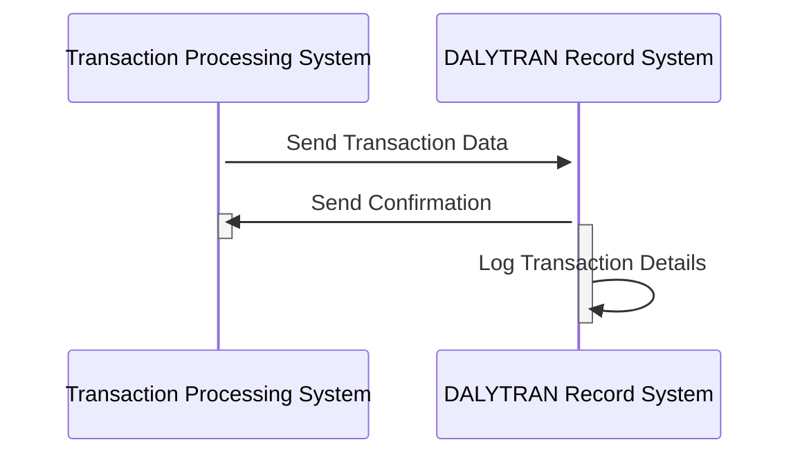

Gerado em: 1º de outubro de 2024

# **Título do Documento:** Especificação de Registro de Transação de Cartão

# **Descrição Resumida:**
Este documento descreve a estrutura e os elementos de dados do Registro de Transação Diária, que captura informações abrangentes para cada transação de cartão de crédito, garantindo dados organizados para processamento, análise e geração de relatórios.

# **Cenários de Usuário:**
Como analista de dados, preciso garantir que todas as transações de cartão de crédito sejam registradas e categorizadas com precisão para que eu possa realizar análises significativas sobre padrões de gastos, atividade do comerciante e possível fraude.

# **Epic Relacionado:** 
4 - Processamento de Transações

# **Requisitos Funcionais:**
- O sistema deve registrar cada transação de cartão de crédito com um ID exclusivo, código de tipo de transação, código de categoria, origem, descrição, valor, detalhes do comerciante (ID, nome, cidade, CEP), número do cartão e carimbos de data/hora para início e processamento.
- O sistema deve validar a exclusividade de cada ID de transação para evitar duplicação.
- O sistema deve garantir que os códigos de tipo de transação e categoria estejam em conformidade com os valores predefinidos para manter a consistência dos dados.

# **Requisitos Não Funcionais:**
- **Segurança:** O sistema deve criptografar dados confidenciais, incluindo números de cartão de crédito, para proteger contra acesso não autorizado. O acesso aos registros de transações deve ser restrito a pessoal autorizado.
- **Desempenho:** O sistema deve lidar com um alto volume de transações com eficiência, garantindo o registro e a recuperação oportunos dos dados.
- **Disponibilidade:** O sistema deve estar disponível 24 horas por dia, 7 dias por semana, com tempo de inatividade mínimo para suportar o processamento de transações em tempo real.
- **Auditabilidade:** O sistema deve registrar todas as ações relacionadas aos registros de transações para fins de auditoria e rastreamento.

# **Critérios de Aceitação:**
- O sistema registra com sucesso todas as transações de cartão de crédito com informações completas e precisas.
- O sistema evita registros de transações duplicados com base no ID de transação exclusivo.
- O sistema aplica regras de validação de dados para tipos de transação e códigos de categoria.
- O sistema protege dados confidenciais por meio de criptografia e mecanismos de controle de acesso.
- O sistema exibe desempenho satisfatório no tratamento de um alto volume de transações.

# **Melhorias de Código:**
- Implementar verificações de validação de dados para todos os campos dentro do DALYTRAN-RECORD para garantir a integridade dos dados.
- Incorporar mecanismos de tratamento de erros para gerenciar eventos inesperados durante o registro da transação.
- Adicionar registro abrangente para rastrear todas as ações e eventos relacionados aos registros de transações.
- Explorar técnicas de otimização de desempenho, como indexação ou particionamento de dados, para aumentar a eficiência.

# **Melhorias de Segurança:**
- Implementar algoritmos de criptografia fortes para dados confidenciais, tanto em trânsito quanto em repouso.
- Impor medidas rígidas de controle de acesso com base em funções e permissões do usuário.
- Auditar regularmente o sistema para vulnerabilidades de segurança e implementar os patches necessários.

# **Diagrama Conceitual:**

--Made by "Smart Engineering" (by Compass.UOL)--