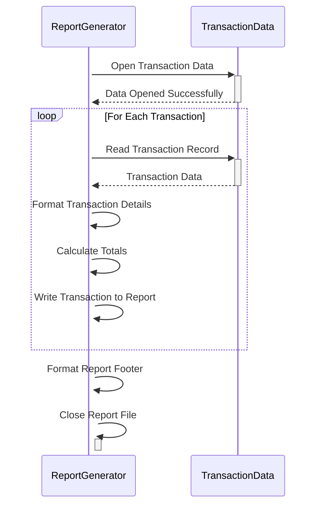

Gerado em: 1º de outubro de 2024

**Título do Documento:** Especificação de Layout do Relatório de Transações de Cartão

**Descrição Resumida:** Este documento define o layout de um relatório de transações para um sistema de cartão de crédito, detalhando como os dados de transação devem ser organizados e apresentados.

**Histórias do Usuário:** Como analista de dados, preciso de um relatório de transações padronizado para analisar padrões de transações diárias, identificar tendências e gerar insights para decisões de negócios.

**Epic Relacionado:** 5 - Relatórios e Análise

**Requisitos Funcionais:**
1. **Cabeçalho do Relatório:** O relatório deve incluir uma seção de cabeçalho exibindo:
    - Título do Relatório: "Relatório de Transações Diárias"
    - Intervalo de Datas: As datas de início e término das transações cobertas no relatório.
2. **Detalhes da Transação:** Cada registro de transação no relatório deve conter os seguintes detalhes:
    - ID da Transação: Identificador exclusivo para cada transação.
    - ID da Conta: A conta associada à transação.
    - Tipo de Transação: Código e descrição do tipo de transação (por exemplo, compra, pagamento, saque).
    - Categoria: Código e descrição da categoria da transação (por exemplo, jantar, viagens, entretenimento).
    - Origem da Transação: O canal pelo qual a transação foi feita (por exemplo, online, terminal POS, ATM).
    - Valor: O valor monetário da transação.
3. **Cabeçalhos de Coluna:** O relatório deve ter cabeçalhos de coluna claros e concisos para cada campo de dados na seção de detalhes da transação.
4. **Totais:** O relatório deve calcular e exibir totais em três níveis:
    - Total da Página: A soma dos valores das transações em cada página.
    - Total da Conta: A soma dos valores das transações para cada conta exclusiva.
    - Total Geral: A soma de todos os valores das transações no relatório.

**Requisitos Não Funcionais:**
1. **Legibilidade:** O relatório deve ser fácil de ler e entender, usando formatação, alinhamento e espaçamento adequados.
2. **Precisão:** Todos os cálculos no relatório, incluindo totais de página, totais de conta e o total geral, devem ser precisos e consistentes com os dados da transação.
3. **Consistência:** O formato do relatório deve ser consistente entre as diferentes gerações de relatório, garantindo uniformidade para análise e comparação.

**Critérios de Aceitação:**
- O relatório gerado reflete com precisão o layout definido, incluindo todas as informações de cabeçalho necessárias, detalhes da transação e totais.
- O relatório é gerado em tempo hábil mediante solicitação ou gatilho.
- Todos os dados no relatório são precisos e consistentes com os dados de transação de origem.
- A formatação e o layout do relatório aumentam a legibilidade e facilitam a análise dos dados da transação.

**Melhorias de Código:**
- Implementar um mecanismo de registro em log para rastrear eventos de geração de relatórios, incluindo timestamps, IDs de usuário e quaisquer erros encontrados.
- Introduzir tratamento de erros para gerenciar situações em que faltam dados ou são inválidos, evitando falhas na geração de relatórios.
- Adicionar comentários ao código para explicar o propósito e a lógica de diferentes seções, melhorando a manutenção do código.

**Melhorias de Segurança:**
- Implementar controles de acesso para restringir a geração e visualização de relatórios apenas ao pessoal autorizado.
- Se o relatório contiver dados confidenciais, considere a incorporação de técnicas de mascaramento ou criptografia de dados para proteger informações confidenciais.
- Manter uma trilha de auditoria das atividades de acesso e geração de relatórios para garantir a responsabilidade e rastrear o acesso não autorizado em potencial.

**Diagrama Conceitual:**

--Made by "Smart Engineering" (by Compass.UOL)--