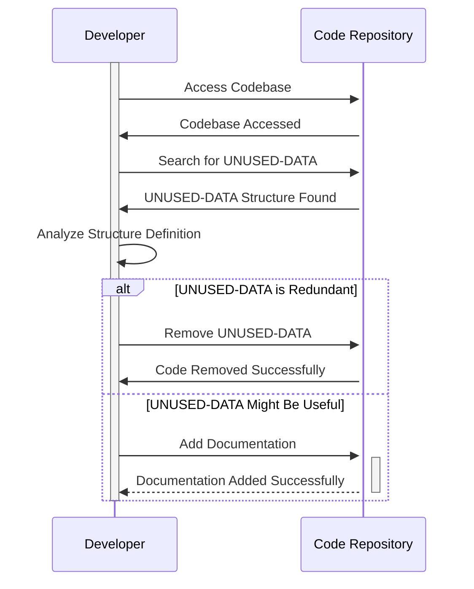

Gerado em: 1º de outubro de 2024

# **Título do Documento:** Especificação da Estrutura UNUSED-DATA

# **Descrição Resumida:**
Este documento descreve uma estrutura de dados chamada `UNUSED-DATA` encontrada no código-fonte do aplicativo CardDemo. A estrutura parece ser um remanescente de uma versão anterior e não está sendo utilizada ativamente no sistema atual.

# **Histórias do Usuário:**
Como Desenvolvedor do Aplicativo, preciso entender o propósito e a relevância de todas as estruturas de dados no código-fonte, incluindo aquelas marcadas como não utilizadas, para manter a clareza do código e potencialmente reutilizar as estruturas existentes.

# **Épico Relacionado:** 9 - Utilitários do Sistema

# **Requisitos Funcionais:**
Nenhum. A estrutura `UNUSED-DATA` não está sendo utilizada atualmente e não possui funcionalidades associadas.

# **Requisitos Não Funcionais:**
N/A

# **Critérios de Aceite:**
N/A

# **Melhorias de Código:**
1. **Investigar o Propósito:** Realize uma revisão completa do código-fonte e histórico de versões para determinar o propósito original da estrutura `UNUSED-DATA`.
2. **Considerar a Remoção:** Se for confirmado que a estrutura não está sendo utilizada e não há planos de uso futuro, remova-a do código-fonte para reduzir a desordem e melhorar a manutenção.
3. **Documentar a Justificativa:** Se a estrutura for mantida para fins históricos ou potencial uso futuro, adicione comentários claros e detalhados explicando seu histórico, o motivo do status "não utilizado" e quaisquer planos futuros potenciais para sua utilização.

# **Melhorias de Segurança:**
N/A

# **Diagrama Conceitual:**

--Made by "Smart Engineering" (by Compass.UOL)--