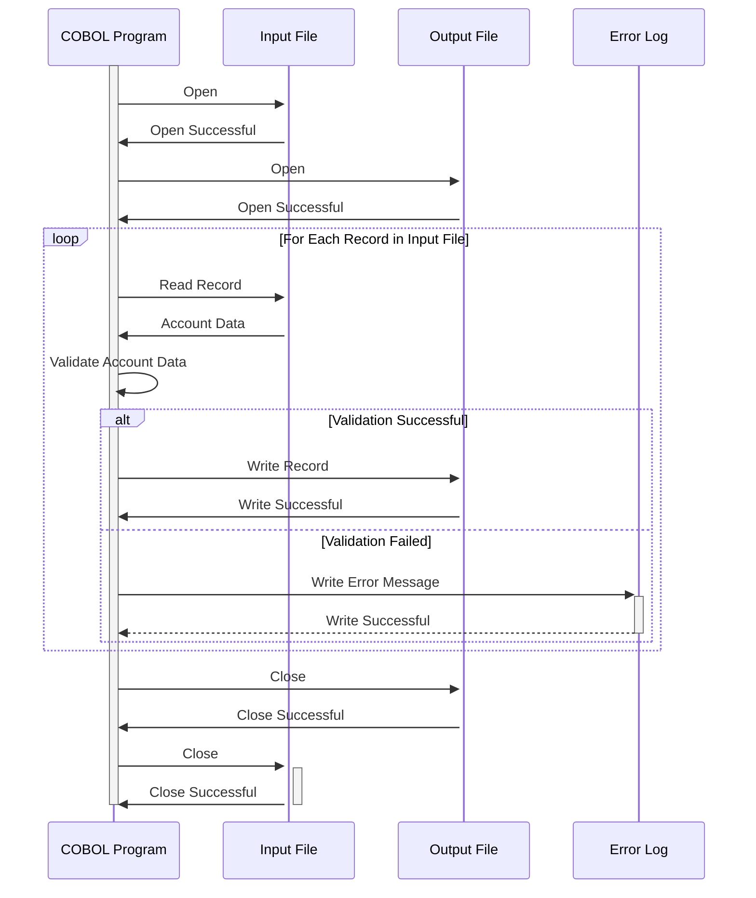

Gerado em: 1º de outubro de 2024

# **Título do Documento:** Processador de Atualização de Conta de Cartão de Crédito

# **Descrição Resumida:**
Este documento descreve as especificações para um programa COBOL projetado para processar atualizações de contas de cartão de crédito. O programa lê os dados da conta de um arquivo de entrada, valida os dados de acordo com as regras de negócios predefinidas e grava os registros válidos em um arquivo de saída. Quaisquer erros encontrados durante o processamento são registrados para posterior investigação e correção.

# **Histórias do Usuário:**
Como analista de dados, preciso garantir que apenas informações válidas e atualizadas da conta do cartão de crédito sejam usadas para análise e geração de relatórios. Este programa me ajuda a conseguir isso validando dados e isolando quaisquer registros que não atendam aos critérios definidos.

# **Épico Relacionado:**
2 - Gestão de Contas

# **Requisitos Funcionais:**

1.  **Leitura do Arquivo de Entrada:**
    *   O programa deve ser capaz de ler dados da conta do cartão de crédito de um arquivo de entrada predefinido.
    *   O formato do arquivo de entrada e o layout do registro devem seguir a estrutura definida no copybook `COACTUP.CPY`.

2.  **Validação de Dados:**
    *   **Status da Conta:** Verifique se o código de status da conta (`ACSTTUSI`) é válido (por exemplo, 'A' para Ativo, 'C' para Cancelado). Se um código inválido for encontrado, o registro deverá ser sinalizado como inválido e um erro deverá ser registrado.
    *   **Limite de Crédito:** Verifique se o limite de crédito (`ACRDLIMI`) é um valor numérico e está dentro dos limites aceitáveis. Caso contrário, marque o registro como inválido e registre um erro.
    *   **Datas:** Valide todos os campos de data (data de abertura, data de expiração) para garantir que estejam no formato correto (AAAAAMMDD) e sejam logicamente válidos. Por exemplo, a data de expiração deve ser posterior à data de abertura. Sinalize e registre erros para quaisquer valores de data inválidos.
    *   **Nome e Endereço:** Valide se os campos obrigatórios como Nome (`ACSFNAMI`), Sobrenome (`ACSLNAMI`), Endereço Linha 1 (`ACSADL1I`), Estado (`ACSSTTEI`), CEP (`ACSZIPCI`) e Cidade (`ACSCITYI`) estão presentes e atendem aos requisitos de comprimento.
    *   **Número do Seguro Social:** Se aplicável, valide o Número do Seguro Social (SSN) quanto ao formato correto (9 dígitos) e potencialmente em relação a um banco de dados ou serviço externo para verificação, se necessário.
    *   **Número de Telefone:** Valide os campos de número de telefone (`ACSPH1A`, `ACSPH1B`, `ACSPH1C`) para garantir que contenham apenas valores numéricos e atendam aos requisitos de comprimento.

3.  **Gravação do Arquivo de Saída:**
    *   Registros válidos, após passarem em todas as verificações de validação, devem ser gravados no arquivo de saída.
    *   O formato do arquivo de saída e o layout do registro devem seguir a estrutura definida no copybook `COACTUP.CPY`.

4.  **Tratamento e Registro de Erros:**
    *   Se um registro falhar na validação, grave uma mensagem de erro detalhada em um arquivo de log de erros.
    *   A mensagem de erro deve incluir o número da conta, o campo específico que falhou na validação e o motivo da falha.
    *   Forneça opções para o usuário revisar o log de erros e potencialmente corrigir os dados de entrada para novo processamento.

# **Requisitos Não Funcionais:**

1.  **Desempenho:**
    *   O programa deve ser otimizado para desempenho para lidar com grandes volumes de dados de contas com eficiência.
    *   O tempo de processamento para um determinado conjunto de dados deve estar dentro dos limites aceitáveis definidos pelos requisitos de negócios.

2.  **Confiabilidade:**
    *   O programa deve ser confiável e robusto, capaz de lidar com erros inesperados normalmente, sem corrupção de dados.
    *   Implemente mecanismos adequados de tratamento de erros e recuperação para garantir a integridade dos dados.

3.  **Manutenibilidade:**
    *   O código deve ser bem estruturado, modular e documentado para facilitar a manutenção e os aprimoramentos futuros.
    *   Use nomes de variáveis e comentários significativos para melhorar a legibilidade do código.

4.  **Segurança:**
    *   O acesso ao programa, arquivos de entrada, arquivos de saída e logs de erros deve ser restrito apenas ao pessoal autorizado.
    *   Dados confidenciais, como números de contas e SSNs, devem ser criptografados durante o processamento e armazenamento, se os regulamentos exigirem.

# **Critérios de Aceitação:**

1.  **Validação e Processamento de Dados Bem-Sucedidos:**
    *   O programa deve validar corretamente todos os registros de entrada em relação às regras de negócios definidas.
    *   Apenas registros válidos devem ser gravados no arquivo de saída, garantindo a precisão e consistência dos dados.

2.  **Tratamento de Erros Abrangente:**
    *   O programa deve capturar e registrar todos os erros encontrados durante a validação e o processamento.
    *   As mensagens de erro devem ser informativas e úteis para solução de problemas.

3.  **Desempenho e Eficiência:**
    *   O programa deve processar um volume significativo de dados de contas dentro de um prazo aceitável.
    *   O teste de desempenho deve ser conduzido para validar a velocidade de processamento e a utilização de recursos.

# **Melhorias de Código:**

1.  **Modularização:** Divida o código em módulos ou sub-rotinas menores e gerenciáveis para melhorar a legibilidade e a capacidade de manutenção.
2.  **Tratamento de Erros:** Implemente uma rotina centralizada de tratamento de erros para evitar código redundante e garantir o registro de erros consistente.
3.  **Documentação:** Adicione comentários claros e concisos para explicar a lógica e o propósito de diferentes seções de código.
4.  **Otimização de Desempenho:** Use estruturas de dados e algoritmos apropriados para otimizar a velocidade de processamento de dados.

# **Melhorias de Segurança:**

1.  **Controle de Acesso:** Implemente controles de acesso rígidos para restringir a execução do programa e o acesso a dados a usuários autorizados.
2.  **Criptografia de Dados:** Considere criptografar elementos de dados confidenciais em trânsito e em repouso para proteger contra acesso não autorizado.
3.  **Trilha de Auditoria:** Implemente uma trilha de auditoria para registrar todas as execuções do programa, ações do usuário e alterações de dados para fins de segurança e conformidade.

# **Diagrama Conceitual:**

--Made by "Smart Engineering" (by Compass.UOL)--