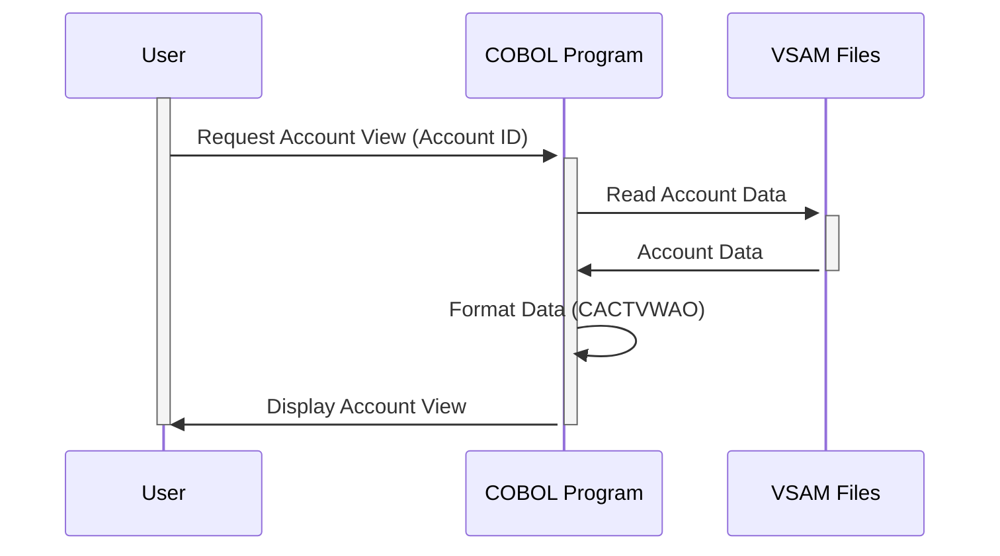

Gerado em: 1º de outubro de 2024

# **Título do Documento:** Especificação da Visualização da Conta do Cartão

# **Descrição Resumida:**
Este documento descreve as especificações para o módulo de Visualização da Conta do Cartão dentro do aplicativo CardDemo. Este módulo é responsável por apresentar uma visão abrangente das informações da conta do cliente, incluindo status da conta, saldos, limites e detalhes do cliente. Ele garante a apresentação padronizada dos dados e a consistência no tratamento dos dados da conta em todo o sistema.

# **Histórias do Usuário:**
Como analista de dados, preciso ter certeza de que apenas registros válidos são usados na análise. Isso significa ter acesso a uma visão clara e abrangente das informações da conta de cada cliente, incluindo status, saldos, limites e dados pessoais. Essa visão deve ser apresentada em um formato padronizado e de fácil compreensão.

# **Épico Relacionado:**
2 - Gerenciamento de Conta

# **Requisitos Funcionais:**
1. **Recuperar informações da conta:** O sistema deve recuperar todas as informações necessárias da conta dos arquivos VSAM relevantes com base em um ID de conta fornecido.
2. **Validação de dados:** O sistema deve validar os dados recuperados para garantir sua integridade e completude. Quaisquer discrepâncias ou dados ausentes devem ser sinalizados e relatados.
3. **Formatar dados para exibição:** O sistema deve formatar os dados da conta recuperados em um layout amigável usando a estrutura CACTVWAO. Isso inclui:
    - Formatar valores numéricos (por exemplo, saldos, limites) com vírgulas e pontos decimais para facilitar a leitura.
    - Organizar os campos de forma lógica e organizada para fácil compreensão.
    - Lidar com quaisquer conversões de dados necessárias (por exemplo, formatos de data) para consistência e preferência do usuário.
4. **Exibir informações da conta:** O sistema deve apresentar as informações da conta formatadas ao usuário ou ao componente do sistema solicitante. Isso pode ser através de:
    - Exibir as informações na tela da interface do usuário para visualização direta.
    - Enviar os dados formatados para outro módulo do programa para processamento posterior.
    - Gerar um relatório contendo as informações da conta.

# **Requisitos Não Funcionais:**
1. **Desempenho:** O sistema deve recuperar e exibir as informações da conta com latência mínima, garantindo uma experiência responsiva ao usuário.
2. **Confiabilidade:** O sistema deve recuperar e exibir as informações da conta de forma consistente e precisa, minimizando erros e garantindo a integridade dos dados.
3. **Manutenibilidade:** O código deve ser bem estruturado, documentado e fácil de entender, facilitando a manutenção futura e aprimoramentos.
4. **Segurança:** 
    - O acesso às informações da conta deve ser restrito apenas ao pessoal autorizado, aderindo ao princípio do privilégio mínimo. 
    - Mecanismos de autenticação e autorização do usuário devem ser implementados para controlar o acesso a dados confidenciais.

# **Critérios de Aceitação:**
1. O sistema recupera e exibe com sucesso todas as informações necessárias da conta dos arquivos VSAM.
2. Os dados recuperados são validados quanto à integridade e completude, com discrepâncias sinalizadas e relatadas.
3. As informações da conta são formatadas de acordo com a estrutura CACTVWAO, garantindo legibilidade e consistência.
4. O sistema fornece uma experiência responsiva e amigável para visualizar as informações da conta.
5. O acesso às informações da conta é seguro e restrito apenas ao pessoal autorizado.

# **Melhorias de Código:**
1. Implementar um mecanismo centralizado de tratamento de erros para registrar e relatar erros de forma consistente em todo o módulo.
2. Adicionar comentários abrangentes ao código para melhorar a legibilidade e facilitar a manutenção futura.
3. Explorar técnicas de otimização de desempenho, como armazenamento em cache de dados ou otimização de consulta, para reduzir o tempo de recuperação de dados.

# **Melhorias de Segurança:**
1. Implementar mecanismos robustos de autenticação de usuário, como autenticação multifator, para evitar acesso não autorizado.
2. Criptografar informações confidenciais da conta em trânsito e em repouso para proteger contra violações de dados.
3. Implementar uma trilha de auditoria para rastrear todo o acesso às informações da conta, fornecendo responsabilidade e auxiliando em investigações de segurança.

# **Diagrama Conceitual:**

--Made by "Smart Engineering" (by Compass.UOL)--