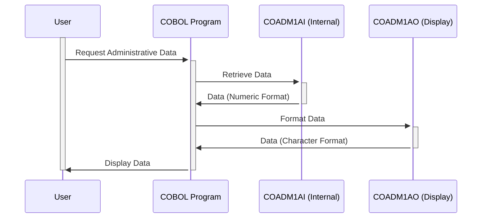

Gerado em: 1 de outubro de 2024

# **Título do Documento:** Gerenciamento de Dados Administrativos do CardDemo

# **Descrição Resumida:**
Este documento descreve a funcionalidade de um programa COBOL que gerencia dados administrativos dentro da aplicação CardDemo. Esses dados são cruciais para apresentar informações consistentes aos usuários e incluem elementos como títulos de tela, datas, horas, nomes de programas, opções de menu e mensagens de erro. O programa utiliza duas estruturas de dados principais: uma para armazenamento interno eficiente e outra para exibição amigável ao usuário.

# **Histórias de Usuário:**
Como administrador do sistema, preciso de uma maneira confiável de gerenciar e exibir informações administrativas de forma consistente em toda a aplicação CardDemo para garantir uma experiência clara e amigável.

# **Épico Relacionado:**
6 - Gerenciamento de Usuários e Segurança

# **Requisitos Funcionais:**
1.  **Definir Estruturas de Dados:**
    *   O programa define duas estruturas de dados: `COADM1AI` e `COADM1AO`.
    *   `COADM1AI` armazena dados em um formato numérico compacto, otimizado para processamento interno.
    *   `COADM1AO` redefine `COADM1AI`, mapeando os dados numéricos para os campos correspondentes baseados em caracteres para exibição em telas ou relatórios.

2.  **Gerenciar Dados Administrativos:**
    *   O programa lida com vários elementos de dados administrativos:
        *   Nome da Transação: Usado para identificação interna e registro.
        *   Títulos de Tela: Exibidos na parte superior das telas para orientação do usuário.
        *   Data e Hora Atuais: Mostrados para referência do usuário.
        *   Nome do Programa: Usado para identificação e navegação.
        *   Opções do Menu: Apresentadas ao usuário para interação.
        *   Opção Selecionada: Armazena a escolha do usuário no menu.
        *   Mensagem de Erro: Transmite mensagens do sistema ou notificações de erro ao usuário.

3.  **Garantir Exibição Consistente:**
    *   O programa usa `COADM1AO` para apresentar dados em um formato baseado em caracteres amigável, garantindo consistência em diferentes telas e relatórios.

# **Requisitos Não Funcionais:**
*   **Desempenho:** O programa deve processar e exibir dados administrativos de forma rápida e eficiente.
*   **Confiabilidade:** O programa deve gerenciar e apresentar dados de forma confiável, sem erros ou inconsistências.
*   **Manutenibilidade:** O código deve ser bem estruturado e documentado para facilitar a manutenção e as atualizações.

# **Critérios de Aceitação:**
*   O programa define e preenche com sucesso as estruturas de dados `COADM1AI` e `COADM1AO`.
*   Os dados administrativos são exibidos com precisão e consistência em telas e relatórios.
*   O programa lida com a formatação de data e hora de acordo com os requisitos do sistema.
*   As mensagens de erro são claras, concisas e informativas para os usuários.

# **Melhorias de Código:**
*   **Tratamento de Erros:** Implementar tratamento de erros mais robusto, incluindo o registro de erros em um arquivo para depuração.
*   **Documentação de Código:** Adicionar comentários claros e concisos para explicar o propósito e a funcionalidade das diferentes seções do código.
*   **Validação de Dados:** Incluir verificações de validação de dados para entradas do usuário, para evitar que dados inválidos sejam armazenados.

# **Melhorias de Segurança:**
*   **Controle de Acesso:** Implementar mecanismos de controle de acesso para restringir a modificação não autorizada de dados administrativos.
*   **Registro de Auditoria:** Registrar todas as alterações feitas nos dados administrativos para fins de auditoria e rastreamento.

# **Diagrama Conceitual:**

--Made by "Smart Engineering" (by Compass.UOL)--