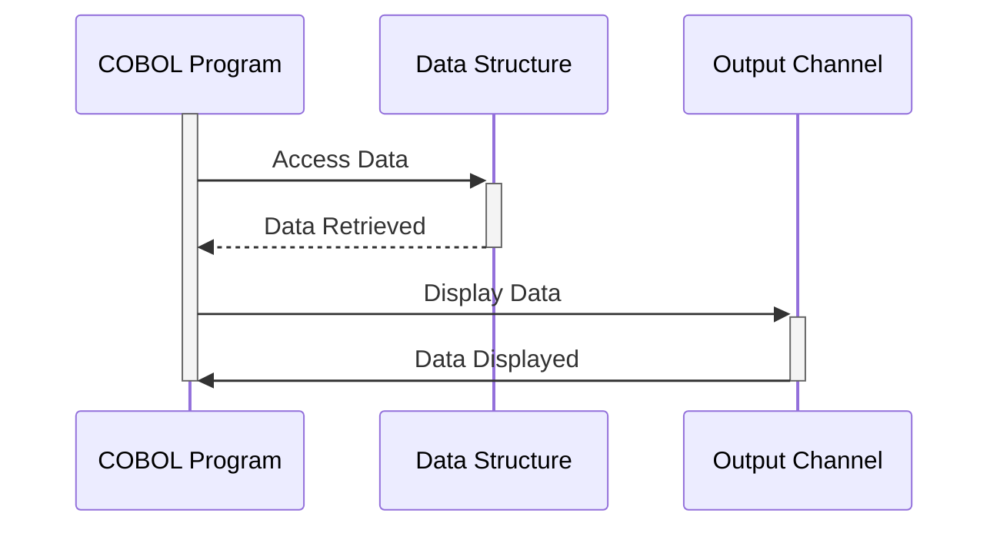

Gerado em: 1º de outubro de 2024

# **Título do Documento:** Especificação da Estrutura de Dados para Pagamento de Contas

# **Descrição Resumida:**
Este documento descreve a estrutura de dados para lidar com transações de pagamento de contas dentro de um programa COBOL. Ele define como o programa armazena e organiza informações relacionadas a cada pagamento, incluindo detalhes como ID da transação, informações da conta, valor do pagamento e status do processamento. Essa estrutura garante que os dados sejam formatados de forma consistente e facilmente acessíveis para processamento e exibição.

# **Histórias do Usuário:**
Como auditor do sistema, preciso ter certeza de que todas as transações financeiras, incluindo pagamentos de contas, sejam registradas com precisão e facilmente rastreáveis para garantir a conformidade com os regulamentos e controles internos.

# **Épico Relacionado:**
4 - Processamento de Transações

# **Requisitos Funcionais:**
* O sistema deve fornecer um formato estruturado para armazenar detalhes da transação de pagamento de conta.
* A estrutura de dados deve incluir campos para:
    * Nome ou identificador da transação
    * Data e hora da transação
    * Nome do programa para rastreamento
    * ID da conta
    * Saldo atual da conta
    * Sinalizador de confirmação de pagamento
    * Armazenamento de mensagem de erro
* O sistema deve suportar representações internas e externas dos dados.
    * Formato interno otimizado para processamento COBOL.
    * Formato externo adequado para exibição em telas ou relatórios.

# **Requisitos Não Funcionais:**
* **Desempenho:** A estrutura de dados deve ser projetada para acesso e processamento eficientes dentro do programa COBOL.
* **Manutenibilidade:** A estrutura deve ser bem documentada e fácil de entender para futuras modificações.
* **Confiabilidade:** A integridade dos dados deve ser mantida por meio da validação adequada do tipo de dados.

# **Critérios de Aceitação:**
* A estrutura de dados definida deve ser compilada sem erros dentro do programa COBOL.
* Todos os campos obrigatórios devem estar presentes e corretamente definidos em termos de tipo e comprimento de dados.
* As representações internas e externas dos dados devem ser consistentes e refletir com precisão as mesmas informações.

# **Melhorias de Código:**
* Implementar verificações de validação de dados para cada campo para garantir a integridade dos dados.
* Adicionar comentários ao código para explicar a finalidade de cada campo e como ele é usado.
* Considere o uso de um dicionário de dados para gerenciar e documentar a estrutura de dados.

# **Melhorias de Segurança:**
* Se dados confidenciais estiverem sendo armazenados (como números de conta), considere implementar criptografia ou outras medidas de segurança para proteger os dados.
* Garanta que os controles de acesso apropriados estejam em vigor para restringir o acesso não autorizado aos dados.

# **Diagrama Conceitual:**

--Made by "Smart Engineering" (by Compass.UOL)--