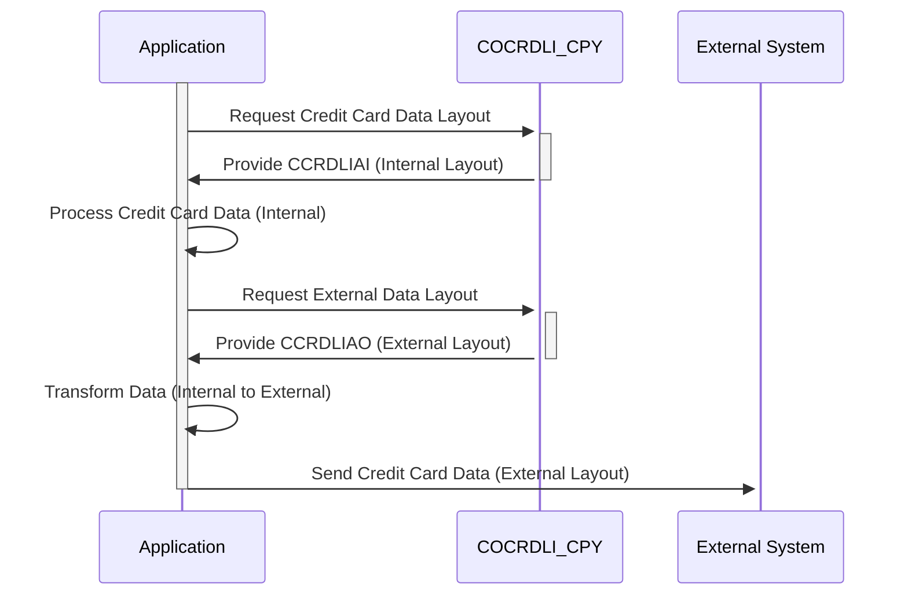

Gerado em: 1º de outubro de 2024

# **Título do Documento:** Layout de Dados de Cartão de Crédito (Entrada/Saída)

# **Descrição Resumida:**
Este documento descreve a estrutura das informações do cartão de crédito usadas no sistema. Ele define dois layouts - um para uso interno (CCRDLIAI) e outro para comunicação externa (CCRDLIAO), garantindo consistência e segurança no tratamento de dados em diferentes partes do sistema e durante interações com entidades externas.

# **Histórias do Usuário:**
Como Analista de Sistemas de Cartão de Crédito, preciso de um formato de dados padronizado para garantir o processamento contínuo das informações do cartão de crédito em nossos sistemas e durante a comunicação com outras partes. Este formato deve representar com precisão os detalhes da transação, informações da conta e dados do cartão, ao mesmo tempo em que segue os padrões de segurança para lidar com informações confidenciais.

# **Épico Relacionado:**
3 - Gestão de Cartão de Crédito

# **Requisitos Funcionais:**
- **Definição da Estrutura de Dados:** Definir uma estrutura de dados clara e consistente para informações de cartão de crédito, incluindo campos para detalhes da transação, dados da conta, números de cartão, status e mensagens.
- **Layout Interno (CCRDLIAI):** 
    - Definir o layout para armazenamento interno e processamento de informações de cartão de crédito.
    - Este layout deve ser otimizado para tratamento eficiente de dados dentro do sistema.
- **Layout Externo (CCRDLIAO):** 
    - Definir o layout para troca de informações de cartão de crédito com sistemas externos ou exibição para usuários.
    - Este layout pode diferir do layout interno para atender a requisitos externos ou para mascarar dados confidenciais.
- **Mapeamento de Dados:** Estabelecer regras claras de mapeamento entre os layouts interno e externo para garantir a consistência dos dados durante a transformação.

# **Requisitos Não Funcionais:**
- **Segurança:** 
    - Implementar métodos robustos de criptografia para proteger informações confidenciais do cartão de crédito durante o armazenamento e transmissão.
    - Impor medidas rígidas de controle de acesso para restringir o acesso não autorizado aos dados do cartão de crédito.
- **Desempenho:** 
    - As estruturas de dados e regras de mapeamento devem ser projetadas para minimizar a sobrecarga de processamento e garantir o tratamento eficiente dos dados.
- **Manutenibilidade:** 
    - O código deve ser bem documentado e modular para facilitar a manutenção e atualizações.
- **Conformidade:** 
    - Seguir os padrões do setor (por exemplo, PCI DSS) para lidar e armazenar dados confidenciais do titular do cartão.

# **Critérios de Aceitação:**
- As estruturas de dados definidas (CCRDLIAI e CCRDLIAO) devem representar com precisão todas as informações necessárias do cartão de crédito.
- As regras de mapeamento entre layouts interno e externo devem garantir a consistência dos dados.
- A implementação deve estar em conformidade com os padrões de segurança para lidar com dados confidenciais do titular do cartão.
- O sistema deve ser capaz de processar informações de cartão de crédito de forma eficiente, sem degradação significativa do desempenho.

# **Melhorias de Código:**
- Implementar verificações de validação de dados para cada campo nas estruturas de dados para garantir a integridade dos dados.
- Adicionar mecanismos de tratamento de erros para gerenciar com elegância quaisquer problemas durante a transformação ou processamento de dados.
- Fornecer documentação abrangente para as estruturas de dados, regras de mapeamento e quaisquer módulos de código associados.

# **Melhorias de Segurança:**
- Implementar técnicas de mascaramento de dados ou tokenização para aumentar ainda mais a segurança, substituindo os dados confidenciais do titular do cartão por substitutos não confidenciais.
- Manter logs abrangentes de todos os acessos, modificações e transmissões de dados de cartão de crédito para fins de auditoria e monitoramento de segurança.

# **Diagrama Conceitual:**

--Made by "Smart Engineering" (by Compass.UOL)--