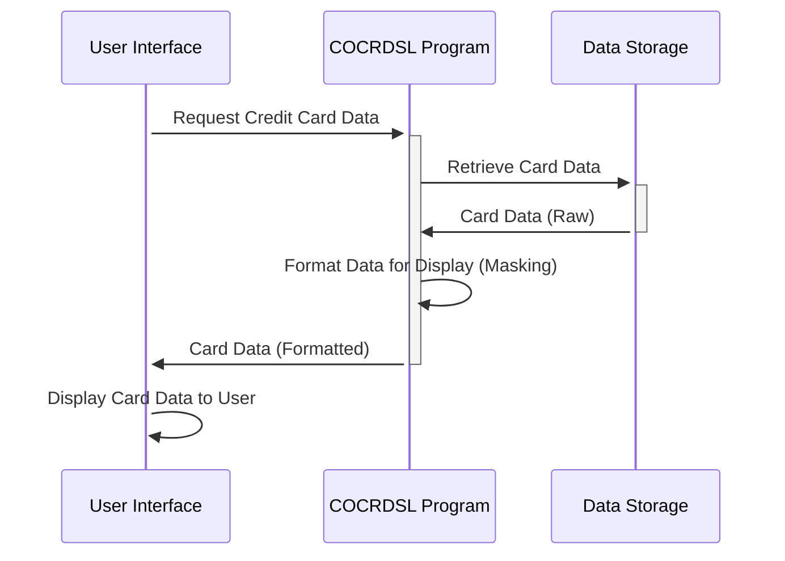

Gerado em: 1º de Outubro de 2024

# **Título do Documento:** Especificação do Programa de Exibição de Dados de Cartão de Crédito

# **Descrição Resumida:**
Este programa define como as informações do cartão de crédito são estruturadas para exibição em uma interface de usuário, garantindo uma apresentação clara e consistente de dados confidenciais.

# **Histórias do Usuário:**
Como representante de atendimento ao cliente, preciso visualizar as informações do cartão de crédito na minha tela de forma clara e organizada, para que eu possa ajudar os clientes com eficiência e precisão.

# **Épico Relacionado:**
3 - Gestão de Cartão de Crédito

# **Requisitos Funcionais:**
- Definir uma estrutura padrão (`CCRDSLAI`) para armazenar dados brutos do cartão de crédito, incluindo o nome da transação, nome do titular do cartão, IDs da conta e do cartão, data de validade e mensagens geradas pelo sistema.
- Definir uma estrutura orientada à exibição (`CCRDSLAO`) que espelhe `CCRDSLAI`, mas adicione atributos para cada campo para controlar a apresentação visual, como cor, destaque e posicionamento na tela.
- Garantir que dados confidenciais, como o número completo do cartão de crédito, sejam mascarados ou truncados para fins de segurança quando exibidos.

# **Requisitos Não Funcionais:**
- **Usabilidade:** As informações exibidas devem ser fáceis de ler e entender, com etiquetas claras e agrupamento lógico de campos.
- **Desempenho:** O programa deve recuperar e exibir os dados do cartão de crédito de forma rápida e eficiente, sem atrasos perceptíveis.
- **Manutenibilidade:** O código deve ser bem documentado e estruturado para facilitar atualizações e modificações.
- **Segurança:** O programa deve aderir às melhores práticas de segurança, particularmente em relação à exibição de dados confidenciais do titular do cartão, com máscara ou truncamento apropriados.

# **Critérios de Aceitação:**
- O programa define com sucesso as estruturas de dados `CCRDSLAI` e `CCRDSLAO` com todos os campos e atributos de exibição necessários.
- O programa compila sem erros e se integra perfeitamente à interface do usuário.
- As informações do cartão de crédito são exibidas com precisão e completamente, com dados confidenciais mascarados adequadamente.
- O formato de exibição é claro, consistente e adere aos atributos de exibição definidos.

# **Melhorias de Código:**
- Implementar um mecanismo de registro para registrar instâncias de dados de cartão de crédito sendo acessados ​​e exibidos, incluindo IDs de usuário e timestamps, para fins de auditoria e segurança.
- Adicionar tratamento de erros para gerenciar situações em que os dados estão ausentes ou inválidos, exibindo mensagens amigáveis ​​ao usuário em vez de falhas no programa.
- Explorar o uso de um dicionário de dados para gerenciar centralmente as definições de campo de dados e atributos de exibição para melhor consistência e manutenção.

# **Melhorias de Segurança:**
- Implementar medidas rígidas de controle de acesso para garantir que apenas pessoal autorizado possa visualizar as informações do cartão de crédito.
- Considere técnicas adicionais de mascaramento de dados, como exibir apenas os últimos quatro dígitos do número do cartão de crédito, para aumentar ainda mais a segurança.
- Revisar e atualizar regularmente as medidas de segurança de acordo com as melhores práticas do setor e as ameaças em evolução.

# **Diagrama Conceitual:**

--Made by "Smart Engineering" (by Compass.UOL)--