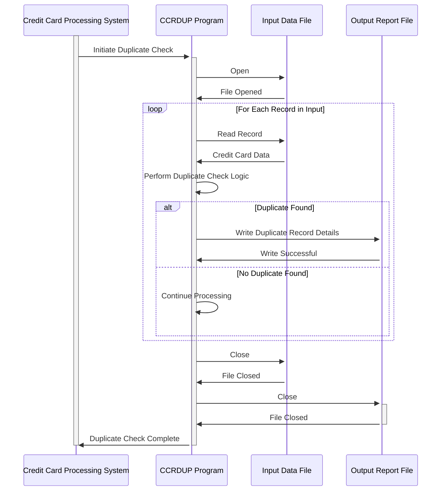

Gerado em: 1º de outubro de 2024

# **Documento de Título:** Especificação do Programa de Verificação de Duplicatas de Cartão de Crédito

**Descrição Resumida:**
Este documento descreve a estrutura de dados e os processos envolvidos na detecção de registros duplicados de cartão de crédito no aplicativo CardDemo. O sistema analisa os detalhes do cartão de crédito para identificar potenciais duplicatas, garantindo a precisão dos dados e prevenindo atividades fraudulentas.

**Histórias de Usuário:**
Como analista de risco de crédito, preciso garantir que nosso sistema possa identificar e sinalizar potenciais registros duplicados de cartão de crédito para manter a integridade dos dados e evitar atividades fraudulentas.

**Épico Relacionado:** 3 - Gestão de Cartão de Crédito

**Requisitos Funcionais:**

1. **Entrada de Dados:** O programa recebe dados do cartão de crédito, incluindo detalhes da transação, informações do cartão e mensagens geradas pelo sistema.

2. **Estruturação de Dados:** O programa utiliza duas estruturas de dados (`CCRDUPAI` e `CCRDUPAO`) para organizar e representar as informações do cartão de crédito:
    - `CCRDUPAI`: Projetado para processamento interno eficiente de dados de cartão de crédito.
    - `CCRDUPAO`: Estrutura os mesmos dados em um formato amigável para exibição em telas.

3. **Validação de Dados (Implícita):** Embora não esteja explicitamente definido no código fornecido, o sistema deve incorporar regras de validação para garantir a integridade dos dados. Por exemplo:
    - Os números do cartão de crédito devem aderir a formatos específicos e verificações de validação (por exemplo, algoritmo de Luhn).
    - As datas de expiração devem ser validadas para garantir que não estejam no passado.

4. **Verificação de Duplicatas:** O sistema compara os dados do cartão de crédito recebido com os registros existentes para identificar potenciais duplicatas. Os critérios de correspondência específicos e a lógica para determinar duplicatas não são detalhados no trecho de código fornecido, mas são aspectos cruciais da funcionalidade do programa.

5. **Saída:** O programa fornece saída com base nos resultados da verificação de duplicatas. Isso pode incluir:
    - **Registros Sinalizados:** Os registros potencialmente duplicados são sinalizados para revisão.
    - **Relatórios/Logs:** Logs detalhados dos resultados da verificação de duplicatas, incluindo registros correspondentes e quaisquer discrepâncias encontradas.
    - **Notificações do Usuário:** Alertas ou notificações podem ser gerados para verificação manual e ação em potenciais duplicatas.

**Requisitos Não Funcionais:**

1. **Desempenho:** O processo de verificação de duplicatas deve ser eficiente e ter impacto mínimo no desempenho do sistema, especialmente considerando os potenciais grandes volumes de dados de cartão de crédito.

2. **Precisão:** O sistema deve identificar duplicatas com precisão com base em critérios de correspondência predefinidos para minimizar falsos positivos e negativos.

3. **Escalabilidade:** O processo de verificação de duplicatas deve ser escalável para lidar com o aumento dos volumes de dados à medida que o sistema cresce.

4. **Manutenibilidade:** O código deve ser bem estruturado, documentado e fácil de manter e atualizar conforme as regras de negócio evoluem.

**Critérios de Aceitação:**

- O programa compila e executa com sucesso sem erros.
- O programa identifica corretamente registros duplicados de cartão de crédito com base em critérios de correspondência predefinidos.
- O programa lida com grandes volumes de dados de forma eficiente, sem degradação perceptível do desempenho.
- O programa gera relatórios ou logs precisos dos resultados da verificação de duplicatas.
- O código do programa é bem documentado e manutenível.

**Melhorias de Código:**

- **Validação Explícita:** Incorpore regras de validação de dados explícitas para números de cartão de crédito, datas de expiração e outros campos relevantes para garantir a integridade dos dados.
- **Tratamento de Erros:** Implemente mecanismos robustos de tratamento de erros para gerenciar exceções normalmente e fornecer mensagens de erro informativas.
- **Modularidade do Código:** Estruture o código em funções ou sub-rotinas modulares para melhorar a legibilidade, capacidade de manutenção e reutilização.

**Melhorias de Segurança:**

- **Criptografia de Dados:** Implemente criptografia para informações confidenciais do cartão de crédito durante o armazenamento e transmissão para proteger contra acesso não autorizado.
- **Controle de Acesso:** Imponha medidas rígidas de controle de acesso para restringir o acesso aos dados do cartão de crédito apenas ao pessoal autorizado.
- **Log de Auditoria:** Mantenha logs de auditoria abrangentes de todos os acessos a dados, modificações e operações de verificação de duplicatas para fins de segurança e conformidade.

**Diagrama Conceitual:**

--Made by "Smart Engineering" (by Compass.UOL)--