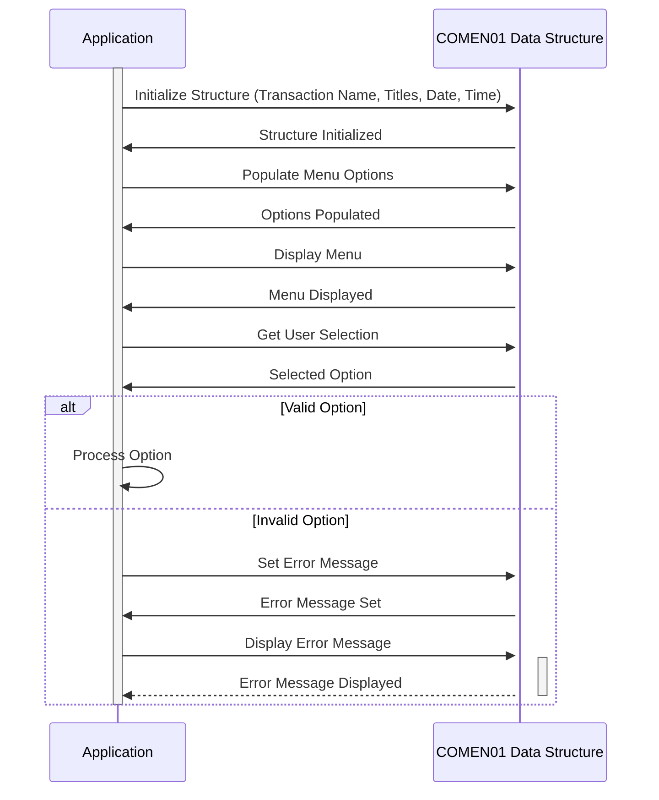

Gerado em: 1º de outubro de 2024

# **Título do Documento:** Estrutura de Dados Comum para Aplicações Orientadas a Menus

# **Descrição Resumida:**
O arquivo `COMEN01.CPY` define uma estrutura de dados padronizada em COBOL para gerenciar informações exibidas em telas de menu dentro de uma aplicação. Ele armazena elementos como nomes de transações, títulos de tela, datas, horas, opções de menu, seleções do usuário e mensagens de erro, garantindo consistência e organização no tratamento das interações do usuário.

# **Histórias do Usuário:**
Como desenvolvedor de aplicações, preciso de uma maneira estruturada de lidar com elementos de dados comuns exibidos em telas de menu, para que a apresentação e o comportamento dos menus sejam consistentes em toda a aplicação.

# **Épico Relacionado:**
9 - Utilitários do Sistema: Fornecer um conjunto de funções utilitárias para dar suporte à manutenção do sistema, gerenciamento de dados e outras tarefas operacionais.

# **Requisitos Funcionais:**
1.  **Armazenar Nome da Transação:**  A estrutura deve armazenar o nome da transação atual sendo executada (por exemplo, "ACTVW" para Visualização de Conta).
2.  **Exibir Títulos de Tela:** A estrutura deve armazenar o título principal da tela (por exemplo, "Detalhes da Conta") e um título secundário opcional.
3.  **Manipular Data e Hora:** A estrutura precisa acomodar a data e hora atuais, provavelmente em formatos diferentes para exibição e processamento interno.
4.  **Gerenciar Opções de Menu:** A estrutura deve armazenar o texto para cada opção de menu apresentada ao usuário (até doze opções).
5.  **Registrar Seleção do Usuário:** Um campo é necessário para armazenar a opção selecionada pelo usuário.
6.  **Exibir Mensagens de Erro:** A estrutura deve incluir um campo para armazenar e exibir mensagens de erro para o usuário.
7.  **Flexibilidade na Representação de Dados:** O código usa REDEFINES para permitir que os mesmos dados sejam acessados e apresentados em formatos diferentes (por exemplo, exibidos na tela, usados em cálculos).

# **Requisitos Não Funcionais:**
1.  **Integridade de Dados:** Os tipos de dados e comprimentos para cada campo devem ser rigorosamente aplicados para evitar corrupção de dados.
2.  **Reutilização:** A estrutura deve ser projetada para ser reutilizável em diferentes programas e módulos dentro da aplicação.
3.  **Manutenibilidade:** O código deve ser bem documentado e estruturado para facilitar a compreensão e modificação.

# **Critérios de Aceite:**
1.  A estrutura de dados deve ser compilada com sucesso, sem erros, em um ambiente COBOL.
2.  As aplicações que usam a estrutura devem ser capazes de armazenar e recuperar dados em todos os campos definidos.
3.  A implementação REDEFINES deve funcionar corretamente, permitindo diferentes representações dos mesmos dados.

# **Melhorias de Código:**
1.  **Adicionar Validação de Dados:** Implementar verificações na lógica da aplicação para validar os dados que estão sendo populados na estrutura (por exemplo, garantir que os formatos de data estejam corretos).
2.  **Centralizar o Tratamento de Mensagens de Erro:**  Considere criar um módulo separado para gerenciar mensagens de erro, permitindo localização e personalização mais fáceis.

# **Melhorias de Segurança:**
1.  **Controle de Acesso:** Implementar mecanismos de controle de acesso apropriados dentro da aplicação para restringir a modificação não autorizada dos dados dentro da estrutura.
2.  **Mascaramento de Dados:** Se informações confidenciais estiverem sendo armazenadas na estrutura (como IDs de usuário), considere mascarar ou criptografar esses dados.

# **Diagrama Conceitual:**

--Made by "Smart Engineering" (by Compass.UOL)--