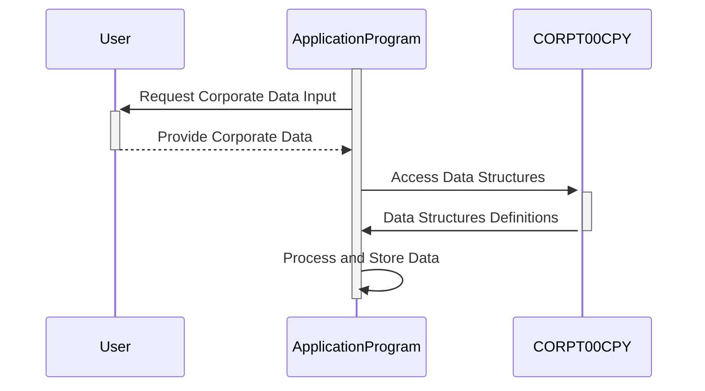

Gerado em: 1 de outubro de 2024

# **Título do Documento:** Especificação da Estrutura de Dados Corporativos

# **Descrição Resumida:**
Este documento descreve a estrutura e o propósito do copybook COBOL `CORPT00.CPY`, que define as estruturas de dados usadas para gerenciar e exibir informações corporativas dentro de uma aplicação maior. Este copybook provavelmente suporta a geração de relatórios ou a apresentação de dados relacionados a operações corporativas, abrangendo aspectos como detalhes de transações, títulos de relatórios, datas, períodos e possíveis mensagens de erro.

# **Histórias do Usuário:**
Como administrador do sistema, preciso de uma maneira padronizada de lidar com dados corporativos em diferentes programas para que a geração de relatórios e o gerenciamento de dados permaneçam consistentes e confiáveis.

# **Epic Relacionado:**
5 - Relatórios e Análise

# **Requisitos Funcionais:**
- **Definição da Estrutura de Dados:**
    - Definir duas estruturas de dados, `CORPT0AI` e `CORPT0AO`, para armazenar informações corporativas.
    - `CORPT0AI` deve armazenar dados em um formato adequado para entrada do usuário, provavelmente baseado em caracteres.
    - `CORPT0AO` deve espelhar `CORPT0AI`, mas potencialmente representar dados em um formato mais adequado para processamento interno ou saída.
- **Definições de Campo:**
    - Incluir campos para nome da transação (`TRNNAMEx`), títulos de relatório (`TITLE01x`, `TITLE02x`), data e hora atuais (`CURDATEx`, `CURTIMEx`), indicadores de período (`MONTHLYx`, `YEARLYx`, `CUSTOMx`), datas de início e término (`SDTMMx`, `SDTDDx`, `SDTYYYx`, `EDTMMx`, `EDTDDx`, `EDTYYYx`), um indicador de confirmação (`CONFIRMx`) e um campo de mensagem de erro (`ERRMSGx`).
- **Aplicação de Tipo de Dados e Formato:**
    - Garantir que os tipos de dados e formatos sejam consistentes com o uso pretendido de cada campo (por exemplo, alfanumérico para títulos, numérico para datas, indicadores de caractere único para campos sim/não).

# **Requisitos Não Funcionais:**
- **Reutilização:** O copybook deve ser projetado para ser incluído em vários programas para garantir a consistência no tratamento de dados corporativos.
- **Manutenibilidade:** O código deve ser bem comentado e estruturado para facilitar a manutenção e as atualizações.

# **Critérios de Aceitação:**
- As estruturas de dados definidas em `CORPT00.CPY` devem ser compiladas e usadas com sucesso por programas COBOL sem erros.
- Os dados armazenados nessas estruturas devem ser interpretados e usados corretamente pela aplicação para geração de relatórios ou outras tarefas de processamento de dados corporativos.
- O copybook deve ser bem documentado para garantir clareza para os desenvolvedores que o utilizam.

# **Melhorias de Código:**
- **Considere adicionar regras de validação de dados diretamente no copybook:** Por exemplo, você pode usar os níveis `88` do COBOL para definir valores válidos para indicadores como `MONTHLYx`, `YEARLYx` e `CONFIRMx`, aprimorando a integridade dos dados.
- **Implemente nomes de campo mais descritivos:** Embora os nomes atuais transmitam o propósito básico, usar nomes mais detalhados (por exemplo, `TRANSACTION_NAME`, `REPORT_TITLE_1`, `START_DATE_MONTH`) melhoraria a legibilidade do código.

# **Melhorias de Segurança:**
- **Sem dados confidenciais:** O copybook em si não parece lidar com dados confidenciais, como senhas ou informações financeiras. No entanto, ao usar este copybook em aplicações que processam dados confidenciais, certifique-se de que medidas de segurança adequadas estejam em vigor, como criptografia de dados e mecanismos de controle de acesso.

# **Diagrama Conceitual:**

--Made by "Smart Engineering" (by Compass.UOL)--