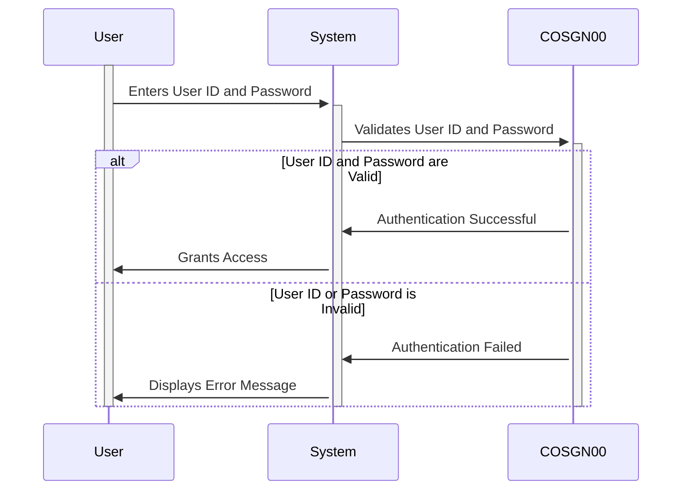

Gerado em: 1º de outubro de 2024

**Título do Documento:** Gerenciamento de Informações de Login do Usuário

**Descrição Resumida:** Este documento descreve a estrutura e o gerenciamento das informações de login do usuário no aplicativo CardDemo. Ele se concentra em como os detalhes do usuário são coletados, organizados e usados durante o processo de login.

**Histórias do Usuário:**
Como usuário do sistema, preciso fornecer minhas credenciais de login para poder acessar o sistema.

**Epic Relacionado:** 6 - Gerenciamento de Usuários e Segurança

**Requisitos Funcionais:**

* O sistema deve fornecer duas estruturas de dados, COSGN0AI e COSGN0AO, para armazenar informações de login do usuário.
* COSGN0AI deve incluir campos para:
    - Nome da Transação (por exemplo, login, logout)
    - Títulos de Tela
    - Data e Hora da ação
    - ID do Usuário
    - Senha
    - Mensagem de Erro
* COSGN0AO deve usar a cláusula REDEFINES para fornecer uma visão alternativa dos dados armazenados em COSGN0AI, permitindo a interpretação flexível dos dados.
* O sistema deve garantir o armazenamento seguro de IDs de usuário e senhas para evitar acesso não autorizado.
* O sistema deve fornecer mensagens de erro claras e informativas ao usuário em caso de tentativas de login inválidas.
* O sistema deve manter a integridade dos dados, garantindo a consistência e a precisão das informações de login do usuário.

**Requisitos Não Funcionais:**

* **Segurança:** As informações de login do usuário, especialmente senhas, devem ser tratadas e armazenadas com segurança para evitar acesso não autorizado e proteger a privacidade do usuário.
* **Desempenho:** O processo de login deve ser rápido e eficiente, minimizando o tempo que um usuário leva para acessar o sistema.
* **Confiabilidade:** O sistema deve ser confiável no tratamento das informações de login do usuário, garantindo que usuários válidos possam acessar o sistema de forma consistente.
* **Manutenibilidade:** O código para gerenciar as informações de login do usuário deve ser bem estruturado, documentado e fácil de manter para futuras atualizações ou modificações.

**Critérios de Aceitação:**
* O sistema armazena e recupera com sucesso as informações de login do usuário.
* O sistema valida as credenciais do usuário com precisão, concedendo acesso a usuários autorizados e negando acesso a usuários não autorizados.
* O sistema exibe mensagens de erro apropriadas para tentativas de login incorretas.
* O sistema garante a segurança das credenciais do usuário, protegendo-as de acesso não autorizado.

**Melhorias de Código:**
* Implementar um mecanismo de criptografia de senha mais robusto para aumentar ainda mais a segurança das senhas armazenadas.
* Adicionar registro detalhado de tentativas de login, incluindo timestamps e IDs de usuário, para fins de auditoria e monitoramento de segurança.
* Considere o uso de um módulo de segurança centralizado para lidar com autenticação e autorização em todo o aplicativo.

**Melhorias de Segurança:**
* Implementar a autenticação multifator para fornecer uma camada adicional de segurança além do nome de usuário e senha.
* Implementar políticas de senha forte, exigindo que os usuários criem senhas que atendam a determinados critérios de complexidade.
* Auditar regularmente o sistema em busca de vulnerabilidades de segurança e implementar as atualizações ou patches necessários.

**Diagrama Conceitual:**

--Made by "Smart Engineering" (by Compass.UOL)--