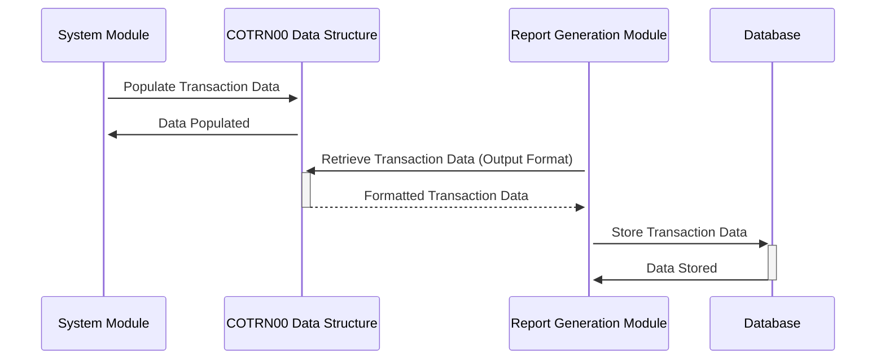

Gerado em: 1º de outubro de 2024

# **Título do Documento:** Especificação da Estrutura de Dados de Transações

# **Descrição Resumida:**
Esta especificação define a estrutura de dados para transações financeiras, garantindo um formato padronizado para processamento e apresentação de informações de transações dentro do Aplicativo CardDemo.

# **Histórias do Usuário:**
Como analista de dados, desejo garantir que todos os registros de transações sejam armazenados em um formato consistente para que eu possa analisar facilmente padrões de transações, rastrear atividades financeiras e gerar relatórios precisos.

# **Épico Relacionado:**
4 - Processamento de Transações

# **Requisitos Funcionais:**
- O sistema deve definir uma estrutura de dados padrão para registrar transações financeiras.
- A estrutura de dados deve incluir campos para ID da transação, data, descrição, valor e sinalizadores de seleção.
- Dois layouts da estrutura de dados devem ser fornecidos:
    - `COTRN0AI`: Formato interno para processamento de transações.
    - `COTRN0AO`: Formato de saída para relatórios e exibições, com formatação para legibilidade.
- O sistema deve ser capaz de preencher a estrutura de dados com detalhes da transação recebidos de várias fontes.
- O sistema deve validar os tipos de dados e o formato dos dados da transação antes do processamento.

# **Requisitos Não Funcionais:**
- **Desempenho:** A estrutura de dados deve ser projetada para recuperação e processamento eficientes de dados.
- **Confiabilidade:** A estrutura de dados deve garantir a integridade e consistência dos dados.
- **Manutenibilidade:** A estrutura de dados deve ser bem documentada e fácil de entender para futuras modificações.
- **Segurança:** O acesso aos dados da transação deve ser restrito com base em funções e permissões do usuário.

# **Critérios de Aceitação:**
- O sistema define e implementa com sucesso a estrutura de dados de transação padronizada.
- O sistema preenche corretamente a estrutura de dados com detalhes da transação.
- O sistema valida os tipos de dados e o formato dos dados da transação.
- O sistema gera relatórios e exibições usando o formato de saída da estrutura de dados.

# **Melhorias de Código:**
- Implementar verificações de validação de dados para cada campo na estrutura de dados para garantir a precisão dos dados.
- Adicionar rotinas de tratamento de erros para lidar normalmente com dados inválidos ou condições inesperadas durante o processamento.
- Documentar a finalidade e o uso de cada campo na estrutura de dados para melhorar a legibilidade e a manutenção do código.

# **Melhorias de Segurança:**
- Criptografar dados confidenciais de transações, como o valor da transação, para protegê-los de acesso não autorizado.
- Implementar trilhas de auditoria para rastrear todas as alterações feitas nos registros de transações.
- Revisar e atualizar regularmente as listas de controle de acesso para garantir que apenas pessoal autorizado tenha acesso aos dados da transação.

# **Diagrama Conceitual:**

--Made by "Smart Engineering" (by Compass.UOL)--