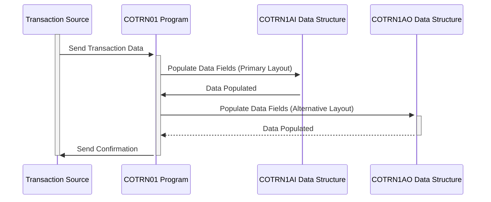

Gerado em: 1º de outubro de 2024

# **Título do Documento:** Especificação da Estrutura de Dados de Transações com Cartão de Crédito

# **Descrição Resumida:**
Este documento detalha a estrutura dos registros de transações com cartão de crédito em nosso sistema. Ele atua como um modelo para capturar, armazenar e processar cada transação com cartão de crédito, garantindo consistência e precisão.

# **Histórias de Usuário:**
Como analista financeiro, preciso de uma maneira padronizada de acessar e analisar dados de transações com cartão de crédito para rastrear padrões de gastos, identificar possíveis fraudes e gerar relatórios para insights de negócios.

# **Épico Relacionado:**
4 - Processamento de Transações

# **Requisitos Funcionais:**
* O sistema deve capturar todos os detalhes essenciais de uma transação com cartão de crédito, incluindo:
    * ID de Transação Único (TRNIDINI)
    * Número do Cartão de Crédito (CARDNUMI)
    * Código do Tipo de Transação (TTYPCDI): Compra, reembolso, adiantamento em dinheiro, etc.
    * Origem da Transação (TRNSRCI): Online, terminal POS, ATM, etc.
    * Descrição da Transação (TDESCI)
    * Valor da Transação (TRNAMTI)
    * ID do Comerciante (MIDI)
    * Nome do Comerciante (MNAMEI)
    * Timestamps: Origem (TORIGDTI), Processamento (TPROCDTI)
    * Mensagem de Erro (ERRMSGI): Se ocorrer algum problema durante o processamento
* O sistema deve validar os tipos de dados e os comprimentos dos campos para garantir a integridade dos dados.
* O sistema deve suportar dois layouts de dados:
    * `COTRN1AI`: Layout primário usando formatos de caractere e decimal compactado.
    * `COTRN1AO`: Layout alternativo com formatação de caractere diferente para necessidades específicas de processamento.

# **Requisitos Não Funcionais:**
* **Desempenho:** O processamento de registros de transações deve ser rápido e eficiente para lidar com altos volumes de transações.
* **Confiabilidade:** O sistema deve registrar e armazenar com precisão todos os dados de transações sem perda ou corrupção.
* **Manutenibilidade:** A estrutura de dados deve ser facilmente compreensível e modificável para aprimoramentos futuros.
* **Segurança:** Os dados confidenciais da transação devem ser protegidos contra acesso e modificação não autorizados.

# **Critérios de Aceitação:**
* Todos os campos de dados definidos são capturados com precisão e completamente para cada transação.
* As validações de tipo de dados e comprimento de campo são implementadas e funcionam corretamente.
* Os layouts `COTRN1AI` e `COTRN1AO` são suportados e podem ser processados ​​pelo sistema.
* O sistema lida com altos volumes de transações sem degradação de desempenho.
* As medidas de segurança estão em vigor para proteger dados confidenciais de transações.

# **Melhorias de Código:**
* Implementar criptografia de dados para campos confidenciais, como números de cartão de crédito, para aumentar a segurança.
* Adicionar técnicas de mascaramento de dados para proteger dados confidenciais durante a exibição ou registro.
* Implementar mecanismos de registro para rastrear a criação, acesso e modificações de registros de transações para fins de auditoria.
* Considere o uso de um dicionário de dados para centralizar as definições dos elementos de dados e garantir a consistência em todo o aplicativo.

# **Melhorias de Segurança:**
* Implementar mecanismos de controle de acesso para restringir o acesso aos dados da transação com base nas funções e permissões do usuário.
* Auditar o sistema regularmente para garantir a conformidade com as políticas de segurança e identificar possíveis vulnerabilidades.
* Implementar políticas de retenção de dados para arquivar ou excluir com segurança os dados da transação de acordo com os requisitos regulamentares.

# **Diagrama Conceitual:**

--Made by "Smart Engineering" (by Compass.UOL)--