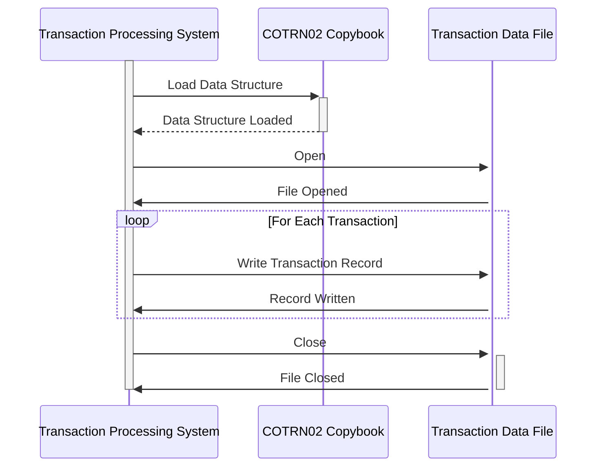

Gerado em: 1º de outubro de 2024

# **Título do Documento:** Especificação da Estrutura de Dados de Transação de Cartão

# **Descrição Resumida:**
Este documento descreve a estrutura de dados relacionada a transações com cartão de crédito no aplicativo CardDemo. Ele define um formato padronizado para capturar e armazenar detalhes cruciais da transação, garantindo consistência e facilitando o processamento e análise eficientes.

# **Histórias do Usuário:**
Como analista de dados, preciso garantir que todas as transações com cartão de crédito sejam registradas em um formato padronizado para que eu possa analisar facilmente as tendências de transações e gerar relatórios precisos.

# **Épico Relacionado:**
4 - Processamento de Transações

# **Requisitos Funcionais:**
- O sistema deve fornecer uma estrutura de dados padronizada para registrar transações com cartão de crédito.
- A estrutura de dados deve incluir campos para capturar todos os detalhes essenciais da transação, incluindo:
    - Nome da Transação
    - Data e Hora da Transação
    - ID da Atividade
    - Número do Cartão
    - Código do Tipo de Transação
    - Código da Categoria da Transação
    - Origem da Transação
    - Descrição da Transação
    - Valor da Transação
    - Data de Origem da Transação
    - Data de Processamento da Transação
    - ID do Comerciante
    - Nome do Comerciante
    - Cidade do Comerciante
    - CEP do Comerciante
    - Status da Confirmação
    - Mensagem de Erro
- O sistema deve impor a validação do tipo e formato de dados para cada campo na estrutura de dados.

# **Requisitos Não Funcionais:**
- **Desempenho:** A estrutura de dados da transação deve ser projetada para armazenamento e recuperação eficientes de dados.
- **Escalabilidade:** A estrutura deve ser capaz de acomodar volumes crescentes de transações.
- **Manutenibilidade:** A estrutura de dados deve ser bem documentada e fácil de entender e modificar.

# **Critérios de Aceitação:**
- A estrutura de dados da transação é definida em um copybook COBOL.
- Todos os campos obrigatórios estão incluídos na estrutura de dados.
- A validação do tipo e formato de dados é implementada para todos os campos.
- A estrutura de dados é usada com sucesso por programas COBOL para registrar transações.

# **Melhorias de Código:**
- Implementar regras de validação de dados para campos específicos, como validação do número do cartão usando o algoritmo de Luhn.
- Adicionar comentários ao copybook para melhorar a legibilidade e a compreensão.
- Considere o uso de um dicionário de dados para gerenciar definições de dados centralmente.

# **Melhorias de Segurança:**
- Criptografar dados confidenciais de transações, como números de cartão, para proteger contra acesso não autorizado.
- Implementar controles de acesso para restringir o acesso aos dados da transação com base nas funções e permissões do usuário.
- Registrar todos os acessos e modificações nos dados da transação para fins de auditoria.

# **Diagrama Conceitual:**

--Made by "Smart Engineering" (by Compass.UOL)--