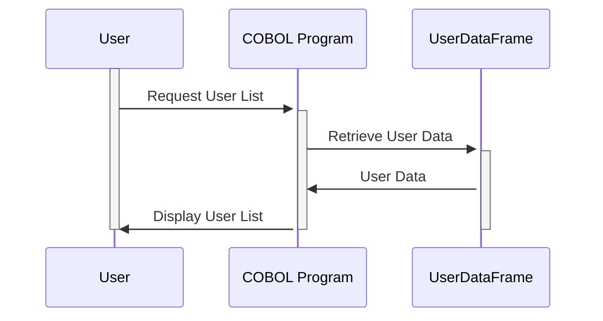

Gerado em: 1º de outubro de 2024

# **Título do Documento:** Especificação da Estrutura de Dados para Gerenciamento de Usuários

## **Descrição Resumida:**

Este documento detalha a estrutura de dados usada para gerenciar informações de usuários dentro de um aplicativo. Ele define como os dados do usuário são organizados, armazenados e apresentados em uma tela de gerenciamento de usuários. Isso é crucial para manter a consistência dos dados do usuário em todo o sistema.

## **Histórias do Usuário:**

Como administrador, preciso visualizar uma lista de usuários com suas informações principais para gerenciar as contas de usuário de forma eficaz.

## **Épico Relacionado:**

6 - Gerenciamento de Usuários e Segurança: Este Épico visa fornecer funcionalidades para gerenciar o acesso de usuários, funções e permissões para garantir a segurança do sistema e a confidencialidade dos dados.

## **Requisitos Funcionais:**

- O sistema deve armazenar e recuperar informações do usuário, incluindo ID do Usuário, Nome, Sobrenome e Tipo de Usuário.
- O sistema deve exibir essas informações de forma clara e organizada na tela de gerenciamento de usuários.
- Cada entrada de usuário na tela deve incluir um sinalizador de seleção (caixa de seleção) para habilitar ações em massa em vários usuários.
- O sistema deve exibir informações do nível do sistema, incluindo a data, hora e número da página atuais.

## **Requisitos Não Funcionais:**

- **Desempenho:** O sistema deve recuperar e exibir informações do usuário com latência mínima.
- **Usabilidade:** A interface do usuário deve ser intuitiva e fácil de navegar.
- **Manutenibilidade:** O código deve ser bem estruturado e documentado para facilitar a manutenção.

## **Critérios de Aceitação:**

- A tela de gerenciamento de usuários deve exibir com precisão todas as informações necessárias do usuário.
- Os sinalizadores de seleção devem funcionar corretamente, permitindo que os administradores selecionem e desmarquem usuários.
- As informações do nível do sistema (data, hora, número da página) devem ser atualizadas dinamicamente.

## **Melhorias de Código:**

- Implementar paginação para lidar com um grande número de usuários de forma eficaz.
- Adicionar funcionalidade de classificação à lista de usuários.
- Usar uma convenção de nomenclatura mais descritiva para os campos (por exemplo, `USER-ID` em vez de `USRID`).

## **Melhorias de Segurança:**

- Implementar medidas de controle de acesso para restringir o acesso à tela de gerenciamento de usuários apenas a pessoal autorizado.
- Armazenar informações confidenciais do usuário (por exemplo, senhas) com segurança usando criptografia.

## **Diagrama Conceitual:**

--Made by "Smart Engineering" (by Compass.UOL)--