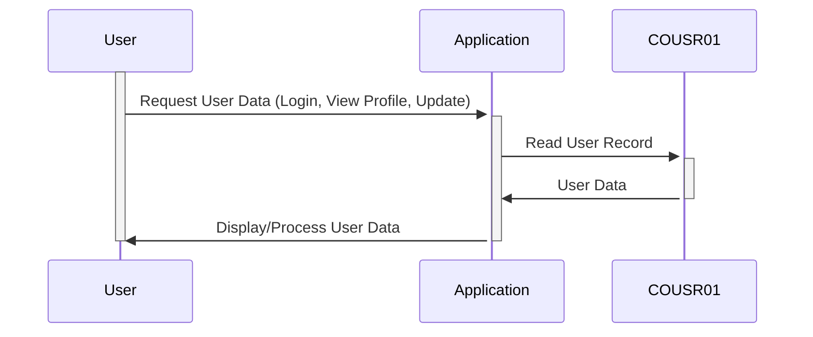

Gerado em: 1º de outubro de 2024

# **Título do Documento:** Gerenciamento de Informações do Usuário

## **Descrição Resumida:**

Este documento descreve a estrutura e o gerenciamento de informações do usuário dentro de um sistema, crucial para logins de usuários, exibição de perfis e tratamento de atualizações de contas.

## **Histórias do Usuário:**

Como administrador do sistema, preciso de uma maneira confiável de armazenar e gerenciar informações do usuário, incluindo suas credenciais de login, para que eu possa controlar o acesso ao sistema e garantir a segurança dos dados.

## **Épico Relacionado:**

6 - **Gerenciamento de Usuários e Segurança:** Gerenciar acesso de usuários, funções e permissões para garantir a segurança do sistema e a confidencialidade dos dados.

## **Requisitos Funcionais:**

- O sistema deve armazenar com segurança as informações do usuário, incluindo nome, sobrenome, ID do usuário e senha.
- O sistema deve ser capaz de recuperar informações do usuário por ID de usuário para autenticação e exibição de perfil.
- O sistema deve ser capaz de atualizar as informações do usuário, como uma mudança de senha.
- O sistema deve lidar com diferentes tipos de usuários e suas permissões associadas.
- O sistema deve registrar erros relacionados aos dados do usuário, como tentativas inválidas de login.

## **Requisitos Não Funcionais:**

- **Segurança:** O sistema deve empregar algoritmos fortes de hash de senha para proteger as senhas dos usuários contra acesso não autorizado.
- **Desempenho:** A autenticação do usuário e a recuperação de dados devem ser eficientes para garantir um sistema responsivo.
- **Manutenibilidade:** O código deve ser bem estruturado e documentado para facilitar a manutenção e atualizações futuras.

## **Critérios de Aceitação:**

- O sistema armazena e recupera informações do usuário com sucesso.
- As funções de autenticação do usuário funcionam corretamente, concedendo acesso apenas a usuários autorizados.
- As alterações de senha são tratadas com segurança e eficácia.
- O sistema registra erros relacionados aos dados do usuário, como tentativas inválidas de login ou falhas de validação de dados.

## **Melhorias de Código:**

- Implementar consultas parametrizadas ou instruções preparadas para evitar vulnerabilidades de injeção de SQL ao interagir com um banco de dados.
- Considere o uso de uma estrutura de logging para um registro de erros mais robusto e estruturado.
- Implementar validação de entrada em dados fornecidos pelo usuário para evitar vulnerabilidades comuns, como cross-site scripting (XSS).

## **Melhorias de Segurança:**

- Impor políticas de senha forte, exigindo que os usuários tenham senhas com um comprimento mínimo, complexidade e expiração regular.
- Implementar autenticação de dois fatores (2FA) para adicionar uma camada extra de segurança às contas de usuário.
- Auditar regularmente o sistema em busca de vulnerabilidades de segurança e garantir que os patches de segurança sejam aplicados prontamente.

## **Diagrama Conceitual:**

--Made by "Smart Engineering" (by Compass.UOL)--