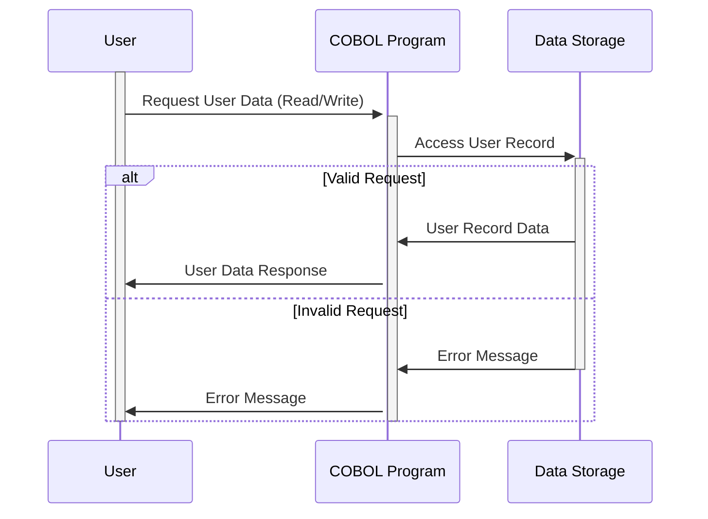

Gerado em: 1º de outubro de 2024

**Título do Documento:** Especificação da Estrutura de Dados da Conta de Usuário

**Descrição Resumida:** Este documento descreve a estrutura dos dados da conta de usuário em um sistema, com foco em como esses dados são organizados e armazenados. É essencialmente um modelo para gerenciar contas de usuário de forma segura e eficiente.

**Histórias do Usuário:** Como administrador do sistema, preciso de uma maneira padronizada de armazenar e gerenciar informações da conta de usuário, incluindo credenciais de login, detalhes pessoais e dados relacionados ao sistema, para garantir acesso seguro e administração eficiente do usuário.

**Épico Relacionado:** 6 - Gerenciamento de Usuários e Segurança

**Requisitos Funcionais:**
- O sistema deve armazenar com segurança IDs de usuário e senhas para autenticação.
- O sistema deve armazenar informações básicas do usuário, incluindo nome, sobrenome e tipo de usuário.
- O sistema deve registrar e armazenar informações relacionadas ao sistema, incluindo nomes de transações, timestamps (data e hora), nomes de programas usados e mensagens de erro.
- O sistema deve suportar diferentes esquemas de codificação de caracteres (ASCII, EBCDIC) para garantir compatibilidade com vários sistemas.

**Requisitos Não Funcionais:**
- **Segurança:** O sistema deve priorizar o armazenamento seguro de dados confidenciais do usuário, particularmente senhas, usando métodos adequados de hashing e criptografia.
- **Desempenho:** As operações de recuperação e armazenamento de dados relacionadas a contas de usuário devem ser eficientes para evitar lentidão do sistema.
- **Confiabilidade:** O sistema deve garantir a precisão e consistência dos dados da conta do usuário ao longo do tempo.
- **Manutenibilidade:** A estrutura de dados deve ser facilmente compreensível e modificável para futuros aprimoramentos do sistema.

**Critérios de Aceitação:**
- As contas de usuário podem ser criadas, modificadas e excluídas sem erros.
- O sistema autentica corretamente os usuários com base nas credenciais armazenadas.
- As informações relacionadas ao sistema são registradas com precisão e associadas às ações correspondentes do usuário.
- A estrutura de dados se integra perfeitamente a outros componentes do sistema, como mecanismos de autenticação e autorização.

**Melhorias de Código:**
- **Segurança de Senha:** Implemente algoritmos robustos de hashing de senha (por exemplo, bcrypt, scrypt) para proteger as senhas contra acesso não autorizado. Evite armazenar senhas em texto simples.
- **Validação de Dados:** Incorpore verificações de validação de dados para cada campo para garantir a integridade dos dados e evitar que dados inválidos sejam armazenados.
- **Tratamento de Erros:** Implemente mecanismos abrangentes de tratamento de erros para gerenciar e registrar graciosamente quaisquer problemas encontrados durante as operações de dados.
- **Documentação de Código:** Adicione comentários claros e concisos ao código para explicar o propósito e a funcionalidade de diferentes campos de dados e seções.

**Melhorias de Segurança:**
- **Criptografia de Dados:** Criptografe dados confidenciais do usuário, em trânsito e em repouso, para adicionar uma camada extra de segurança.
- **Controle de Acesso:** Implemente medidas rígidas de controle de acesso para restringir o acesso não autorizado às informações da conta do usuário. Somente pessoal autorizado deve ter permissão para visualizar, modificar ou excluir esses dados.
- **Auditoria:** Implemente trilhas de auditoria para rastrear todas as ações relacionadas a contas de usuário, incluindo quem acessou os dados, quais alterações foram feitas e quando essas alterações ocorreram.

**Diagrama Conceitual:**

--Made by "Smart Engineering" (by Compass.UOL)--