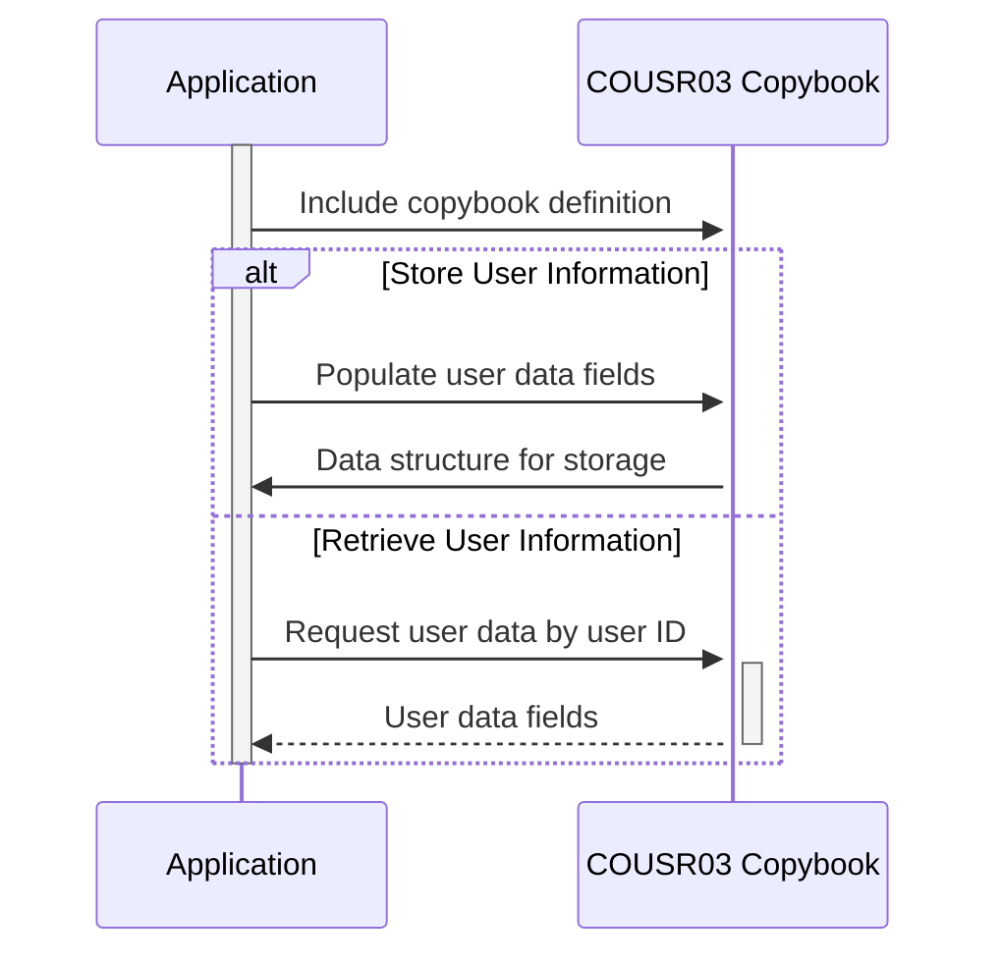

Gerado em: 1 de outubro de 2024

# **Título do Documento:** COUSR03 Copybook - Estrutura de Informação do Usuário

**Descrição Resumida:**
O copybook COUSR03 define um formato padronizado para lidar com informações do usuário dentro do aplicativo CardDemo. Ele atua como um modelo para armazenar e acessar detalhes sobre cada usuário, como ID, nome, tipo (por exemplo, administrador, usuário regular) e quaisquer mensagens do sistema destinadas a eles.

**Histórias do Usuário:**
Como administrador do sistema, preciso de uma maneira de armazenar e recuperar informações do usuário, incluindo sua função e mensagens do sistema, para gerenciar o acesso do usuário e rastrear suas atividades.

**Epic Relacionado:**
6 - Gerenciamento de Usuários e Segurança

**Requisitos Funcionais:**
- O copybook deve definir estruturas de dados para armazenar informações do usuário.
- Deve incluir campos para ID do usuário, primeiro nome, último nome, tipo de usuário, nome da transação, nome do programa, data atual, hora atual e mensagens de erro.
- As estruturas de dados devem ser compatíveis com a linguagem de programação COBOL.

**Requisitos Não Funcionais:**
- O copybook deve ser bem documentado com explicações claras de cada campo e sua finalidade.
- Deve ser projetado para armazenamento e recuperação eficientes de dados.

**Critérios de Aceitação:**
- O copybook deve ser compilado com sucesso no ambiente COBOL do aplicativo CardDemo.
- Os programas que usam o copybook devem ser capazes de armazenar e recuperar corretamente as informações do usuário.

**Melhorias de Código:**
- Considere adicionar verificações de validação de dados no copybook para garantir a integridade dos dados (por exemplo, verificando tipos de usuário válidos).

**Melhorias de Segurança:**
- O acesso ao copybook e seu conteúdo deve ser restrito apenas ao pessoal autorizado.
- Informações confidenciais, como senhas de usuário, não devem ser armazenadas no copybook.

**Diagrama Conceptual:**

--Made by "Smart Engineering" (by Compass.UOL)--