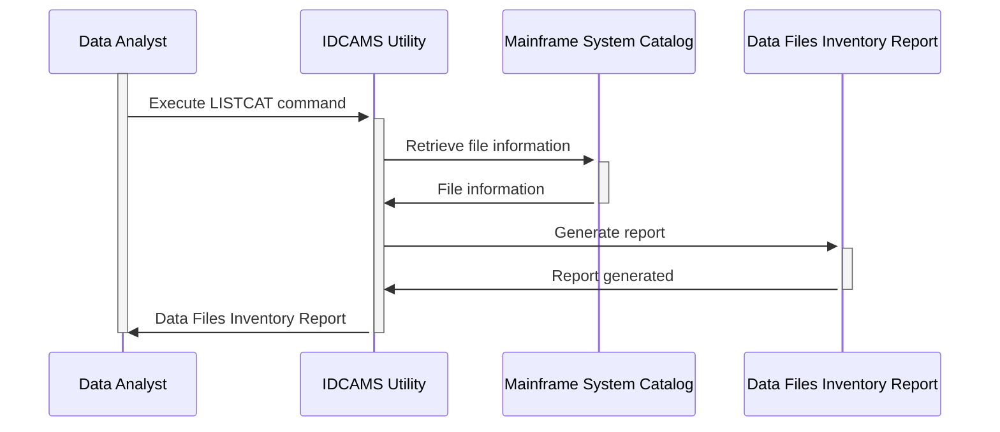

Gerado em: 1º de outubro de 2024

**Título do Documento:** Inventário de Arquivos de Dados do Aplicativo CardDemo

**Descrição Resumida:** Este documento lista os vários arquivos de dados usados pelo aplicativo CardDemo, um sistema baseado em mainframe para gerenciar contas de cartão de crédito. Ele detalha como esses arquivos são organizados e seus detalhes de armazenamento.

**Histórias do Usuário:** Como analista de dados, preciso entender como os dados do CardDemo são organizados e armazenados para que eu possa acessá-los e analisá-los com eficiência.

**Epic Relacionado:** 10 - Gerenciamento de Arquivos de Dados

**Requisitos Funcionais:**
- O documento deve listar todos os arquivos de dados usados pelo aplicativo CardDemo.
- Para cada arquivo, o documento deve especificar:
    - Nome do arquivo
    - Tipo de arquivo (VSAM ou não VSAM)
    - Organização do arquivo (por exemplo, KSDS, AIX)
    - Local de armazenamento (volume)
    - Data de criação
    - Tamanho
    - Contagem de registros
- O documento deve indicar se cada arquivo está ativo ou inativo.
- O documento deve distinguir entre arquivos de dados primários e arquivos de backup.

**Requisitos Não Funcionais:**
- O documento deve ser claro, conciso e fácil de entender.
- O documento deve ser preciso e atualizado.
- O documento deve ser acessível ao pessoal autorizado.

**Critérios de Aceitação:**
- O documento lista com precisão todos os arquivos de dados usados pelo aplicativo CardDemo.
- O documento fornece todas as informações necessárias para cada arquivo.
- O documento é claro, conciso e fácil de entender.

**Configurações e Constantes:** Não aplicável

**Melhorias de Código:** Não aplicável

**Melhorias de Segurança:** 
- O acesso ao documento deve ser restrito ao pessoal autorizado.
- O documento não deve conter informações confidenciais, como senhas ou chaves de criptografia.

**Diagrama Conceitual:**

Este diagrama ilustra o processo de geração de um inventário de arquivos de dados para o aplicativo CardDemo.

--Made by "Smart Engineering" (by Compass.UOL)--