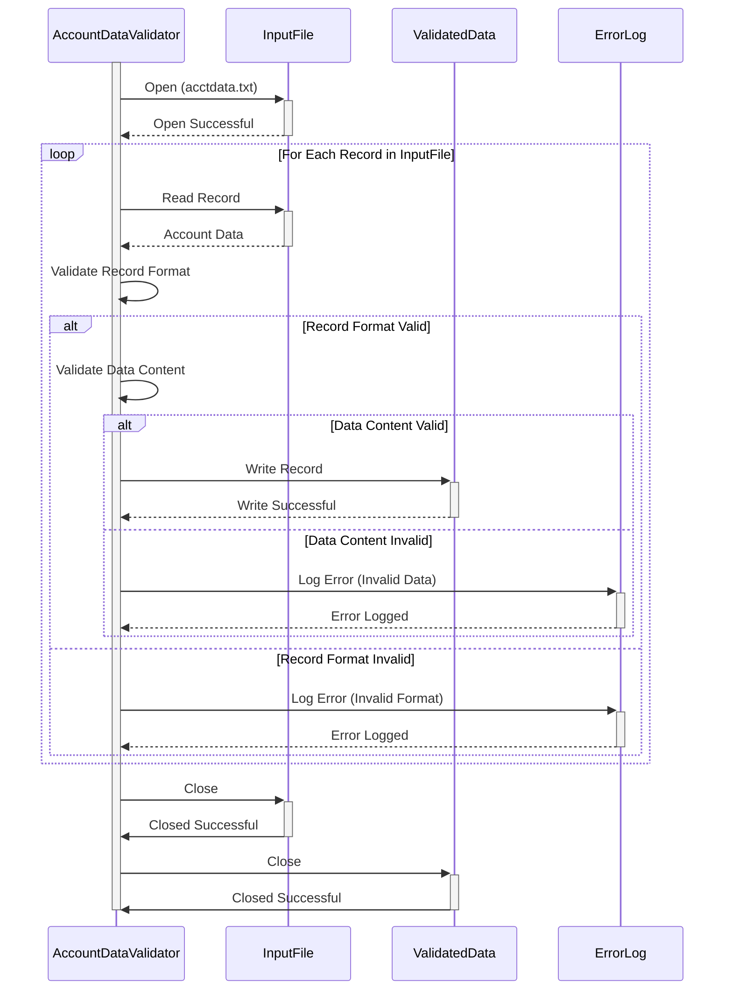

Gerado em: 1 de outubro de 2024

# **Título do Documento:** Validador e Processador de Arquivo de Dados de Conta

## **Descrição Resumida:** 
Este programa valida registros de clientes de um arquivo de entrada (`acctdata.txt`) com base em regras de negócios predefinidas, com foco principal no formato e conteúdo dos dados. Os registros que passam na validação são gravados em um arquivo de saída, enquanto os registros inválidos são registrados para posterior investigação e correção. 

## **Histórias do Usuário:**
Como analista de dados, desejo garantir que apenas dados de contas válidos e formatados corretamente sejam usados para análise e geração de relatórios. Este programa me ajudará identificando e separando automaticamente os registros inválidos, economizando meu tempo e reduzindo erros em minhas análises.

## **Épico Relacionado:**
10 - Gerenciamento de Arquivos de Dados

## **Requisitos Funcionais:**
1. **Ler Arquivo de Entrada:** O programa deve ser capaz de ler registros de clientes de um arquivo de entrada chamado `acctdata.txt`. 
2. **Validar Formato do Registro:** Cada registro deve estar em conformidade com um formato predefinido (por exemplo, colunas de largura fixa, campos delimitados). O programa deve identificar e sinalizar quaisquer desvios deste formato.
     - **Número da Conta:** 10 dígitos, somente numéricos.
     - **Tipo de Conta:** 1 caractere, alfanumérico.
     - **Limite de Crédito:** 6 dígitos, somente numéricos.
     - **Saldo Atual:** 6 dígitos, somente numéricos.
     - **Data de Abertura da Conta:** Formato AAAA-MM-DD.
     - **Data da Última Transação:** Formato AAAA-MM-DD.
     - **Data do Último Extrato:** Formato AAAA-MM-DD.
     - **Status da Conta:** 1 caractere.
3. **Validar Conteúdo de Dados:** O programa deve verificar a validade de campos de dados individuais com base em regras de negócios. Por exemplo:
     - **Limite de Crédito:** Não pode ser negativo.
     - **Saldo Atual:** Não pode exceder o Limite de Crédito.
     - **Status da Conta:** Deve ser um dos códigos de status permitidos (por exemplo, A - Ativo, C - Fechado, S - Suspenso).
4. **Registrar Registros Inválidos:** Para cada registro que falhar na validação, o programa deve registrar o seguinte:
     - **Número do Registro:** O número da linha do arquivo de entrada.
     - **Código de Erro:** Um código que identifica a regra de validação específica que falhou.
     - **Descrição do Erro:** Uma breve descrição do erro.
5. **Gravar Registros Válidos:** Os registros que passarem em todas as verificações de validação devem ser gravados em um arquivo de saída. 
6. **Relatório de Erros:** O programa deve gerar um relatório resumido listando todos os registros inválidos e seus erros correspondentes. 

## **Requisitos Não Funcionais:**
1. **Desempenho:** O programa deve ser capaz de processar arquivos de entrada grandes (por exemplo, milhões de registros) em um período de tempo razoável.
2. **Confiabilidade:** O programa deve ser confiável e produzir resultados consistentes. O tratamento de erros deve ser robusto para evitar a terminação inesperada do programa.
3. **Manutenibilidade:** O código deve ser bem estruturado, documentado e fácil de entender para futuras manutenções e aprimoramentos.
4. **Registro em Log:** O programa deve ter um mecanismo para registrar eventos, erros e informações importantes para fins de depuração e auditoria.

## **Critérios de Aceite:**
1. **Validação e Processamento Bem-Sucedidos:** O programa lê o arquivo `acctdata.txt`, valida cada registro de acordo com as regras definidas e grava os registros válidos em um arquivo de saída.
2. **Tratamento de Erros Preciso:** Registros inválidos são identificados e registrados com códigos de erro e descrições específicas.
3. **Geração de Relatório de Erros:** Um relatório de erros abrangente é gerado, listando todos os registros inválidos e seus erros associados.
4. **Desempenho e Eficiência:** O programa demonstra desempenho aceitável em termos de tempo de processamento para diferentes tamanhos de arquivo.

## **Melhorias de Código:**
1. **Design Modular:** Implemente as regras de validação como funções ou métodos separados para melhorar a organização e a legibilidade do código.
2. **Arquivo de Configuração:** Use um arquivo de configuração para armazenar regras de validação e parâmetros, permitindo modificações mais fáceis sem alterar o código-fonte. 
3. **Estruturas de Dados:** Utilize estruturas de dados apropriadas (por exemplo, matrizes, estruturas) para armazenar e gerenciar dados com eficiência.
4. **Tratamento de Exceções:** Implemente o tratamento de exceções para gerenciar erros normalmente e evitar falhas no programa.
5. **Documentação de Código:** Adicione comentários claros e concisos para explicar a lógica e a funcionalidade do código.

## **Melhorias de Segurança:**
1. **Validação de Entrada:** Implemente validação de entrada rígida para evitar o processamento de dados maliciosos ou malformados que podem comprometer o sistema.
2. **Manipulação Segura de Arquivos:** Garanta que o programa manipule arquivos com segurança, incluindo permissões de arquivo adequadas e exclusão segura de dados confidenciais.
3. **Registro em Log e Auditoria:** Registre todas as operações de arquivo, resultados de validação e condições de erro para auditoria e análise de segurança.

## **Diagrama Conceitual:**

--Made by "Smart Engineering" (by Compass.UOL)--