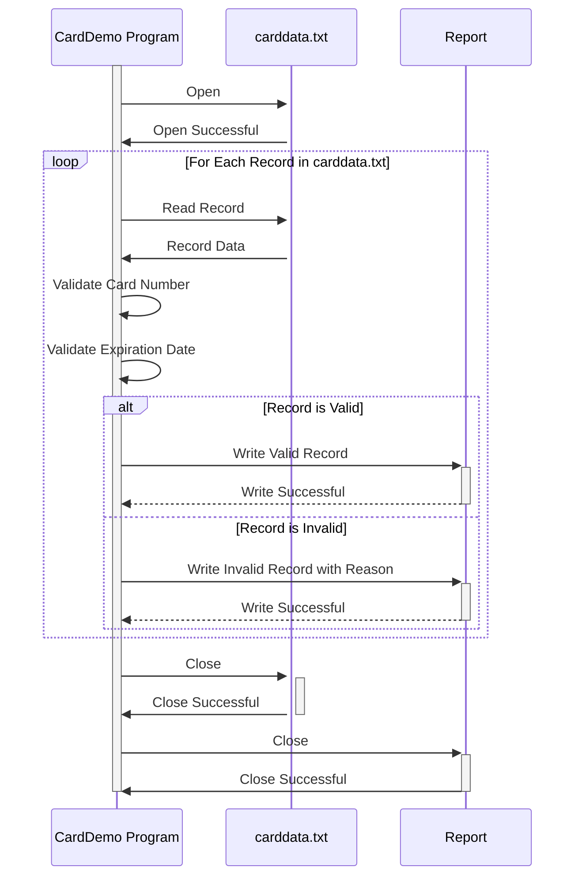

Gerado em: 1 de outubro de 2024

**Título do Documento:** Programa de Validação e Processamento de Dados de Cartão de Crédito

**Descrição Resumida:** 
Este programa valida informações de cartão de crédito de um arquivo chamado "carddata.txt". Ele verifica se os números dos cartões são válidos (usando o Algoritmo de Luhn), se as datas de validade estão no futuro e garante que os dados sejam tratados com segurança. Um relatório de registros válidos e inválidos é gerado.

**Histórias de Usuário:** 
Como Analista de Dados, preciso ter certeza de que estou usando apenas registros de cartão de crédito válidos para que minha análise seja precisa e não contenha dados inválidos.

**Épico Relacionado:** 
3 - Gestão de Cartão de Crédito

**Requisitos Funcionais:**
1. **Ler dados do arquivo "carddata.txt".**
   - O arquivo contém o número do cartão de crédito, o nome do cliente e a data de validade de cada cliente.
2. **Validar cada registro:**
   - **Número do Cartão:** 
     - Deve ter de 13 a 19 dígitos.
     - Deve passar na verificação do Algoritmo de Luhn.
   - **Data de Validade:**
     - O formato deve ser YYYY-MM-DD.
     - A data deve ser no futuro.
3. **Gerar um relatório de saída:**
   - Listar todos os registros de cartão de crédito válidos.
   - Listar todos os registros inválidos com o motivo da invalidade (por exemplo, "Número de Cartão Inválido", "Expirado").

**Requisitos Não Funcionais:**
1. **Segurança:** 
   - O programa deve lidar com as informações do cartão de crédito com segurança, seguindo os padrões PCI DSS.
   - Dados confidenciais não devem ser armazenados de forma insegura.
2. **Desempenho:** 
   - O programa deve processar os dados de forma eficiente.
   - O tempo de processamento deve ser minimizado, especialmente para arquivos grandes.
3. **Manutenibilidade:** 
   - O código deve ser bem documentado e fácil de entender para futuras modificações.

**Critérios de Aceitação:**
1. O programa lê com sucesso todos os registros do arquivo "carddata.txt".
2. Todos os números de cartão de crédito são validados de acordo com o Algoritmo de Luhn.
3. Todas as datas de validade são validadas quanto ao formato correto e data futura.
4. Um relatório de saída é gerado que:
   - Lista com precisão todos os registros de cartão de crédito válidos.
   - Lista com precisão todos os registros inválidos com motivos específicos para invalidade.
5. O programa lida com erros graciosamente e fornece mensagens informativas.

**Melhorias de Código:**
1. Implementar o registro em log para registrar detalhes de execução do programa, erros e exceções.
2. Usar um formato estruturado para o relatório de saída (por exemplo, CSV, JSON) para facilitar a análise de dados.
3. Adicionar tratamento de erros para operações de arquivo (por exemplo, arquivo não encontrado, erros de leitura).

**Melhorias de Segurança:**
1. Minimizar o armazenamento e exibição de informações confidenciais do cartão de crédito. Mascarar ou truncar números de cartão quando possível.
2. Implementar criptografia para armazenar dados confidenciais se a persistência for necessária.
3. Atualizar regularmente as regras de validação para alinhar com os padrões de segurança mais recentes.

**Diagrama Conceitual:**

--Made by "Smart Engineering" (by Compass.UOL)--