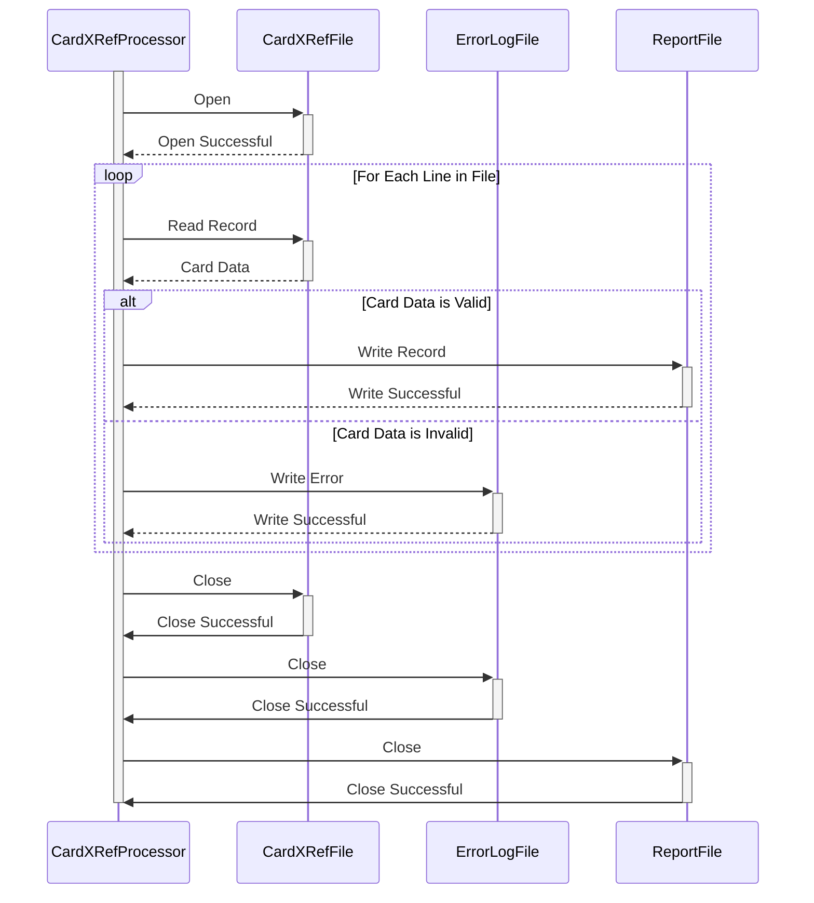

Gerado em: 1º de outubro de 2024

# **Título do Documento:** Processador de Arquivo de Referência Cruzada de Cartão

# **Descrição Resumida:** 
Este documento descreve as especificações para um programa projetado para processar um arquivo de referência cruzada de cartão de crédito (`cardxref.txt`). O programa lerá o arquivo, validará cada registro e gerará um relatório de registros válidos e inválidos.

# **Histórias do Usuário:** 
Como analista de dados, preciso garantir que apenas registros de cartão de crédito válidos sejam usados para análise e geração de relatórios. Este programa me ajudará a identificar e isolar quaisquer registros inválidos no arquivo `cardxref.txt`.

# **Épico Relacionado:** 
**10 - Gerenciamento de Arquivos de Dados:** Esta história de usuário está diretamente relacionada ao gerenciamento e integridade dos arquivos de dados usados no aplicativo CardDemo.

# **Requisitos Funcionais:**
1. **Leitura de Arquivo:**
    - O programa deve ser capaz de ler o arquivo `cardxref.txt` de um diretório especificado. 
2. **Validação de Registro:**
    - Cada registro no arquivo deve seguir o seguinte formato:
        - **Identificador do Cartão:** String numérica de 19 dígitos.
        - **Contador/Referência:** String numérica de 2 dígitos.
    - O programa deve validar:
        - **Tipo de Dado:**  Garantir que tanto o identificador do cartão quanto o contador/referência sejam numéricos.
        - **Tamanho:** Verificar se o identificador do cartão tem exatamente 19 dígitos e o contador/referência tem 2 dígitos.
3. **Tratamento de Erros:**
    - Se um registro falhar na validação, o programa deve:
        - Gravar o registro inválido em um arquivo de log de erros (`cardxref_errors.log`) junto com uma descrição do erro.
        - Ignorar o registro inválido e continuar processando os registros restantes.
4. **Geração de Relatório:**
    - O programa deve gerar um relatório (`cardxref_report.txt`) contendo:
        - Um resumo dos resultados do processamento (total de registros, registros válidos, registros inválidos).
        - Uma lista de todos os identificadores de cartão válidos e seus respectivos valores de contador/referência.

# **Requisitos Não Funcionais:**
1. **Desempenho:**
    - O programa deve processar o arquivo `cardxref.txt` de forma eficiente, especialmente para arquivos grandes.
2. **Confiabilidade:**
    - O programa deve ser robusto e capaz de lidar com erros inesperados normalmente.
3. **Manutenibilidade:**
    - O código do programa deve ser bem estruturado, documentado e fácil de entender e modificar. 

# **Critérios de Aceitação:**
1. **Processamento de Arquivo Bem-Sucedido:** O programa deve ser capaz de ler e processar o arquivo `cardxref.txt` sem erros.
2. **Validação Precisa:** O programa deve validar corretamente cada registro com base nas regras definidas.
3. **Relatórios Abrangentes:** O relatório gerado deve refletir com precisão os resultados do processamento e listar os registros válidos e inválidos conforme o esperado.
4. **Tratamento de Erros:**  O programa deve lidar normalmente com registros inválidos e registrar erros adequadamente. 

# **Melhorias de Código:**
1. **Modularidade:** Divida o programa em funções menores e reutilizáveis para melhorar a legibilidade e a manutenção.
2. **Estruturas de Dados:** Considere o uso de estruturas de dados apropriadas (por exemplo, matrizes, structs) para armazenar e gerenciar dados de cartão de forma eficiente.
3. **Validação de Entrada:** Implemente verificações de validação de entrada mais robustas, como verificar a existência do arquivo antes de tentar lê-lo.
4. **Log:** Use uma biblioteca de log para mensagens de erro e informações de depuração mais estruturadas e informativas. 

# **Melhorias de Segurança:**
1. **Permissões de Arquivo:** Garanta que o programa tenha apenas as permissões de leitura necessárias para o arquivo `cardxref.txt`.
2. **Log Seguro:** Se informações confidenciais estiverem sendo registradas, considere a implementação de práticas de log seguras (por exemplo, ofuscação de log, criptografia). 

# **Diagrama Conceitual:**

--Made by "Smart Engineering" (by Compass.UOL)--