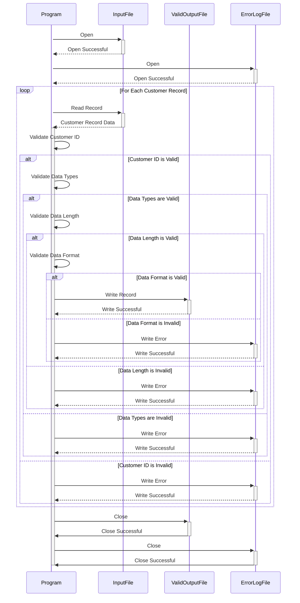

Gerado em: 1º de outubro de 2024

**Título do Documento:** Programa de Validação e Processamento de Dados do Cliente

**Descrição Resumida:**
Este programa valida registros de clientes de um arquivo de texto (`custdata.txt`) em relação a regras de negócios predefinidas. Os registros válidos são gravados em um arquivo de saída, enquanto os registros inválidos são registrados para revisão. Isso garante que apenas dados precisos e consistentes do cliente sejam usados para análise e outras operações comerciais.

**Histórias de Usuário:**
Como analista de dados, preciso garantir que apenas registros válidos de clientes sejam usados em minha análise para manter a integridade dos dados e gerar insights confiáveis.

**Épico Relacionado:**
8 - Gestão de Dados do Cliente

**Requisitos Funcionais:**
1. **Ler Dados do Cliente:** O programa deve ler os registros do cliente do arquivo `custdata.txt`. Cada linha no arquivo representa um único registro de cliente, com campos separados por espaços.
2. **Validar ID do Cliente:**
    - Cada ID de cliente deve ser exclusivo.
    - O programa deve registrar um erro se um ID de cliente duplicado for encontrado.
3. **Validar Tipos de Dados:**
    - O ID do cliente deve ser numérico.
    - Os nomes (primeiro, do meio, último) devem ser alfabéticos.
    - Os números de telefone devem ser numéricos.
    - Os números de cartão de crédito devem ser numéricos.
    - As datas (data de validade do cartão de crédito) devem seguir um formato específico (por exemplo, AAAA-MM-DD).
    - O programa deve registrar um erro se uma incompatibilidade de tipo de dados for detectada.
4. **Validar o Comprimento dos Dados:**
    - Cada campo deve ter um limite máximo de comprimento.
    - O programa deve registrar um erro se um campo exceder seu comprimento máximo.
5. **Validar Formato de Dados:**
    - Os números de telefone devem seguir um formato específico (por exemplo, (XXX) XXX-XXXX).
    - Os números de cartão de crédito devem seguir um formato específico (por exemplo, 16 dígitos).
    - As datas devem seguir um formato específico.
    - O programa deve registrar um erro se uma incompatibilidade no formato dos dados for detectada.
6. **Lidar com Registros Inválidos:**
    - O programa não deve gravar registros inválidos no arquivo de saída.
    - Os registros inválidos devem ser registrados em um arquivo de log de erros, incluindo o ID do cliente e o motivo do erro.
7. **Gravar Registros Válidos:**
    - Os registros válidos do cliente devem ser gravados em um novo arquivo de saída (por exemplo, `valid_custdata.txt`).
    - O arquivo de saída deve manter o mesmo formato separado por espaço do arquivo de entrada.

**Requisitos Não Funcionais:**
1. **Desempenho:**
    - O programa deve processar o arquivo de dados do cliente com eficiência, especialmente para arquivos grandes.
    - Considere otimizar para velocidade e uso de memória.
2. **Confiabilidade:**
    - O programa deve ser confiável e produzir resultados consistentes.
    - Implemente tratamento de erros robusto para evitar o término inesperado do programa.
3. **Manutenibilidade:**
    - O código do programa deve ser bem estruturado, documentado e fácil de entender para manutenção futura.
    - Use nomes de variáveis ​​significativos e comentários.
4. **Segurança:**
    - O programa deve lidar com dados confidenciais (informações de cartão de crédito) com segurança.
    - Considere criptografar dados confidenciais no arquivo de saída.
    - Implemente controles de acesso adequados para restringir o acesso não autorizado ao programa e arquivos de dados.

**Critérios de Aceitação:**
1. O programa lê com sucesso todos os registros de clientes do arquivo de entrada (`custdata.txt`).
2. O programa valida corretamente cada registro de cliente em relação às regras de negócios definidas.
3. Todos os registros válidos do cliente são gravados no arquivo de saída (`valid_custdata.txt`) no formato correto.
4. Todos os registros inválidos do cliente são registrados em um arquivo de log de erros com mensagens de erro específicas, incluindo o ID do cliente e o motivo da falha de validação.
5. O programa é executado sem erros de tempo de execução.

**Melhorias de Código:**
1. **Tratamento de Erros:** Implemente um mecanismo centralizado de tratamento de erros para capturar e registrar erros com elegância, fornecendo mensagens informativas ao usuário.
2. **Log:** Use uma estrutura de log para criar logs detalhados da execução do programa, incluindo erros de validação, para facilitar a solução de problemas.
3. **Estruturas de Dados:** Use estruturas de dados apropriadas (por exemplo, matrizes, structs) para armazenar e gerenciar dados do cliente com eficiência.
4. **Modularidade:** Divida o programa em funções menores e bem definidas para melhorar a organização e a manutenção do código.
5. **Configuração:** Permita regras de validação configuráveis ​​(por exemplo, comprimentos máximos de campo, formatos de dados) por meio de um arquivo de configuração externo.

**Melhorias de Segurança:**
1. **Limpeza de Entrada:** Implemente a limpeza de entrada para evitar vulnerabilidades como injeção de SQL ou injeção de comando.
2. **Criptografia de Dados:** Criptografe dados confidenciais (como números de cartão de crédito) em trânsito e em repouso.
3. **Manuseio Seguro de Arquivos:** Garanta práticas seguras de manuseio de arquivos, incluindo permissões de arquivo adequadas e exclusão segura de arquivos temporários.
4. **Auditoria:** Implemente trilhas de auditoria para rastrear o acesso a dados e modificações para fins de segurança e conformidade.

**Diagrama Conceitual:**

--Made by "Smart Engineering" (by Compass.UOL)--