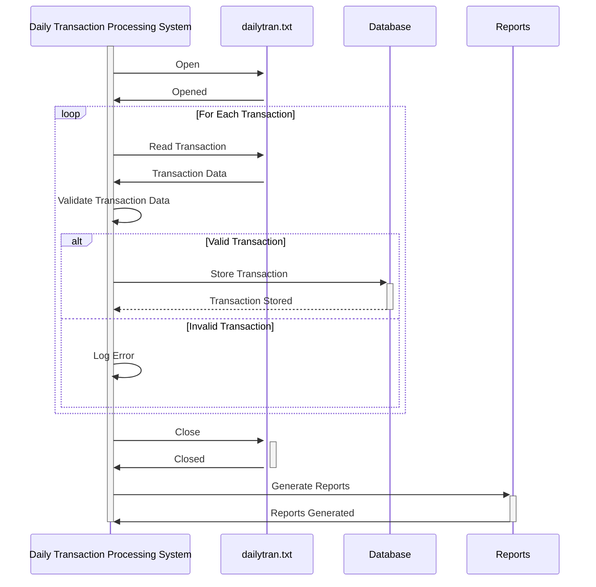

Gerado em: 1º de outubro de 2024

**Título do Documento:** Sistema de Processamento Diário de Transações

**Descrição Resumida:**
O Sistema de Processamento Diário de Transações foi projetado para processar logs de transações diárias de lojas de varejo. Ele analisa essas transações para acompanhamento de vendas, gerenciamento de estoque, análise de comportamento do cliente e eficiência operacional.

**Histórias do Usuário:**
Como um analista de dados, preciso de um sistema para processar logs de transações diárias para garantir que apenas registros válidos sejam usados para análise e geração de relatórios.

**Épico Relacionado:**
4 - Processamento de Transações

**Requisitos Funcionais:**
- O sistema deve ler os dados da transação de um arquivo chamado `dailytran.txt`.
- O sistema deve validar os seguintes campos de dados para cada transação:
    - Tipo de Transação: Deve ser "Purchase" ou "Return".
    - Local: Deve corresponder a uma lista predefinida de locais de lojas.
    - Timestamp: Deve estar em um formato de data/hora válido e em ordem cronológica.
    - Informações do Cliente: Se disponível, deve corresponder aos dados no banco de dados do cliente.
- O sistema deve aplicar as seguintes regras de negócios:
    - **Rastreamento de Vendas:**
        - Calcular as vendas totais por dia.
        - Calcular as vendas por produto por dia.
        - Calcular as vendas por localização da loja por dia.
        - Identificar tendências de vendas ao longo do tempo.
    - **Gerenciamento de Inventário:**
        - Atualizar os níveis de estoque com base em compras e devoluções.
        - Gerar alertas para níveis baixos de estoque.
    - **Comportamento do Cliente:**
        - Analisar os padrões e a frequência de compra do cliente.
        - Calcular o valor médio da transação por cliente.
    - **Eficiência Operacional:**
        - Identificar horários de pico para cada local da loja.
        - Analisar os tempos de processamento de transações.
        - Gerar relatórios para otimização da equipe.
- O sistema deve armazenar os dados da transação processados em um banco de dados.
- O sistema deve gerar relatórios sobre vendas, estoque, comportamento do cliente e eficiência operacional.

**Requisitos Não Funcionais:**
- O sistema deve ser capaz de processar arquivos de transações grandes de forma eficiente.
- O sistema deve ser confiável e garantir a integridade dos dados.
- O sistema deve ser sustentável e fácil de atualizar.
- O sistema deve ser seguro e proteger dados confidenciais.

**Critérios de Aceitação:**
- O sistema lê e analisa com sucesso os dados da transação do arquivo `dailytran.txt`.
- Todas as regras de validação de dados são implementadas e aplicadas corretamente.
- As regras de negócios para rastreamento de vendas, gerenciamento de estoque, análise de comportamento do cliente e eficiência operacional são aplicadas corretamente.
- Os dados da transação processados são armazenados com precisão no banco de dados.
- Os relatórios são gerados e fornecem insights significativos.
- O sistema lida com erros normalmente e fornece mensagens de erro informativas.

**Melhorias de Código:**
- Implementar um mecanismo de registro em log para rastrear eventos e erros do sistema.
- Adicionar documentação abrangente ao código.
- Otimizar algoritmos de processamento de dados para melhor desempenho.
- Implementar testes de unidade para garantir a qualidade do código e evitar regressões.

**Melhorias de Segurança:**
- Proteger o acesso ao arquivo `dailytran.txt` com permissões apropriadas.
- Criptografar dados confidenciais armazenados no banco de dados.
- Implementar uma trilha de auditoria para rastrear alterações de dados e acesso.

**Diagrama Conceitual:**

--Made by "Smart Engineering" (by Compass.UOL)--