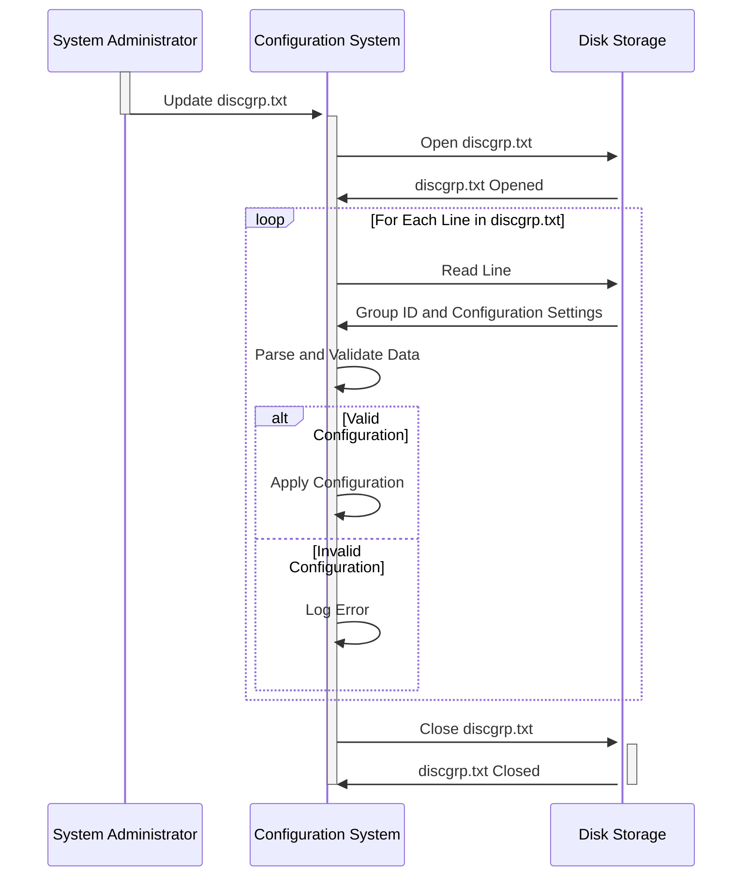

Gerado em: 1º de outubro de 2024

**Título do Documento:** Analisador de Configuração de Alocação de Grupo de Discos

**Descrição Resumida:**
Este documento descreve um sistema responsável por ler e interpretar um arquivo de configuração que define como os dados devem ser organizados e alocados entre diferentes grupos de armazenamento.

**Histórias do Usuário:**
Como administrador do sistema, preciso de uma maneira de definir como os dados são agrupados e armazenados para que eu possa otimizar o desempenho e gerenciar o espaço de armazenamento com eficácia.

**Épico Relacionado:**
10 - Gerenciamento de Arquivos de Dados

**Requisitos Funcionais:**
1. **Ler Arquivo de Configuração:** O sistema deve ser capaz de ler e analisar o conteúdo do arquivo de configuração `discgrp.txt`.
2. **Identificar Grupos de Dados:** O sistema deve identificar corretamente cada grupo de dados exclusivo listado no arquivo (por exemplo, 'A000000000010001', 'ZEROAPR', 'DEFAULT').
3. **Extrair Valores de Configuração:** Para cada grupo de dados, o sistema deve extrair os valores de configuração associados.
4. **Aplicar Configuração Padrão:** Se um grupo de dados específico não tiver uma configuração exclusiva, o sistema deverá aplicar uma configuração 'DEFAULT' predefinida.

**Regras de Negócio:**
* **Identificadores de Grupo Exclusivos:** Espera-se que cada grupo de dados tenha um identificador exclusivo. O sistema deve lidar com erros potenciais se identificadores duplicados forem encontrados.
* **Formato do Valor de Configuração:** Os valores de configuração devem seguir um formato específico. O sistema deve incluir validação para garantir a integridade dos dados e evitar problemas de valores formatados incorretamente.
* **Prioridade de Configuração Padrão:** A configuração 'DEFAULT' atua como um fallback. Qualquer configuração específica para um grupo nomeado substitui essas configurações padrão.

**Requisitos Não Funcionais:**
* **Desempenho:** O sistema deve ser capaz de ler e processar o arquivo de configuração de forma rápida e eficiente, especialmente ao lidar com arquivos grandes.
* **Confiabilidade:** O sistema deve ser confiável na análise precisa do arquivo de configuração e na aplicação das configurações definidas. Quaisquer erros na leitura ou interpretação do arquivo podem levar a armazenamento mal configurado e possíveis problemas de dados.
* **Manutenibilidade:** O sistema deve ser projetado de forma modular e compreensível para permitir atualizações e modificações fáceis à medida que os requisitos de armazenamento evoluem.

**Critérios de Aceitação:**
* O sistema lê e analisa com sucesso o arquivo `discgrp.txt` sem erros.
* Para cada grupo de dados identificado, o sistema extrai e armazena corretamente os valores de configuração associados.
* O sistema aplica a configuração 'DEFAULT' quando apropriado e prioriza corretamente as configurações específicas do grupo em relação aos padrões.
* O sistema registra quaisquer erros encontrados durante o processamento do arquivo ou análise de configuração, fornecendo informações úteis para solução de problemas.

**Melhorias de Código:**
* Implementar tratamento de erros robusto para gerenciar cenários como um arquivo de configuração ausente, formato de arquivo inválido ou tipos de dados incorretos dentro dos valores de configuração.
* Introduzir o registro em log para registrar as ações do sistema, incluindo quando ele inicia o processamento do arquivo, cada grupo de dados identificado e quaisquer erros encontrados.
* Adicionar comentários ao código para melhorar a legibilidade e o entendimento, especialmente em torno da lógica para analisar os valores de configuração e aplicar os padrões.

**Melhorias de Segurança:**
* **Armazenamento Seguro de Arquivos:** Armazene o arquivo `discgrp.txt` em um local seguro com controles de acesso apropriados para evitar modificações não autorizadas.
* **Validação de Entrada:** Implemente validação rígida nos valores de configuração lidos do arquivo para mitigar os riscos associados a dados maliciosos ou malformados.
* **Auditoria:** Registre todos os acessos e alterações feitas no arquivo de configuração para rastrear quaisquer modificações não autorizadas ou possíveis violações de segurança.

**Diagrama Conceitual:**

--Made by "Smart Engineering" (by Compass.UOL)--